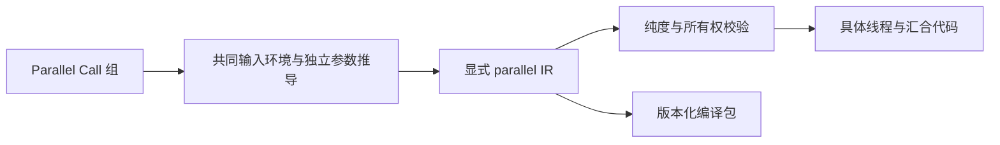
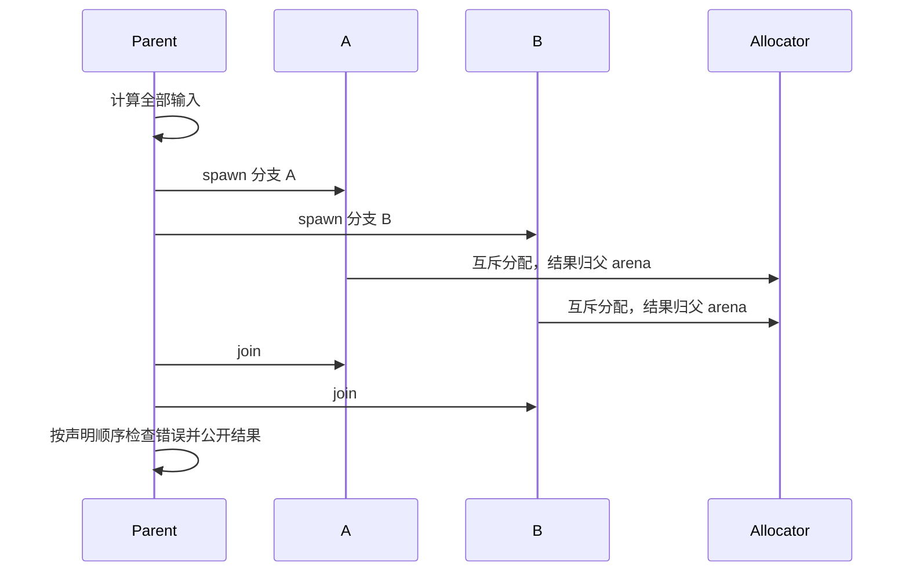

# RX 并行调用

## Intent：最终目标

让 Parallel 保留真实 fork/join 语义，生成静态可知的原生线程调用与结果汇合，不增加解释器、任务注册表或专用运行库。完整 RX 目标继续包含 Task 并行、Store 和外部能力；本阶段先接通独立纯计算 Call 分支。

## Data：可用证据

现有 RX Schema 接受 Parallel，执行准备阶段明确拒绝；core IR 只有顺序、条件及状态语句。直接展开 Call 会错误地串行执行。函数和编译包已经有类型、调用图、所有权摘要及统一序列化，可复用调用表达式与函数身份。

当前 Zig 0.16 的普通 ArenaAllocator 不提供并发分配保证；标准 DebugAllocator 使用 std.Io.Threaded.mutexLock/mutexUnlock 保护底层分配。线程生成必须保护同一请求 arena，不能让分支直接并发操作它。

## Edges：边界与限制

第一阶段支持 Parallel 的直接 Call.fn/Call.service。参数在父线程按声明顺序计算，兄弟分支互不可见，直接 Call.out 在所有分支结束后才加入外层作用域。输出路径不得相互重叠。Task 的局部 Return 与模块 Return 尚需独立定义，不把 Task 当作顺序展开；遇到它明确拒绝，完整目标保留。

分支函数的可达闭包必须没有 Store 和原生 external 调用；未知副作用不推定线程安全。进入块前的不可变数据可借用，分支不能消费外层 owned 数据。生成固定数量的工作记录和线程句柄；以锁包装父 allocator，只有分配操作互斥，计算实际并行。输出仍由父 arena 持有，不转移到短命分支 arena。

全部线程 join 后按声明顺序返回首个错误；不取消其他分支。部分 spawn 失败也必须等待已启动线程，随后返回启动错误，不降级为串行。无原生线程能力的目标明确失败。证明与 FPGA 后端暂时明确拒绝 Parallel，不用顺序模型冒充并发证明。

## Answer：实现与成功标准

core IR 增加显式 parallel 调用组并升级版本；RX 完成独立参数环境与结果汇合；IR 校验、深复制、所有权、缓存和编译包链路保持一致；genz 生成具体线程工作结构与分配互斥。使用现有纯函数源码构造实际编排示例，检查构建、执行、失败回收、源码中的真实 spawn/join 及库消费。仅运行相关既有回归，不新增测试用例、不执行全量测试或浏览器检查。

## 自我复核

生成线程并不意味着任意外部副作用、Store 并发或 Task 控制流都已解决。固定线程启动会有系统开销，本阶段没有线程池或自动任务粒度优化；零成本抽象指没有额外通用语言运行库，不能声称线程与同步本身没有运行成本。实际执行成功也不等于并发数据竞争已被一般性证明。

## 实施记录

IR 的 parallel 成员保存调用表达式和可选结果符号，无 out 的调用不制造无用变量。RX 的类型约束、表达式编译和最终 lowering 分别保持进入块前的绑定环境，在组尾发布结果。公共调用表达式生成复用 invoke，顺序与并行分别决定执行语句形状。IR 校验再次检查参数作用域和可达函数纯度，深复制保留组成员，协议版本由 9 升为 10，生成摘要包含新节点。

genz 为每个分支生成具体工作结构和 run 函数，固定线程句柄在内部作用域注册 defer join。参数与工作结构先构造，随后启动线程；离开该作用域后读取结果。分配包装仅委托原 allocator 并对四种操作加锁，不复制数据、不接管独立分支 arena、不引入运行库包。无 Parallel 的生成模块不包含该包装。

Call.in 中的 Store getter 在父线程生成普通快照语句，允许把已经捕获的不可变值传给纯分支；纯度门禁针对实际工作函数及其可达闭包，拒绝它们访问 Store 或 external。这里不承诺并发服务请求对同一个 State 的同步。

## 实际执行证据

示例复用仓库现有 map_values、sum_values、first、identity 及 discard 函数。主模块有两个映射分支、一个求和分支和一个 RX 服务分支。输入 `[2,3,7]` 得到两个 `[3,4,8]`、总和 12、首项 2；空列表的 first 分支报 IndexOutOfBounds。通用 DebugAllocator 宿主在成功与失败退出后均记录 remaining_bytes 为 0。

输入 20,000 个整数时，宿主底层 allocator 记录到两个不同于父线程的分配线程；两个输出列表各有 20,000 个元素、求和为 199,990,000。此观测与生成的 spawn/join 一起证明执行了真实工作线程，不用耗时或相同输出冒充并行证据。记录在 [执行结果](RX并行调用/执行结果.json)。

同一模块已按统一 lib 发布。独立 Zig 宿主按公开模块及依赖清单构建，RX 消费者在外层 Parallel 中两次调用编译库，ZX 消费者通过普通 import 调用；三条路径实际执行成功。另一个公开入口包含无 out 的 void Call，输入 42 返回 42。verify 与 FPGA 对该标量入口明确拒绝 Parallel，FPGA 未产生输出文件。

既有库发布专项 28/28 步通过；既有 RX 运行专项第一次执行为 107/107 步、197/197 项通过。后续仅调整调用表达式共用边界并再次执行 RX 专项，最终结果追加在下方。没有新增测试用例，没有运行全量测试。

部分线程启动失败的 join 次序已通过生成结构和只读复核检查，本轮未注入操作系统线程启动失败；不把它报告为已经实际覆盖的故障场景。所有权冻结采用保守借用，不声称已实现精细借用结束分析。

最终正式构建 14/14 步通过；调用表达式整理后的 RX 运行专项复跑通过。最终源码重新生成和库发布两次均成功，生成缓存全部复用，具体计数见 [缓存记录](RX并行调用/缓存记录.json)。示例的发布包放在消费工作区内部，源码包独立于该工作区，避免把正在发布的目标误纳为自身输入；原有输出覆盖输入保护保持有效。
