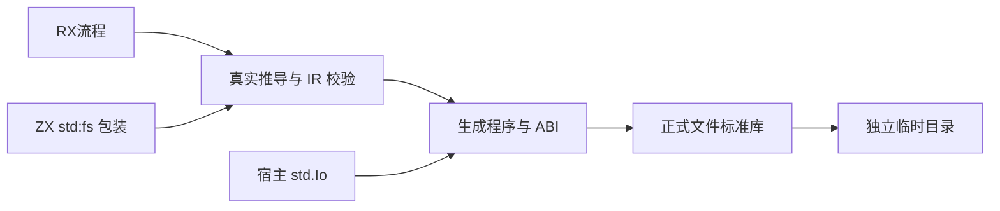
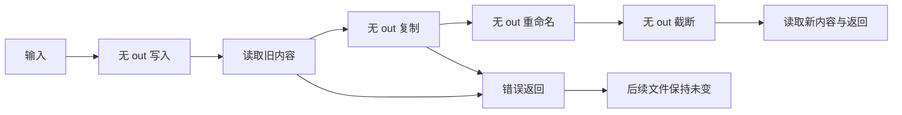

# RX 文件副作用执行验证计划

## Intent：最终目标

第 381 阶段验证 81ccb7a7 引入的宿主 IO 参数链及 evaluate 语句。通过真实 RX/ZX 编译生成 Zig，在独立临时目录实际执行文件流程，确认无 out 的 void/非 void 调用都执行，错误立即传播并阻止后续副作用。

## Data：可用证据

前一阶段 49 项 std:fs 测试验证底层库，但未经过 RX 推导和生成。现有 RX discard 只验证纯 ZX 调用，无法证明 IO 依赖经 service、Task、Switch 到原生操作。已阅读 RX statements.lower 的 evaluate 分支、生成 Bundle 和标准模块注册；std:fs 的注册模块为 zxc_standard、namespace 为 fs。

## Edges：边界与限制

测试使用正式 std:fs 与真实生成 ABI，正常路径不以替身 host 代替文件副作用；宿主传递故障测试仅替换传入 std.Io 的单个底层回调，其余操作仍真实执行。不做字符串匹配后声称执行正确。所有副作用限于各测试独立临时目录，宿主显式传入 std.testing.io。失败时保留此前成功副作用是预期，不假定跨调用事务。OOM 注入只针对应用 arena，测试夹具使用独立 allocator。

暂不覆盖 Gateway、Store 请求和编译包再次发布的 IO；这些入口需另外验证。保持已有纯计算测试并运行 RX 聚合，证明新增 IO 不要求纯入口额外传参。未要求浏览器或新增生产实现。

## Answer：交付与成功标准

- 新建专用 io 编译驱动：真实 parseXml → project.infer → validateIr → emitBundle，使用生成 ABI 重新实例化标准库模块。
- 模式覆盖直接文件流程、service 转发、Task 包装、Switch 选择、丢弃非 void 读取、隐式 void 入口、丢弃 void service 返回、调用参数先行错误。
- 完整流程依次写入、读取旧值、复制、重命名、截断、读取新值；用宿主独立底层文件 API 验证执行顺序与最终内容。
- 首调用失败、读取失败、中途复制失败、后续读取失败均核对磁盘上的完成前缀及未执行后缀；避免仅检查错误名。
- 空内容、Unicode、旧结果存活、多次请求、逐次分配失败和未选中分支无副作用纳入断言。
- 运行新专项及已有 RX 执行聚合，归档日志和基线；发现生产缺陷才反馈实现聊天。按本部分完成后提交 push。

## 自我复核

这是实施计划。原生文件结果与失败后的磁盘前缀是预言，生成源码只作为辅助诊断。现有底层文件测试或类型检查通过不能替代本轮执行证据。

## 第 381 阶段执行记录

新增 25 个命名测试声明，经 8 种生成模式运行为 54 项测试组合：完整流程 13 × direct/service/Task 三种入口；Switch 4；丢弃非 void 3；void 入口及丢弃 void service 各 3；参数错误 2。正式测试目录为 `tests/rx/runtime/io/`，编译驱动为同级 `io_compile.zig`，构建通过 `rx_io_runtime.zig` 注册并接入既有 RX runtime 聚合。

完整流程真实执行写入 → 读取旧值 → 复制 → 重命名 → 截断 → 读取新值。已覆盖空文件、ASCII、Unicode、扩展补零、旧输出跨后续调用存活，以及首写、首次读、复制、最终读和最终 UTF-8 校验失败后的磁盘完成前缀。Switch 未选中分支包含非法路径仍成功且不创建文件；列表参数越界使两个写入都不执行。成功与错误断言均核对独立底层读取，不仅检查返回值。

宿主 IO 传递专项复制 std.testing.io 的 vtable，只把 dirOpenFile 改为 AccessDenied，或把 dirRename 改为 ReadOnlyFileSystem。其余回调和 userdata 保持原值，实际写入/复制照常运行。direct/service/Task 均在预定操作处返回注入错误，分别保留仅源文件或源与复制文件，后续目标不存在，证明生成链实际使用传入的宿主 IO。

接入初轮的测试构建错误：夹具依赖全标准库 ABI，生成程序又依赖按程序生成 ABI，造成同一标准库源码注册为两份 Zig module。改为每个模式的程序与夹具复用同一个标准库 module；不修改生产逻辑、不复制标准库源码，见 [首轮日志](RX文件副作用执行测试草稿/首轮结果.txt)。

修正后 `zig build test-rx-io-runtime --summary all`：35/35 步骤、48/48 项通过，见 [专项日志](RX文件副作用执行测试草稿/专项结果.txt)。补上 6 项宿主 IO 故障组合后，运行 `zig build test-rx-runtime --summary all`：**149/149 步骤、251/251 构建图测试通过**；其中包含新增 54 项生成 IO 执行测试。聚合内另外由 7 个 Node 宿主组执行的 **31/31 Store Zig 测试**也通过，与构建图计数分开，见 [RX 聚合日志](RX文件副作用执行测试草稿/RX聚合结果.txt)。

本阶段生产基线为 794d48a4（包含 81ccb7a7 的 IO/evaluate 实现）。聚合后归档时发现实现聊天对 ownership/check.zig 的并行改动，已记录文件指纹；因此本轮按工作区验证报告，不称为固定 HEAD 全绿。未发现需反馈的生产缺陷，未执行根全量回归。旧纯 RX 与 Store 入口仍按不含 IO 的既有签名运行通过。

自我复核：没有读取生成源码字符串后代替行为断言；没有在生产端加入针对夹具的处理。通过的是本机真实文件流程及两个受控宿主失败，不证明 Gateway 或 Store.Request 的 IO 入口，也未证明统一库发布后的 IO 传递。下一阶段应补 Store.Request IO 及编译库消费者链路。
