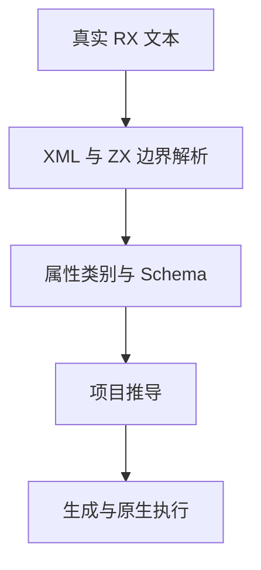
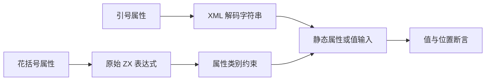

# RX 新属性验证计划

## Intent：最终目标

验证 52c7f0b5 引入的字符串属性与 ZX 表达式属性分离，确保花括号边界、静态属性限制、源码位置、真实执行及扩展名省略契约正确，迁移没有改变原有流程含义。

## Data：可用证据

依据同日 RX属性值参考、RX开发约定、frontend.attribute/template、dsl XML AST 与 RX attribute_kind。参考成熟的 rx/text、rx/inference、rx/runtime 测试，通过真实文本而非手造 AST 验证。

## Edges：边界与限制

XML 字符串仍执行实体解码和空白规范化，ZX 表达式保留原始文本。字符串中的 $in 不读取输入；花括号不是动态模块路径许可。解析成功不代表表达式或项目可执行；Emit 只验证语法，不推断事件运行时已实现。不修改生产源码，发现问题由指定实现会话处理。

## Answer：交付格式与成功标准

按解析、属性契约、位置与资源、实际执行分组建立测试。每项失败保留并定位根因。Debug 与 ReleaseSafe 验证新套件并运行相关既有迁移回归；中文执行记录包含自审。每个完成部分提交推送。

## 固定覆盖

- 70 条解析案例：原始表达式、嵌套对象与模板、字符串中的分隔符、注释、CRLF、XML 实体解码及畸形边界。
- 78 条属性契约案例：23 个静态字符串位置、4 个必须花括号的位置，各验证接受与拒绝；6 个值属性各验证引号非空/空字符串与两种表达式。
- 所有 148 条原生案例都逐个注入分配失败；成功解析结果在覆盖原输入缓冲区后核对值、位置与释放。
- 26 个真实 RX 应用执行 55 次固定断言，按 literals、expressions、flows、functions、services 组织。
- 另有 6 条真实 CLI 编译拒绝案例，验证空表达式、仅空白表达式、旧引号数字/输入写法及表达式内 XML 实体不被误接受。
- 既有文本/推导 258 项及原生执行 875 项用于迁移回归，不计入新增案例数。
