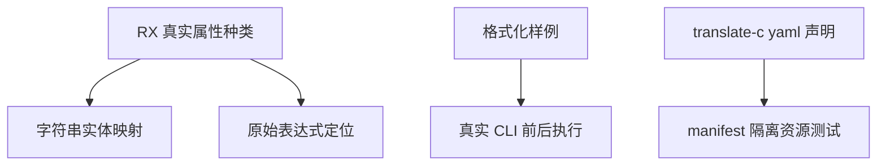

# RX 样例与隔离构建修复记录

## Intent：最终目标

修复全量回归暴露的三处测试迁移遗漏，使已有断言继续检查真实行为，而不是在不匹配的输入或构建依赖上失败。全量回归仍在进行，本阶段只交付已独立复验的测试修复。

## Data：可用证据

- XML 位置测试把源码改为原始表达式后，仍搜索 `&#109;issing`、`&#49;` 等旧实体 marker，触发 MissingMarker；实体边界测试对不存在的实体执行可空解包，导致崩溃。
- RX 格式化运行样例仍写 `in="$in"` 和 `value="ctx.value"`，在新语法下这是字符串字面量，无法作为 u8 的运行输入。
- manifest 资源测试复制了使用 `@import("yaml")` 的新源码，却没有注册 CLI 已经提供的 translate-c 声明模块，测试无法编译。

修复后 `zig build test-xml-expression` 退出 0。使用真实 Z3 路径执行 `zig build test-rx-formatting test-package-manifest-resources -j2` 退出 0；格式化前后真实 CLI 执行结果一致，manifest 资源门禁通过。日志分别为 `测试包全量回归/XML位置修复.log` 和 `测试包全量回归/样例与构建修复.log`。

## Edges：边界与限制

- 十进制、十六进制和换行实体放在真正的引号字符串属性中，检查其 IR span 映射；原始表达式仍检查 name/syntax 诊断位置，不恢复旧的引号表达式行为。
- CR、LF、CRLF 样例恢复实际换行，保留独立场景；数值和字符串表达式 marker 对应实际原始字节，EOF 指向闭合花括号。
- 多字节实体的内部起止映射继续逐字节验证，不删除边界断言或可空检查。
- manifest 测试按现有 CLI 构建方式添加 translate-c 的 yaml 模块，保留原静态库和资源检查。
- 没有修改生产代码，没有放宽所有权 OOM 检查。其余分配次数不确定性及读取上限回归由各自调查继续处理。

## Answer：交付格式与成功标准

本阶段仅提交三处测试代码和执行记录，附已结束的定向日志；仍在写入的总入口日志不随本次提交冻结。后续使用正确 Z3 环境变量完成全量复验。

## 自我批判

不能将旧实体 marker 简单换成任意可找到的字符。修复先区分字符串属性与表达式属性，再恢复各自对应的输入和断言。修改过程中曾发现 LF 样例被批量替换连带改成实体样例，已在差异自审中纠正并重新执行门禁。首轮全量遗漏 Z3 环境变量导致的 FileNotFound 属于运行配置失误，未报告为生产缺陷。
