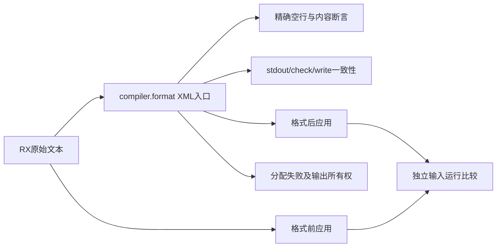
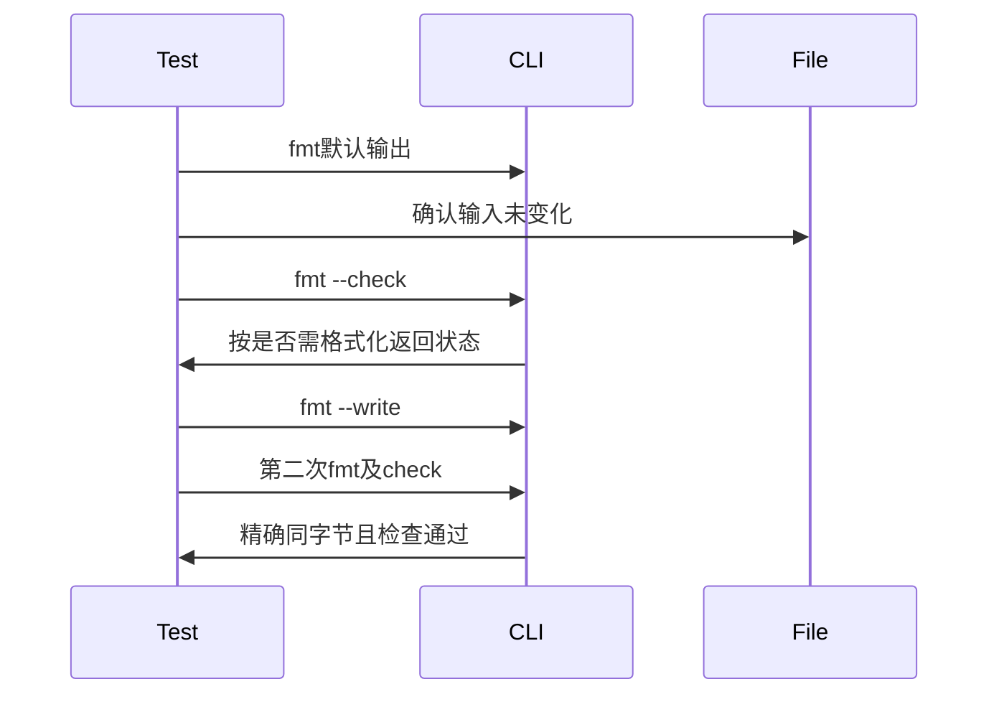

# RX格式化入口验证

## Intent：最终目标

阶段三百七十一：对5cd83672新增的RX格式化建立CLI与库层回归，验证空行规则、原始内容保留、幂等性、失败保护及分配失败清理。

## Data：可用证据

实际公开命令是zxc fmt，而不是lint子命令。compiler.format按.rx后缀使用XML解析；支持普通Module、Store、Gateway以及XML合法但RX语义未成立的文档。fmt默认stdout、--check只检查、--write才写入；不支持--out或--project。

## Edges：边界与限制

只新增测试及构建入口。格式器只调整已有换行中的空白，不重缩进、不重排属性、不拆同一物理行的标签，也不承担Schema、依赖或类型校验。预期字符串独立显式编写，同时覆盖LF与CRLF。XML错误应有位置诊断且不能修改原文件。使用真实RX应用构建前后执行比较，不以格式成功替代语义验证。

## Answer：交付与成功标准

按形状、嵌套、注释、实体、引号、CDATA、混合文本和特殊RX后缀分类验证精确输出；各例检查默认输出不写入、check前后状态、write结果与二次幂等性。CLI无效参数、XML失败保持输入字节。库层遍历分配失败，并在输入释放后读取输出以验证所有权。真实应用格式化前后执行一致。

## 自我复核

不能通过删除所有空白来宣称语义保留，属性值、注释与CDATA中的空白可能有意义。测试要求精确输出，且真实应用另行编译运行。格式化允许语义未完成的输入，不把其接受视为语义检查漏洞。CLI边界以实际参数契约为准，--out只测拒绝，不虚构不存在的输出路径模式。

## 实施记录

新增tests/formatting/rx，按输入表、CLI驱动、运行比较和分配失败职责分文件，注册test-rx-formatting接入根测试。16类文本逐一覆盖LF与CRLF，共32项：同形元素收紧、异形元素分隔、不同属性名与顺序、多行嵌套首尾空行、同行标签、独立与尾随注释、引号/实体/中文/大于号、CDATA、混合文本、多行属性、空根、单标签根、Store与Gateway后缀。

每项运行默认fmt、原文check、write、再次默认fmt和clean check，逐字比较输入及输出。所有正常格式用例旁放置故意损坏的pkg.yaml，仍应格式化成功，证明不误入项目清单与语义装载路径。未知标签、缺失服务和不完整Store语义只作为“XML格式化不要求Schema通过”的边界，不能宣称对应应用可以运行。

5种XML错误分别经过默认、check、write，共15项，要求syntax位置诊断、无stdout且输入不变；5种不允许的参数组合要求退出1，输入及预先存在的saved.rx保持原字节。实际参数错误退出码为1，--out没有受支持的格式化输出模式。

独立运行用例用真正的Call.fn与Return编排identity ZX函数，在格式化前后分别使用--no-cache构建应用，输入0、1、127、255各执行一次；结果既与输入独立预期比较，也跨两个应用比较。确认格式化确实改变了源文件空行。

库层两项checkAllAllocationFailures分别遍历复杂合法XML与不匹配闭合标签。主动释放原输入后才读取完整格式化输出及XML诊断文本，并对合法输出再次格式化检查幂等性；验证输出所有权和每个分配失败点的资源释放。

初次启动命令中的一段补丁脚本用了错误工作目录而报告FileNotFound；已在CLI测试运行前从正确路径应用退出码修正，该错误不是生产缺陷。首轮专项已全部通过；自我复核后补强check诊断和输入释放后的诊断全文断言，再执行最终专项。

## 最终验证结果

| 检查                | 实测结果                                            |
| ------------------- | --------------------------------------------------- |
| test-rx-formatting  | 13/13构建步骤通过                                   |
| CLI文本与拒绝测试   | 52/52 Node项通过：32正常格式、15 XML错误、5参数错误 |
| 真实运行比较        | 1/1 Node项通过：2次应用构建、8次执行                |
| Node合计            | 53/53通过                                           |
| Zig内存测试         | 2/2通过，2项完整分配失败遍历                        |
| @zxc/test typecheck | 退出码0                                             |
| 格式与diff检查      | 通过                                                |

最终专项退出码0，基线5cd83672。没有发现生产缺陷，未向实现聊天发送消息。本轮未修改生产代码，未执行根目录全量回归；JSONL用例和Test262审阅数量不变。输入表与完整测试代码副本、机器可读结果保存在RX格式化测试草稿，日志本地忽略。

剩余边界：本轮运行比较是普通RX模块，不是Store/Gateway运行验证；未穷举全部XML词法、所有嵌套深度或并发文件修改。LF/CRLF是同一语义场景的换行维度，不计入Test262新增语义条目。格式成功不能替代RX结构、依赖与类型校验。
