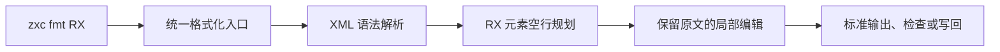
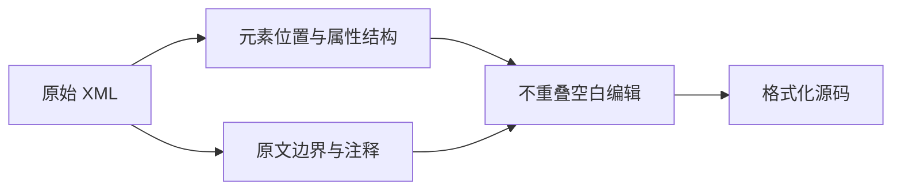

# RX 源码格式化接入

## Intent：最终目标

让 `zxc fmt` 接受普通 RX、Store 和 Gateway 源文件，支持输出、检查和写回。落实 lint 对 RX 的职责；不以格式化成功代替 Schema、依赖、类型或执行验证。

## Data：可用证据

当前 CLI 在 RX 编译入口直接拒绝 formatting；compiler.format 只调用 ZX 解析。lint 已通过 AST 规划 ZX 空行编辑并保留原始词法内容。dsl.parseXml 提供带真实源码偏移的元素和属性，但忽略注释、不提供闭合标签偏移。

同职责实现采用 lint/source.zig、spacing.zig；CLI 沿用已有 fmt 的结果输出、--check、--write 行为。RX 格式化只需要 XML 语法解析，不需要装载业务依赖。

## Edges：边界与限制

不新增 XML 语法解析器，先使用 dsl 的真实解析结果。lint 根据实际元素及原文确定完整节点边界，扫描时跳过带引号属性、注释及 CDATA，避免把表达式中的符号当标签。只编辑元素间可忽略的空行；保留属性、引号、注释正文、实体、文本、CDATA、缩进及换行类型。与既有 ZX formatter 一样，不承担完整缩进或行宽重排。

同层跨行元素或不同结构元素之间保留一个空行；同结构单行元素紧凑排列。元素内部首尾去除多余空行。包含非空白文本的父节点保持自己的间隔，避免改变混合文本语义。格式化不要求 Schema、类型和命名正确。无效 XML 不写回。此阶段不把新空行规则强制加入 RX 构建门禁。

不新增测试，不运行全量测试，不调用浏览器。使用现有 RX 文件、实际 CLI 格式化及现有定向回归验证行为。

## Answer：交付与成功标准

格式规则归属 lint；compiler 负责 XML 解析及统一诊断；CLI 复用 fmt 输出通路。验证重复格式化不再改变文本，保留所有业务属性与注释，语法失败不改写原文件，普通/Store/Gateway 都可独立格式化，依赖缺失不阻断格式化。完成后提交并推送。

## 自我复核

不能用 AST 重新序列化替代原文编辑，否则会丢失注释与实体写法。不能只按第一个大于号截取标签，因为表达式属性可能包含该字符。不能把格式化成功描述为整个 lint 功能完成，系统配置校验及完整 RX 检查仍需继续推进。

## 实施与验证结果

已接入 lint/rx 的元素规划与边界读取；既有 ZX 与新 RX 共用 spacing.boundary 的注释和换行处理。compiler.format 对 .rx 先调用 dsl.parseXml，CLI fmt 绕过项目装载和应用生成。格式化钩子与 ZX 一样跳过 RX，由正式 zxc fmt 维护其规则。

首轮构建发现 compiler 模块尚未直接导入 dsl；已在编译器构建依赖中显式注册，随后根构建 14/14 通过。已有 compiler integration_root 的格式化、命名及分配失败检查 5/5 通过，没有新增测试。

对当前仓库已跟踪的 210 个 RX 文件运行实际 fmt，210 个全部成功，160 个只发生空行变化；全部幂等，原文件均保持不变。普通模块、Store、Gateway 各取一个现有文件复制到本目录，未复制依赖，--write 后 --check 全部通过。已有 XML 解析测试中的 24 个非法输入经实际 fmt --write 均失败，原文件全部保持不变。执行记录见 [执行结果](RX格式化/执行结果.json)。

本轮没有验证完整 RX 名称、Schema、类型、所有配置格式或运行时检查，也没有以格式化样本替代这些范围。它们仍属于总体目标中的后续工作。
