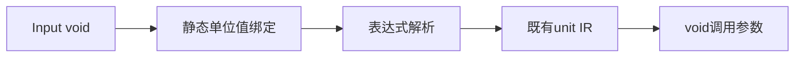
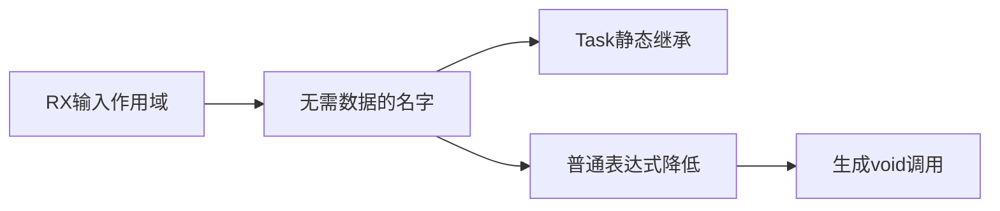

# RX 空输入单位值修复

## Intent：最终目标

修复真实 Process RX 入口反馈：Input=void 的 Call.fn/service 显式 in="$in" 应能传递单位值，而不是未知名字。

## Data：可用证据

测试会话提供 packages/test 的 test-process-entry 定向目标。module_compile 与 program.lower 都省略 void 环境绑定，frontend.expression_binding 又明确禁止 void 普通绑定。直接将 void 塞入环境元组会破坏既有类型约束。

## Edges：边界与限制

增加独立编译期单位值绑定，不生成普通符号或环境元组字段。表达式名称解析时降低为既有 unit IR，支持嵌套表达式中的同一语义；普通值绑定、对象或元组包含 void 的限制不变。RX 仅在真实模块 Input=void 时引入 $in 单位值，Parallel Task 继承该静态上下文，无运行时捕获。名字重叠与局部遮蔽仍按词法规则处理。

优先修复测试反馈，暂缓 Gateway 后续接入。仅运行用户测试会话提供的目标，不新建测试、不全量回归。

## Answer：交付与成功标准

编译期单位值绑定、RX 根与 Task 传递、代码草稿及定向回归结果。修复独立提交推送，不夹带未完成的 Gateway 工作。

## 自我复核

不能仅按某个夹具或字符串文本改写；单位值是语言语义，必须经过 AST 名称匹配与作用域判断。模型不应引入隐藏运行时环境字段。

## 实际验证

在 packages/test 执行 `zig build test-process-entry -j4`，46 项全部通过。原先失败的 workflow.rx void Call.fn、service.rx void Call.service，以及 state.rx 均通过 default/json/discard 入口行为检查。没有修改测试夹具，没有新增测试或运行全量测试。首次在仓库根调用同名 target 被构建器拒绝为不存在，改到正确子包后执行成功。
