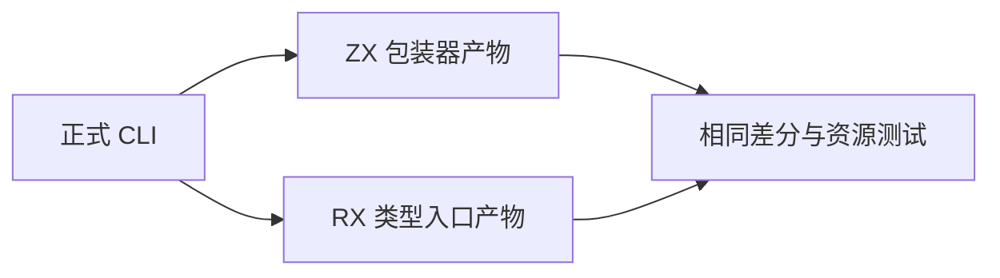
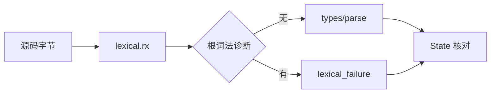

# RX 类型入口回归

## Intent

让当前类型差分与资源检查同时覆盖直接 ZX 包装器和正式 parser/type.rx 编排入口，验证词法阶段、诊断分支和类型结果传递。

## Data

e35f7d6d 新增 lexical.rx、parser/type.rx 及模板 token 流准备。完整生产 parser 仍为 Zig。现有 test-type-parser 已覆盖 408 条语料、23550 次短序列比较及三个逐分配失败测试，可复用同一观察标准验证新入口。

## Edges

只修改测试构建注册，复用原断言，不复制生产编排。RX 与 ZX 仍是同一模块内部层次，两路均由正式 CLI 生成普通 Zig。此处验证 RX 类型入口返回的 State，不宣称 Prepared 中每个模板分段、插值流或性能已全部覆盖。固定检出全量任务不变。

## Answer

增加 rx 路由生成，跟踪 lexical.rx、type.rx、lexer、types 与 templates 的源码依赖。两路各执行完整语料、短序列和资源测试，在 Debug、ReleaseSafe 下记录结果；检查生成物仍只依赖标准库。发现真实缺陷再向实现会话报告。

