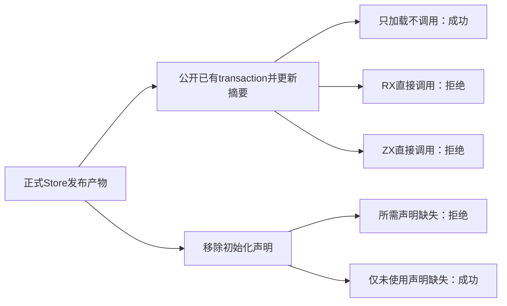
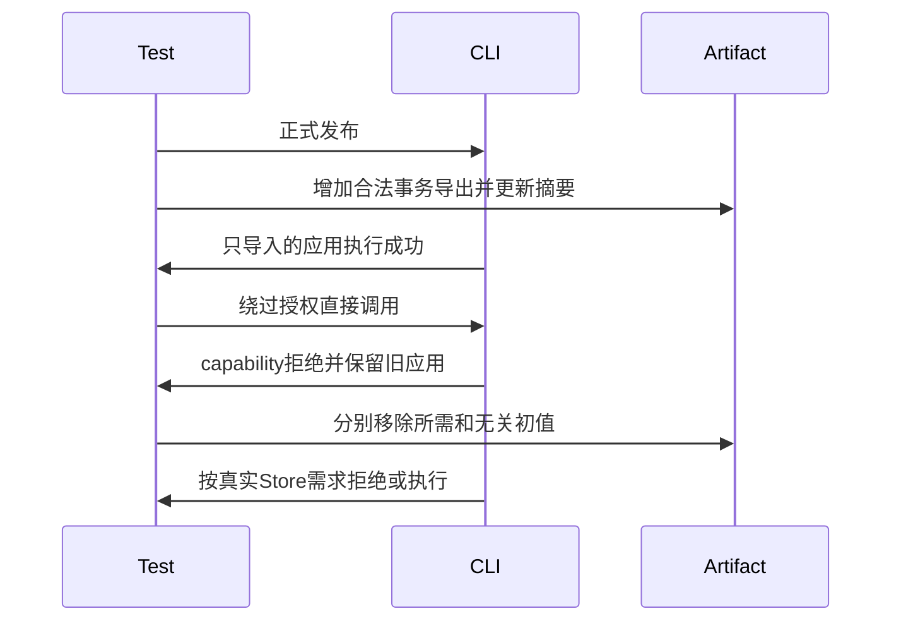

# RX编译库事务与初始化权限验证

## Intent：最终目标

阶段三百六十七：验证编译库公开导出并不授予裸Store事务权限，以及应用必须具有所需初始化声明，不能自动使用零初值或要求无关Store的初值。

## Data：可用证据

Call.module明确仅允许带Store的orchestration，拒绝transaction；普通ZX函数调用同样需要显式授权。旧显式宿主库允许没有初始化表，但自动应用宿主对实际使用的Store要求初始化声明。已有用例分别证明合法RX调用和编码兼容，尚缺CLI入口组合边界。

## Edges：边界与限制

只修改测试。先正式发布真实Store库，再在临时副本中选择已有transaction函数，增加与原签名一致的编码导出和包清单导出，并重新计算摘要。不是伪造损坏摘要来触发无关错误。测试只针对CLI读取编码图的入口，不声称手工增加了对应Zig公开源码入口。加载成功不等于有调用权限。

## Answer：交付与成功标准

未调用的普通ZX导入先成功构建执行，证明修改后的编码产物可加载；随后RX和ZX调用裸事务必须明确拒绝，保持旧应用可执行。源码包不得冒充编译模块。移除全部或所需counter初值时，未调用导入仍可生成代码，但自动Store应用应报MissingInitializer；只移除未使用settings初值应正常运行。恢复完整声明后再次运行。

## 自我复核

必须先证明编码图可被正常加载，否则权限反例可能只是格式损坏。缺初值的旧库不能在解码阶段一律拒绝，应用层仍需区分实际使用的槽位。反例既检查诊断，也检查旧应用字节和实际执行结果。

## 实施与验证结果

新增test-library-rx-boundary并接入统一库发布回归。store_artifact助手先核验原始v2摘要，从真实函数表选择带Store的transaction，按原函数索引、源路径和Input/Output类型建立raw导出；每次修改后重算完整JSON摘要。没有硬编码函数索引或类型编号。

未调用raw的ZX应用成功构建并输出37，证明该编码图与包导出可以加载。RX调用raw报告需要显式授权的RX模块；普通ZX调用raw报告需要显式授权的orchestration Call。另验证声明过的源码包依旧不能用于Call.module，避免把“存在依赖”等同于“是编译模块”。

移除全部初值或只移除counter初值时，未调用导入仍能生成Zig代码，证明旧显式宿主库的无初值编码继续有效；真正调用read的自动应用均报MissingInitializer。保留counter而移除settings时应用正常输出3，恢复全部声明后同样输出3。

| 验证                     | 实测结果                            |
| ------------------------ | ----------------------------------- |
| test-library-rx-boundary | 10/10构建步骤，8/8 Node测试项通过   |
| Node计数                 | 1项父测试、7项独立子测试            |
| 正式库发布               | 1次成功                             |
| 应用构建                 | 3次成功、5次预期拒绝                |
| 编码加载检查             | 缺初值时2次独立Zig生成成功          |
| 应用执行                 | 8次成功，含每次拒绝后旧应用仍输出37 |
| @zxc/test typecheck      | 退出码0                             |
| 格式与diff检查           | 通过                                |

本轮没有发现生产缺陷，未向实现聊天发送消息。基线18d97c88；未执行根目录完整回归，不增加JSONL目录或Test262审阅数量。本文验证合法图与权限边界，不将摘要视为来源签名或可信代码认证，也不声称覆盖所有恶意IR形态。

提交前实现聊天已推进至fbe78546（直接验证和重建编译清单）；本轮未针对该新入口验证，不将上述结果扩展为其通过证据。

完整测试与共享Store源码副本、机器可读结果保存在RX编译库权限测试草稿，原始日志本地忽略。计划、证据、边界、验收和自我复核均按IDEA记录，整体目标仍未完成。
