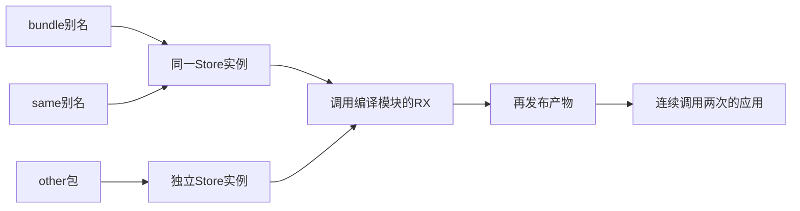
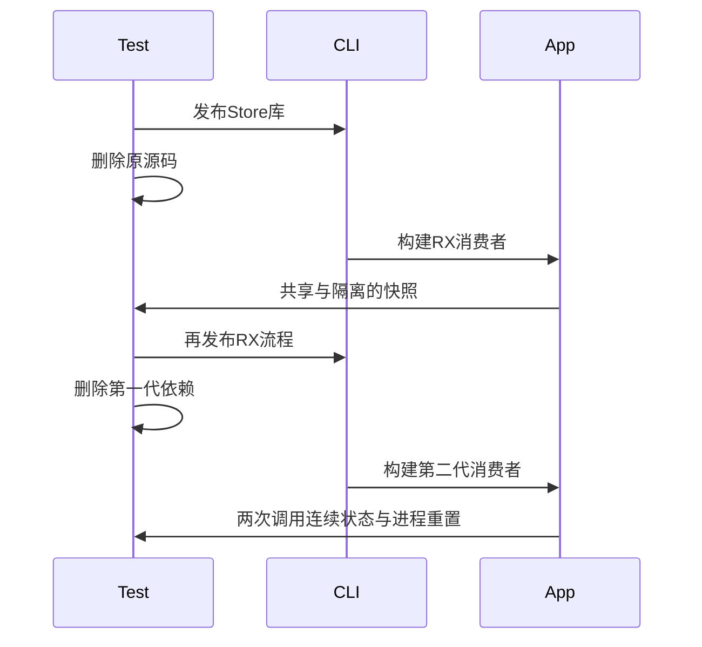

# RX编译库共享状态与再发布验证

## Intent：最终目标

阶段三百六十六：验证05abf8ff的Call.module真实应用链路，在没有库源码的条件下保持同实例共享、不同实例隔离、旧快照与跨层再次发布状态。

## Data：可用证据

RX公开契约允许Call.module调用声明依赖的编译公开模块；void Input可省略in，非void不得省略。Store orchestration沿用库内授权，调用者不能附加setter。上一阶段只执行了生成初始化模块与显式Zig宿主，没有执行此入口。

## Edges：边界与限制

仅改测试。复用正式Store发布fixture，应用通过CLI生成宿主，不手写状态存储。两个别名指向同一workspace包，另一个包以独立名称和路径持有同一产物副本。普通CLI每次进程独立初始化，跨进程不会持久化。本轮不把check-rx成功当作完整类型与能力检查。

## Answer：交付与成功标准

发布带快照入口的Store库并删除原源码；RX以两个别名读写同一实例，再操作另一个实例，核对完整value/history快照。再发布RX，删去第一代所有输入，由第二代应用连续调用两次，断言初值只在进程启动时生效。反例逐项核对诊断并确认既有可执行产物不被覆盖。专项通过后提交push。

## 自我复核

只检查数值会漏掉历史列表被覆写的别名问题；返回更新前后完整快照。两个包内容相同不代表实例相同。验证既要看到同别名更新互通，也要确认不同实例不会污染。缺少输入、目标无权限等反例必须在build层拒绝。

## 实施结果

复用上一阶段Store源码并新增snapshot公开RX入口，返回value/history完整只读快照；另增加纯类型公开入口用于拒绝检查。两个产物副本分别作为bundle与other包，same通过workspace:bundle@*指向bundle同一实例。

消费者先保存两个实例的初始快照，分别经same与bundle更新同一counter，再更新other。四组输入为{0,0}、{1,2}、{4,0}、{3,7}，检查首实例两次更新、第二实例一次更新及各自旧列表快照。零增量仍检查history变化，避免数值未变掩盖调用漏执行。

RX消费者再次发布后，删除其源工程及两个第一代依赖，仅将第二代产物放入最终工程。最终RX连续调用relay两次，第一实例累计四次history更新，第二实例累计两次；每次独立启动应用的初始快照仍为3/[8]。所有应用在独立运行目录执行，运行目录保持空，不生成状态文件。

## 验证结果

| 验证                     | 实测结果                                      |
| ------------------------ | --------------------------------------------- |
| test-library-rx-compiled | 10/10构建步骤，17/17 Node测试项通过           |
| 正例                     | 8个子测试，对应2次应用构建、8次进程执行       |
| 反例                     | 8个子测试，均拒绝且完整保留已有可执行文件字节 |
| 父测试                   | 1项，负责两次发布、搬迁和清理                 |
| @zxc/test typecheck      | 退出码0                                       |
| 格式与diff               | 通过                                          |

反例分别为非void省略输入、调用纯类型模块、引用未公开源码路径、依赖未声明、module与fn同时存在、module与service同时存在、module附加setter、参数类型不匹配。普通ZX越权与裸事务调用的其他边界不包含在这八项中。

首轮所有正例通过，仅未公开源码路径的诊断措辞断言不符。实际解析表只登记公开依赖目标，因此bundle/snapshot.rx报告“ZX package is not declared in the project dependencies”；修改为准确断言后完整重跑通过，拒绝行为始终正确，不报为生产缺陷。

本轮未发现新生产问题，未向实现聊天发送消息。基线0cfb8983，能力实现来自05abf8ff。未执行根目录完整回归，不增加JSONL目录与Test262审阅数量；现有73,894目录案例和2,187条审阅不因Node集成测试增加。

执行计划与结果按IDEA记录；正式源码副本、共享Store输入副本和机器可读结果位于RX编译库调用测试草稿，原始日志本地忽略。完整Test262与ZX全特性目标仍未完成。
