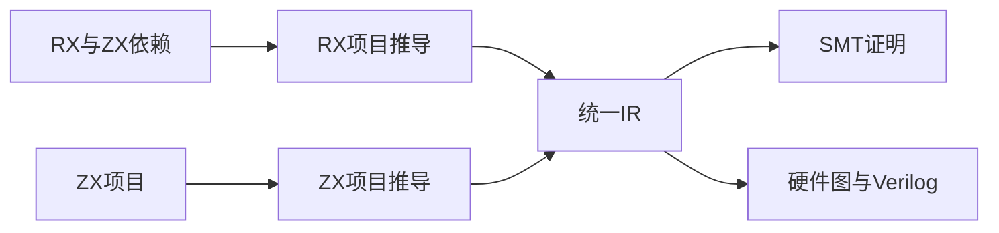
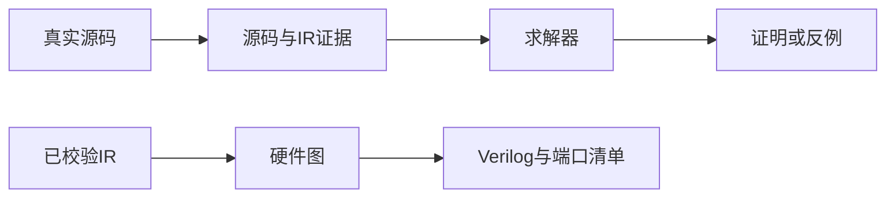

# RX 证明与硬件入口实施计划

## Intent：最终目标

让 RX 的静态流程进入既有统一 IR 证明与硬件生成链路，消除 CLI 对文件后缀的整类拒绝。支持范围由实际语义决定，保留不支持 Store、动态数据等能力的明确诊断。

## Data：可用证据

RX analyze 已完成模块联结、类型推导和统一 IR 构造。现有 verification.check 校验 IR 并生成 SMT、源码证据、求解结果与反例。现有 FPGA 入口在 ZX 分析之后完成证明门禁、硬件图与 Verilog 输出；其后半段可直接复用。

## Edges：边界与限制

不把入口接通等同于一般形式化证明或完整 FPGA 支持。不增加运行库，不绕过证明门禁，不新增测试用例、不运行全量测试。新增可复制的使用示例，并复用既有 RX 项目核验反例与不支持语义的失败结果。源证据应包含真实 RX 文本及其 ZX 依赖，不能只记录生成 IR 后宣称输入可追溯。

## Answer：实现与成功标准

CLI RX 分析完成后，verify 调用统一证明接口，fpga 调用既有硬件生成流程。ZX 继续使用同一流程。RX 文本在推导完成后加入证据集合，不送入 ZX 解析器。fmt 和 lib 保持原有明确边界，后续分别实现。

## 自我复核

不能仅移除模式保护；必须复用既有行为、验证结果文件与失败传播，并核对纯函数边界。当前已有真实求解与生成结果，不把源码生成成功扩张为硬件行为已通过仿真。

## 执行结果

仓库构建 14/14 步骤通过。布尔分支使用示例通过 Z3 5.1.0：前提 sat、正确性 unsat。生成组合与时钟握手 Verilog，端口清单分别标识 enabled、value 和输出；源码证据保留 read.zx 与 main.rx 原文。

已有 double.rx 的 i64 乘法返回溢出反例，入口退出 1；带求解器的 FPGA 生成同样退出 1 且未生成目标文件。已有 Store 项目的 verify 与 fpga 都返回纯函数模型限制。ZX 直接函数的 FPGA 入口仍成功生成。详见 [执行结果](RX证明与硬件入口/执行结果.json)及 [使用参考](RX证明与硬件参考.md)。

本轮未新增测试用例、未运行全量测试，未使用浏览器。未安装仿真器或进行硬件仿真，因此不宣称上板、时序或握手行为已在本轮实际验证。实现范围为 3 个 CLI 源码文件，证明与硬件后端语义保持复用。

同一使用示例还完成原生应用构建，enabled 为 true/false、value 为 42 时分别输出 42/0，确认补入 RX 源证据后应用构建继续可用。
