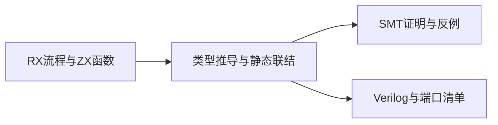
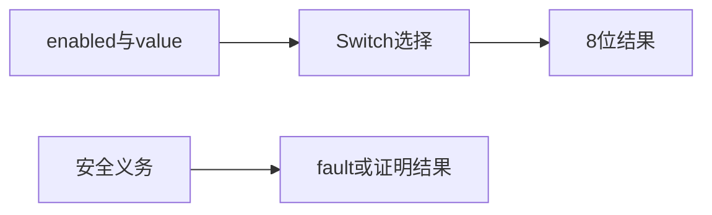

# RX 证明与硬件参考

## Intent：用途

对 RX 描述的静态纯计算流程进行安全义务证明，或生成可综合的 Verilog 源码。RX 负责流程组合，ZX 函数负责具体计算；两者联结后使用同一类型与 IR。

## Data：输入与输出

[完整示例](RX证明与硬件入口/示例/main.rx)读取 `{ enabled: bool, value: u8 }`，enabled 为真时返回 value，否则返回 0。示例包含 Call、Task、Switch 和 Return。

在安装好 zxc 与 Z3 后运行：

```sh
zxc verify main.rx --solver /path/to/z3 --out build/main.smt2

zxc fpga main.rx --out build/main.v

zxc fpga main.rx --clocked --out build/main_clocked.v
```

`main.rx` 与 [read.zx](RX证明与硬件入口/示例/read.zx)放在同一目录。`--project pkg.yaml` 沿用应用构建的项目装载规则。

证明成功退出 0，反例、不支持的语义或求解失败退出非零。输出包括正确性查询、前提查询、源码及 IR 证据、求解器版本、求解结果和反例模型。未提供 `--solver` 时使用 PATH 中的 z3。

硬件输出包括 Verilog 与同名 `.json` 端口及图清单。输入名称为 input_N，具体字段路径和位宽以清单为准。组合模式的 fault 为真时输出数据无效；时钟模式使用 input_valid/input_ready 和 output_valid/output_ready 握手，同步高电平 reset，输出等待消费时保持稳定。

## Edges：支持边界

当前符号模型支持布尔、定宽整数及其静态对象、元组。Store 共享内存、动态列表、字符串、原生 I/O 等不属于当前纯计算硬件与证明模型，遇到不支持语义时明确失败。RX 语法通过不代表模型一定支持。

没有业务契约时，verify 证明受支持的安全义务，不自动证明业务意图。普通 fpga 可以生成携带 fault 的硬件；含形式化契约或显式传入 `--solver` 时先通过证明门禁。证明失败时本次不生成硬件；输出路径中此前存在的文件仍由使用者根据命令退出状态判断是否有效。

本轮已验证证明、反例、门禁、端口清单及组合/时钟源码生成，未进行 Verilog 仿真、综合时序评估或上板验证。

## Answer：如何判断成功

先检查命令退出状态，再检查 SMT 结果或硬件清单。示例证明结果为前提 sat、正确性 unsat；输出硬件包含 1 位 enabled、8 位 value 和 8 位结果。跨进程执行记录及边界说明见 [实施记录](RX证明与硬件入口实施计划.md)。




