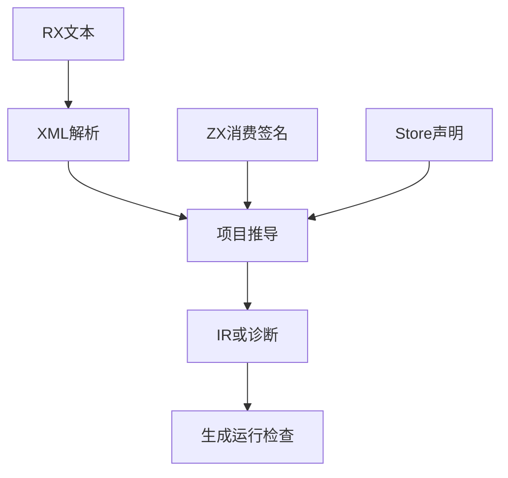
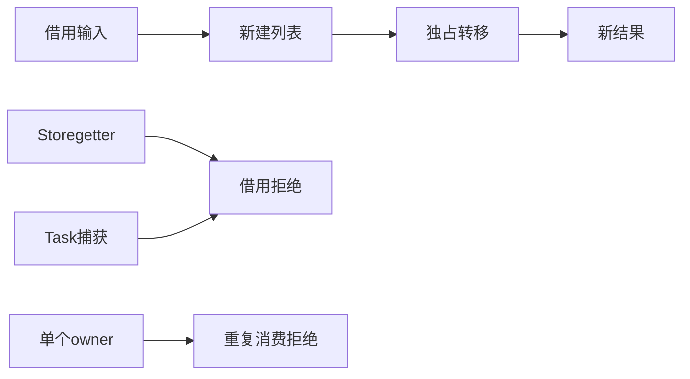

# RX 输入消费验证计划

## Intent：最终目标

第 387 部分：验证显式 owned Input 在 RX 顺序调用、Task、Parallel 和 Store 借用边界中的传播，防止借用值或共享捕获被当作独占值消费。

## Data：可用证据

实现基于 b674fa5f；前两部分已经覆盖 ZX 直接调用和库重发布。成熟参考为 tests/rx/inference/parallel/check.zig、capture_ownership_test.zig 和 rx_parallel_runtime 构建入口。已阅读 RX 开发约定和模块说明。

## Edges：边界与限制

只写测试与文档，生产缺陷报告指定会话。RX 输入默认借用，Store getter 和 Task 捕获不因调用 owned 函数而升级归属。并行分支应拥有独立输入；不允许一次 owner 转移到两个并行调用。编译分析通过不替代实际生成执行。

## Answer：交付格式与成功标准

在既有 RX 推导测试入口中添加分组案例、精确诊断位置与 OOM 遍历，再对合法顺序和并行输入执行真实生成 Zig 检查。通过相应测试后记录自我复核，提交并 push。





## 执行与自我复核

### 交付范围

新增推导用例放在 tests/rx/inference/parallel/owned_input，已有检查器增加可选 ZX 源码及编译库配置。新增运行示例放在 tests/rx/runtime/parallel/fixtures/owned，复用既有 parallel_compile 驱动与库归档/消费链路，不修改生产实现。

- 推导新增 27 项：顺序转移、借用入口、旧绑定、丢弃返回值、独立并行 owner、重复转移、借用与消费混用的两种顺序、Task 捕获与局部 owner、Store getter/复制/发布、公开 owned ZX 编译模块，以及四个分配失败遍历。
- 运行时新增 252 项组合：直接 ZX 调用、Task 内调用、RX service 调用、Call.module 公开 owned ZX 函数四种流程，各经过九条源码/库路径，每条执行七项结果与资源检查。
- 九条路径是 source、forward、reverse、rx_forward、rx_reverse、zx_forward、zx_reverse、republish_forward、republish_reverse，复用已有路径含义，覆盖别名和出口顺序变化。
- 每条运行路径检查空列表、单元素、重复/零、最大 u64、257 元素、后续请求不覆盖旧结果、所有底层分配失败。逐元素确认两个输出均正确逆序，并检查独立存储、借用输入保持及入口 consumes_input=false。
- 合计新增 279 项；运行时矩阵按实际编译和执行组合计数，不将构建模式或 OOM 内部迭代次数累加为新用例。

### 实际验证

在 packages/test 执行：

```sh
zig build test-rx-owned-runtime test-rx-parallel-inference -j4 --summary all
zig build test-rx-owned-runtime test-rx-parallel-inference -Doptimize=ReleaseSafe -j4 --summary all
zig build test-rx-parallel-runtime -j4 --summary all
```

- 首批推导 96/96 通过；三种流程运行加入后合并 285/285 通过。
- 增加公开编译函数调用后，两种模式均为 216/216 构建步骤、353/353 测试通过。其中运行时 252 项，推导 101 项。
- 最后增加并行借用/消费混用的两个拒绝检查，仅重跑受到改动的推导入口，两种模式均为 4/4 步骤、103/103 通过。最终受检范围为运行时 252 项与推导 103 项，合计 355 项，含既有推导 76 项。
- 共享编译驱动的既有源流程回归为 91/91 步骤、103/103 测试通过，其中与本部分重叠的 28 项运行测试不重复累计。
- Zig 格式与本次 diff 检查通过。未发现新的生产缺陷，因此未向实现会话发送消息。

### 自我复核与边界

这里覆盖真实 XML 解析和完整项目推导，拒绝检查同时核对诊断代码、文件、偏移、行列；运行时通过真实 genz 生成并编译执行，未用手写 IR 或文本快照代替行为证据。

Task 捕获保持借用，不因为父层原来拥有独占值就允许 Task 消费。并行读取同一列表的工作函数也会阻止另一个分支消费它，两种排列均拒绝，避免只检查重复消费而漏掉读写冲突。

Store 相关用例在本部分属于推导检查，不声称已验证 owned setter 的完整 Request 生命周期。线程调度次数、一般线程安全与任意数据规模不由有限样例证明。公开编译 ZX 函数的推导测试确实经历库编码/解码；运行库矩阵进一步覆盖 RX 流程归档、链接、消费和再发布。

运行期间实现会话正新增进程能力参数，compiler/core/genz/cli 有并行改动，因此不将结果描述为整段时间固定的干净 HEAD。记录时 HEAD、生产状态及关键消费实现指纹见执行结果.json；本部分提交仅含测试和文档。

下一部分优先验证已提交的显式 IO 同步子进程标准库，并关注实现会话新增的 argv/getEnv/cwd 与 Process 转发契约；Store owned setter 生命周期及持久缓存上下文边界继续保留为待办。整体 Test262 对齐仍未完成。
