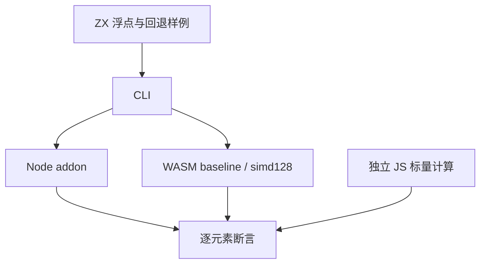
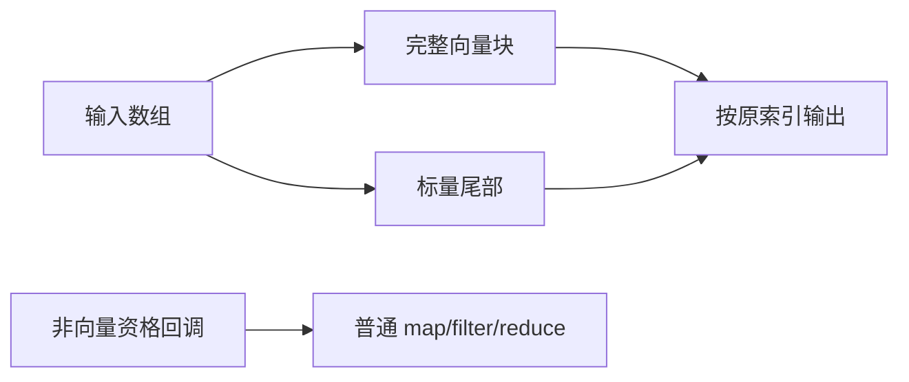

# SIMD 语义验证计划

## Intent：最终目标

验证 `b1982c15` 的浮点 map 向量化与通用 map 预分配，证明结果保持逐元素运算语义、尾部完整且标量回退正常。使用真实 Node/WASM 产物，不以生成源码或汇编存在代替运行结果。

## Data：可用证据

已读取 SIMD 参考、实施计划、`genz/src/zx/simd/{root,expression}.zig` 及 transform。向量资格仅限同类型 f32/f64、元素/常量/取负/四则；宽度由目标决定；其余回调保留标量循环，filter/reduce 保持原行为。现有 NAPI 与 WASM 测试宿主可直接复用。

## Edges：边界与限制

- 使用空数组及 1 至 33 的所有长度，再覆盖较长非整块长度；不假定某一目标一定使用固定宽度。
- f32 输入与每个算术节点分别舍入，f64 保持原表达式树；检查 NaN 类别、Infinity、负零和取消误差，不要求 NaN payload 相同。
- Node 通道承载全部浮点特殊值；WASM JSON 通道只发送有限且不会溢出的样例，分别运行 baseline 与 baseline+simd128。
- 补充条件 map、整数 map、嵌套 map、filter/reduce，检查未向量化路径及预分配后的结果次序。
- 汇编证据须定位生成应用计算函数，不借其他库中的向量指令宣称业务已向量化；不由指令存在推导性能提升。

## Answer：交付格式与成功标准

在 `packages/test/tests/targets/simd/` 保存样例与独立标量预期，新增 `test-simd-semantics` 入口。Debug、ReleaseSafe 实际运行，记录模式和场景计数；生产缺陷反馈指定实现会话；完成本部分后提交推送。

