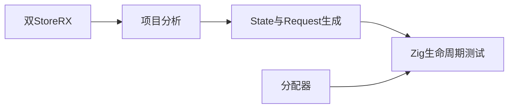
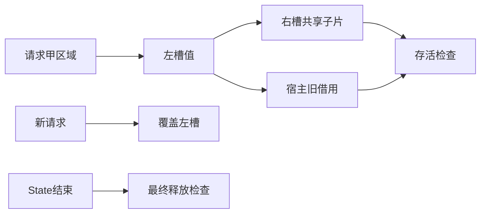

# Store 共享引用验证计划

## Intent：最终目标

为长期回收建立安全回归：原请求结束、原槽位覆盖后，仍被其他 Store 和宿主借用的切片必须保持有效。不得用错误释放换取表面的低内存。

## Data：可用证据

当前 HEAD 7b3d7e47。实现会话的 Store长期回收边界核对说明通用回收未实现；生成 Request 在首次成功提交登记整个 arena，State 最终释放。复用既有双 Store 真实 RX 编译产物，使用正式生成的 Request.commit、State 与 Request 生命周期。

## Edges：边界与限制

本阶段验证活引用安全与最终释放，不宣称长期有界回收完成。当前宿主允许保留裸输出到 State 结束，因此测试保持这个现有契约。跨 Store 共享由合法 borrowed 切片表达，不能把输入的外部临时内存冒充请求自有内存。

## Answer：交付与成功标准

独立 test-store-alias-lifetime，覆盖整片/子片/空片、跨请求转移、覆盖旧槽、同请求多次提交、请求重叠、无效提交和 OOM。Debug 与 ReleaseSafe 均实际编译宿主，最终用 DebugAllocator 观测释放。生成计划与记录后提交推送。

