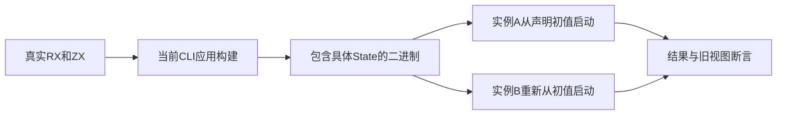
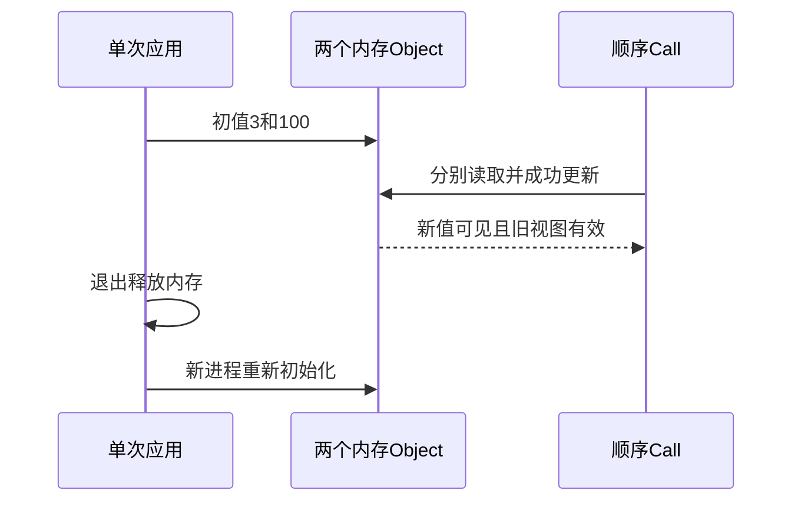

# Store 内存应用入口验证

## Intent：最终目标

阶段三百三十七：将当前53d70a68的应用共享内存Store语义接入真实CLI应用回归，验证同次运行内成功更新延续、别名及物理身份、旧读取视图、重启初值和无自动落盘。

## Data：可用证据

当前[Store设计](Store设计.md)明确排除磁盘持久化，53d70a68已撤除此前2cb8dc2的磁盘实现。初始进度更新误将旧实现当当前契约，读取最新设计后立即纠正，未构造任何跨进程恢复测试。复用既有dual真实RX/ZX夹具，两物理定义同显示名称，每次应用运行读旧值、分别更新、再读新值。

## Edges：边界与限制

每次CLI启动是新实例。一个应用执行内两Object调用的状态变化应可见，独立进程不得沿用上次值。程序构建与运行工作目录分离，运行前后比较执行目录和项目树，区分编译缓存与应用自动落盘。

同一State的多次顶层请求、请求arena归属及并发回收需要另外验证；本轮原生CLI是单次请求入口，不将它扩大为长期服务器生命周期已完成。

## Answer：交付格式与成功标准

新增Node真实进程测试与test-rx-state-app入口，使用构建图的当前CLI生成独立二进制。逐个输入核对全部输出字段，复验重启及无磁盘状态副作用；类型和格式检查通过，无缺陷不通知实现聊天。

## 自我复核

不以旧磁盘方案的通过证据验收当前设计。目录对照发生在编译完成之后，避免将正常构建缓存误判成应用状态文件；运行目录含空格并与项目分离。跨进程测试断言重新初始化，与旧恢复语义相反。

## 验证结果

在packages/test运行`zig build test-rx-state-app --summary all`，10/10步骤成功，Node 8/8通过（1父测试及7子测试），无失败、取消或跳过。五个增量0、1、7、42、65535均核对左右Object、未更新右视图、前后历史数组及返回值。7、42、7交替启动时两次7输出完全一致，确认新进程不恢复上次应用值。

运行前后的整个临时目录文件内容摘要一致，执行目录仍为空；未将编译时创建的缓存视为状态副作用。真实源码通过当前CLI编译，使用生成State及生成初值模块，不用手写宿主替代应用入口。TypeScript类型、格式及diff检查通过。

首次构建接线误用了当前Zig不具备的目录监视方法，已改为七个实际夹具文件的显式依赖并保存失败日志。没有生产实现问题，无需通知实现聊天。JSONL73834与Test262计数不变；此项是新增独立Node真实进程组，未重跑完整根回归。

## 历史测试定位与下一边界

阶段330–333的begin测试验证显式宿主的可选钩子兼容及静态映射；当前默认生成内存State没有begin，不依赖外部刷新或磁盘读取，不能把那些测试当成默认Store需要刷新协议的证据。

本轮尚未验证同一State多次顶层调用、失败后继续调用、独立请求arena长期存储归属或并发调度。下一阶段优先验证生成State的连续使用和失败发布门禁；独立请求arena缺口仍属于实现边界，不用共用arena测试冒充完成。
