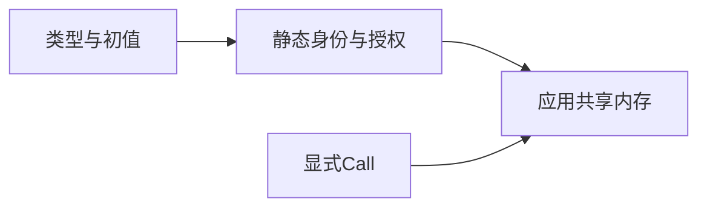
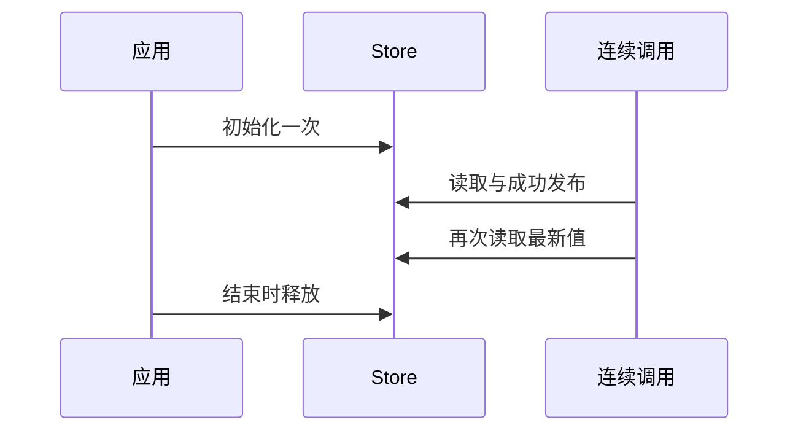

# Store 内存状态修正计划

## Intent：最终目标

落实 [Store设计](Store设计.md)：通过生成代码提供应用生命周期的共享内存，替代隐式全局变量，撤除错误的磁盘持久化机制。

## Data：可用证据

2cb8dc2 的 State 已绑定真实类型、初值模块、槽位和权限，但额外生成了文件锁、JSON、版本、恢复及目录同步。ed29b2ac 已撤回这套设计。本轮继续既有完整实现授权，修改相应源码，不新增测试用例或执行全量测试。

## Edges：边界与限制

保留文件路径加 Object 的编译期身份、共享 ABI、初值缓存和 Call 授权。文件身份只用于编译联结，不是数据文件路径。State 没有目录、I/O、磁盘版本和序列化限制。

当前 CLI 一次执行对应一次应用生命周期，使用同一个应用 arena。显式 Zig 消费方可以在同一 State 和 arena 下连续调用；输入及提交值必须覆盖 Store 和结果的使用期。后续长期请求入口仍需编译器落实存储归属，不能保存已释放请求 arena 的引用，不能以这次 CLI 接入声称所有长期入口已完成。

## Answer：实现与验收

生成具体 value_N 与稳定的 store_N 指针单元，应用启动时执行一次初值。commit 在所有权限和单 Object 门禁通过后替换单元中的值；旧对象不修改，旧借用在应用 arena 生命周期内有效。原生 CLI 恢复普通 JSON 输入约定，移除 --state-dir。State 不再提供磁盘刷新 begin，已有显式宿主接口的编译期可选钩子保留兼容。

复用既有 RX/ZX 项目验证同一 State 连续执行、旧值保留与新进程重新初始化。移除活动磁盘演示和记录，不把此前跨进程恢复作为成功标准。

## 自我复核

源码修正必须同时去除磁盘行为与错误的参数、缓存输入和文档，保留有效的编译期能力。共享状态不能退化为每 Call 新建实例；跨请求生命周期问题不能用深拷贝或未经要求的运行框架掩盖。

## 执行结果

正式生成器已撤除文件 I/O、磁盘版本、JSON 编解码、锁及恢复，删除独立 state/object.zig；缓存域改为 memory.v1。CLI 只接受普通 JSON 输入。生成 State 保持固定地址，初始化后不得按值搬迁，应用 arena 覆盖所有调用及旧值的使用期。

仓库 `zig build` 为 14/14 步骤通过。复用既有请求项目和消费程序，未新增测试用例、未运行全量测试、未使用浏览器。

| 执行方式             | 初始读取 | 最终值 |
| -------------------- | -------- | ------ |
| 同一实例，输入 1     | 3        | 5      |
| 同一实例，继续输入 7 | 5        | 19     |
| 新实例，输入 7       | 3        | 17     |

每次执行含两个更新 Call，旧 original 对象仍保留更新前值。生成器重复生成新增数为 0。原生 CLI 独立执行输入 1、7 分别返回 5、17，见 [原生应用结果](Store内存状态修正/原生应用结果.json)。连续调用记录位于 [运行结果](../2026-10-04/RX状态宿主/零运行时生成/运行结果.json)。

复现：先在 `docs/2026-10-04/RX状态宿主/初值演示` 执行 `zig build`，再从仓库根运行 `python3 docs/2026-10-04/RX状态宿主/零运行时演示/运行.py`。原生应用通过 `zig-out/bin/zxc build docs/2026-10-04/RX状态宿主/请求项目/main.rx --out docs/2026-10-05/Store内存状态修正/应用` 构建，以 JSON 数字参数执行。

原磁盘执行 JSON 标记为撤回的历史记录，生成器草稿和生成 State 同步为内存版本。长期服务的请求分配归属、旧值回收和并发调度仍不能从共用 arena 的演示推导为完成；此处没有加入深拷贝或通用运行库来掩盖这些边界。
