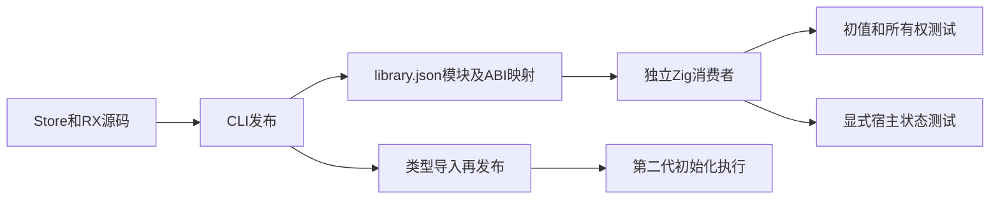
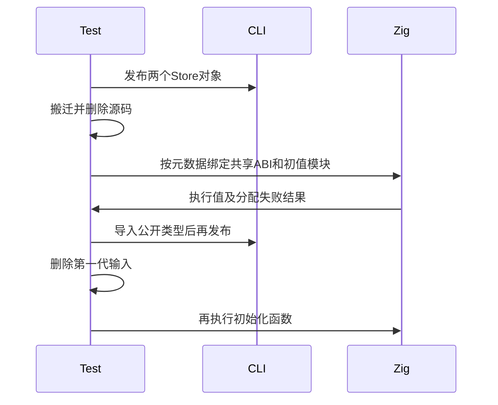

# Store初始化产物实际执行验证

## Intent：最终目标

阶段三百六十五：执行正式CLI生成的Store初始化函数，在发布搬迁及再次发布后验证实际初值、ABI一致性和内存所有权，补上仅检查IR保真的盲点。

## Data：可用证据

上一阶段26项API测试覆盖联结、编解码和导入边界，但没有执行生成初值函数。library.json已列出store_initializers的identity、schema_version、module_name、type_name；对应文件在generated_modules中，共享abi.zig。

## Edges：边界与限制

初始化模块属于生成模块，通过实际元数据装配Zig消费者，不假定它已作为b.dependency公开模块导出。不补写生产初始化逻辑。显式Zig宿主只负责持有状态与提交，不冒充CLI已实现RX编译库自动Store宿主。原生Store调用不执行纯函数solver证明。

## Answer：交付与成功标准

真实Store声明包含counter和settings两个Object，覆盖整数表达式、列表、字符串、布尔、空/非空可选值和嵌套列表。发布后移走产物并删除源码，再执行初始化值/独立arena/逐分配点失败测试，以及带真实初值的读写、快照和拒绝提交。纯类型导入第一代库并再发布，删除第一代库与包装源码，再执行第二代初始化函数。完成专项后提交push。

## 自我复核

不能从函数生成成功推断内存独立，也不能用手写初值替代生成函数。宿主测试必须从生成初始化函数获得初始状态；同一ABI模块需共享，避免偶然用结构相似的不同Zig类型通过元数据检查。

## 已确认缺陷与跟进

首次专项在Store的u64?初值8 + 9处失败，尚未完成发布。最小ZX对照确认：Output=u64?时直接return 17成功、return 8 + 9失败、先绑定value:u64=8再return value+9成功。三个源码与实际结果保存在草稿的可选算术复现目录。

已向指定实现聊天发送复现。初步定位为binary的expected optional提示过早应用于操作数，造成非空数值字面量先提升为optional，再被算术规则拒绝；不应通过允许optional算术来规避。

正式fixture保留8 + 9。为独立检查后续发布与Zig装配，另在草稿诊断输入中临时使用17；该诊断不作为正式场景通过证据，最终仍须原fixture在生产修复后通过。

## 修复与正式复验

实现聊天提交115a00f7：二元算术和非字面量取负使用可选类型的数值载荷作为上下文，完成运算后再提升结果。正式fixture保留u64?的8 + 9，并增加i64?的-(8 + 9)与f64?的1.5 + 0.25，运行预期分别为17、-17和1.75。

另加四项静态拒绝：可选u64加法、可选i64取负、可选f64乘法和取负，全部要求type_mismatch且不发布输出；确认没有通过允许真实可选操作数直接运算来放宽规则。

## 实施和验证结果

Store版本为7，counter和settings合计覆盖九个字段。Node驱动读取真实library.json，检查两个初始化身份唯一、版本正确、模块引用唯一，并通过type_name绑定共享ABI。所有Zig路径来自产物表，不固定生成摘要或源码位置。

第一代库包含advance/again别名、read和settings入口；移走产物并删除源码后运行初值测试和显式宿主测试。类型包装库导入公开Settings类型后再次发布；删除第一代库、包装源码及第一代消费者，再执行第二代初始化模块，且初始化身份必须已重映射。

| 验证                               | 实测结果                                                       |
| ---------------------------------- | -------------------------------------------------------------- |
| test-library-store-publish最终复验 | 10/10构建步骤、2/2 Node测试通过                                |
| 库发布                             | 2次成功，原始发布和类型包装再发布                              |
| Zig初始化执行                      | 两代产物各3项测试通过，包含各1组逐分配点失败遍历               |
| 第一代显式宿主                     | 3项测试通过：别名共享与旧快照、拒绝提交后恢复、settings共享ABI |
| 可选操作数拒绝                     | 4种表达式全部拒绝且无输出                                      |
| @zxc/test typecheck                | 退出码0                                                        |
| 格式与diff检查                     | 通过                                                           |

三次Zig测试命令各3项，共9项执行；第二代重复检验初始化性质，不额外宣称新增三种语义。独立arena测试释放第一组arena后仍检查第二组数据，非空对象、列表与嵌套列表地址也分别独立。

起始基线1d29a648，正式复验包含115a00f7修复。期间另有05abf8ff实现RX调用编译库；本轮未使用该新入口，不将本轮显式Zig宿主结果扩展为其完整验证。未执行根目录全量回归，目录案例和Test262审阅数不变。

已确认缺陷只向指定实现聊天报告一次；修复后的成功结果不额外发送无问题消息。正式测试、源码副本和机器可读结果保存于Store初始化执行测试草稿；失败复现与临时诊断明确区别于最终验证。文档遵循IDEA，完整目标仍未完成。
