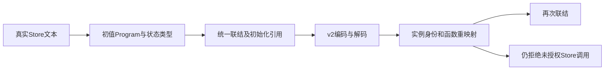

# Store初始化产物边界验证

## Intent：最终目标

阶段三百六十四：为ad4b5d02新增的统一库Store初始化声明建立独立回归，验证联结、编码、导入和再次发布时初值函数与Store身份一致，且不扩大调用权限。

## Data：可用证据

library.Input.initializers接收源码初值Program，Result.store_initializers保存identity/schema_version/function引用。codec写v2并读取v1，v1不得有非空初始化声明。compiled.load重映射函数及实例Store身份；既有store_fixture已从真实RX文本推导Store读取模块，可复用。

## Edges：边界与限制

仅改测试，不修改生产。fixture使用真实RX与ZX解析推导，不用替代Program伪装前端支持。损坏测试在正确摘要下检查语义拒绝。旧无初始化宿主库继续允许，不伪造零初值。程序结构保真不等同于完整RX编译库调用和应用宿主已接通，本轮不声称验证该尚未完整接通的运行链路。

## Answer：交付与成功标准

三组专项：初始化联结去重/冲突/失败清理，v2保真与v1兼容/损坏拒绝，导入身份与权限/再次联结。成功路径释放原输入后继续检查独立所有权；失败路径覆盖分配失败。配合现有library-link和library-codec回归，通过后提交push。



```mermaid
sequenceDiagram
  Tests->>Frontend: 解析并推导Store
  Frontend->>Link: 初值与公开读取模块
  Link->>Codec: 统一函数图及初始化引用
  Codec->>Tests: 独立持有的解码结果
  Tests->>Import: 一个或多个库实例
  Import->>Tests: 重映射身份但不增加权限
```

## 自我复核

只检查store_initializers非空不足以验证初值；需比较完整Program与引用、检查输出类型对应真实Store槽位。有效摘要不意味着有效语义，错误初始化表必须单独拒绝。去重与冲突要区分同版本同初值、版本不一致和初值不一致。

## 实施结果

新增test-library-initializers并接入默认test。fixture复用真实RX解析推导，将Store定义中的初值Program显式传给library.link；在返回库前释放推导结果，随后核验初值3、版本1、void输入、对象输出以及对应Store槽位类型。

| 分组    | 用例 | 覆盖                                                                                                      |
| ------- | ---- | --------------------------------------------------------------------------------------------------------- |
| link    | 9    | 独立所有权、重复去重、版本冲突、初值冲突、允许无初值宿主库及4组分配失败遍历                               |
| codec   | 13   | v2完整Program与初始化表保真、销毁输入后的所有权、v1省略字段兼容、8种正确摘要下的损坏拒绝及2组分配失败遍历 |
| imports | 4    | 同实例别名去重、不同实例身份独立、再发布与再编码、调用权限拒绝及1组分配失败遍历                           |

损坏输入分别为函数越界、空Store后缀、错误前缀、嵌入NUL、无对应Store、重复身份、引用普通读取函数以及v1携带非空初始化表。改变摘要前先序列化实际JSON，避免只命中摘要错误而未进入语义校验。

## 验证记录

初轮联合命令中，原有test-library-link与test-library-codec均成功，共58/58测试。新增fixture有两处编译错误：跨越Zig模块根的相对导入、函数参数与payload函数重名。已改为显式store_fixture模块依赖并重命名参数；没有修改生产。

修正后单独运行test-library-initializers，8/8构建步骤、26/26测试通过，包含7组逐分配点失败遍历。既有58项的驱动与源码未变，没有重复运行。格式及diff检查通过；本轮没有TypeScript实现变更，未额外执行类型检查。

没有发现生产缺陷，未向实现聊天发送消息。验证基线22aa673b，Store实现来自ad4b5d02。本轮不包含初始化函数的生成代码实际执行、应用级Store宿主或RX调用编译库的端到端验证，也未执行根目录完整回归。新增26项为Zig API测试，不增加JSONL或Test262审阅数量。

源码副本及机器可读结果保存于Store初始化产物测试草稿，原始日志本地忽略。本文件按IDEA提供目标、证据、边界、成功标准及自我复核；完整目标仍未完成。
