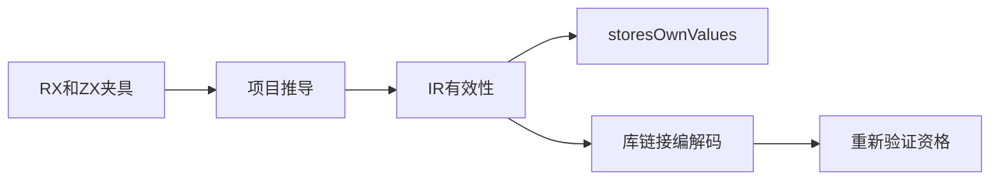
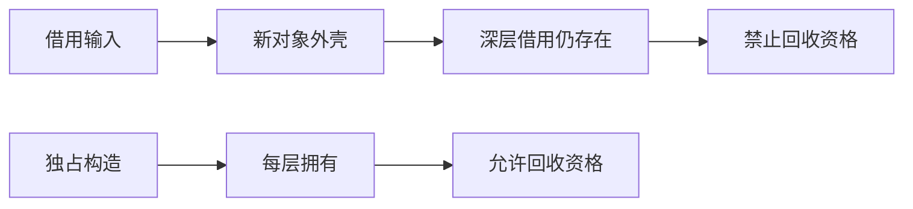

# Store 回收证明验证计划

## Intent：最终目标

验证回收资格来自完整可达写入的真实所有权，而非对象外壳、新列表外壳或库声明。深层借用必须保守拒绝资格，逐层构造独占数据可允许。

## Data：可用证据

基线 10fc9710；frontend.storesOwnValues 复用所有权检查，并检查内部函数。上一阶段已验证生成 State 的回收运行，本阶段补真实 RX/ZX 组合、辅助函数、嵌套服务及库往返后的证明一致性。

## Edges：边界与限制

不把 borrowed 写入视为语法错误：程序可以合法运行，但回收资格应为 false。普通浅拷贝不等于深层独占。非法函数所有权摘要须在 validateIr/库链接门禁被拒绝，不信任来自外部的 owned 标记。

## Answer：交付与成功标准

新增 test-store-ownership-proof，覆盖嵌套数字列表、字符串列表、条件写入、辅助函数与嵌套服务；源码与库编解码后重新检查资格，并遍历关键 OOM。Debug、ReleaseSafe 通过后记录与提交推送。

