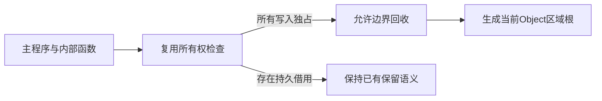
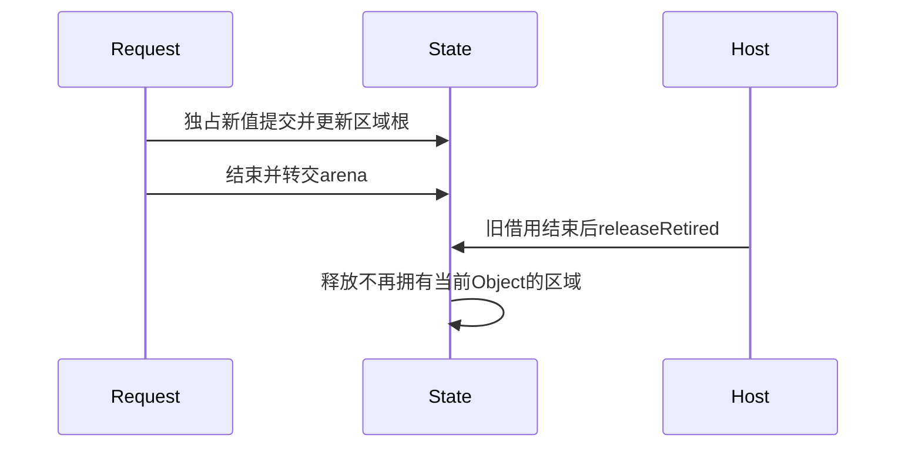

# Store 独占区域回收实施计划

## Intent：最终目标

先闭合可静态证明独占的 Store 更新的长期回收，使其保留内存取决于当前仍存活的请求区域，而不随历史提交次数累积。一般共享持久值的分配归属继续保留为独立未完成项，不将此阶段冒充全部 Store 回收完成。

## Data：可用证据

当前 Request 在首次提交登记 Region，请求结束后转交 arena；所有 Region 到 State 结束才释放，登记节点也留在应用 arena。现有所有权检查已经区分递归 owned、borrowed 与 copy，并拒绝从 Store getter 消费借用值；原生返回只能 borrowed。可以据此检查每一个可达 setter 写入是否独立拥有其可变数据，不能仅按 Store 字段类型或计数器示例推断。

现有 Zig 宿主允许跨请求保存旧快照，因此 Request.deinit 不是通用借用结束证明。Gateway 的同步 handle 返回则已结束请求且消费完响应，具备明确的释放边界。

## Edges：边界与限制

- 只有整个编译程序的 Store 写入均为 owned/copy 时，才生成可用的过期区域释放路径。任一 borrowed 写入保留原行为；不以动态猜测补足静态证明。
- 当前 Object 记录其提交请求 Region。释放时只比较这些静态数量的根，不扫描值、追踪堆图或计数共享引用。
- 释放入口要求所有 Request 与旧输出借用已经结束。旧宿主不自动调用；Gateway 在受控边界调用。
- 直接 State.commit 没有请求来源证明，使用后禁用该 State 的过期区域释放。现有手动宿主契约保持。
- Region 登记从可单独释放的 backing allocator 分配，先登记再发布，申请失败不得改变状态；释放 arena 后释放登记节点。
- 不使用 Arena 私有 Node 布局、深拷贝、压缩迁移、GC、引用计数或专用运行库。
- 一个仍被 Store 使用的请求区域仍保留其临时数据；业务主动保留的数据和单次请求大小不承诺常量上界。一般跨 Object 共享仍需深层分配归属证明。

## Answer：交付与成功标准

compiler 从现有所有权检查取得写入性质，覆盖主程序与内部函数；genz 生成当前区域根与显式 releaseRetired；CLI Gateway 在请求结束后调用。以真实 Store 程序连续执行和 allocator 观测核对历史区域是否释放，同时保留旧借用宿主与借用写入的行为。文档包含 IDEA、实现草稿、运行记录与边界；不新增测试套件、不执行全量测试或浏览器，完成后独立提交推送。

## 自我复核

这项证明必须来自所有权语义，不能把 owned 的名称当成分配归属的无条件保证。宿主仍须遵守请求输入来自本请求、应用长期存储或静态存储的契约。若发现合法程序能够从旧持久区域构造 owned 写入，应先修复证明或拒绝启用回收。

## 实施与复核

ownership.check 保留原 analyze 接口，新增 facts 汇总，在 store_set 求值后、freeze 前记录写入状态。storesOwnValues 先验证整个 IR，再检查入口和所有带 Store 的内部函数；任一非独占写入关闭能力。先 validateIr 是必要门禁，否则伪造无 Store helper 的 output_ownership 可能误导调用者。

普通 State 与 Gateway State 都使用该静态结论。状态生成缓存升级为 memory.v5。genz 按具体 Object 生成 owner_N，首次提交从 backing allocator 分配 Region，成功提交后更新 owner；Request 结束才移交 arena。releaseRetired 在宿主声明旧借用结束后逐个释放没有当前 Object 的区域与登记节点。直接非空 State.commit 永久设置 release_disabled。只读和无 Store 入口保留可调用的空清理方法。

外部输入的“应用长期存储”不包含旧 Request 的可回收 Region。宿主若跨请求移交裸输出，需要另行保证其实际分配不被回收；本阶段没有偷偷转移这些所有权。现有带 Store 的并行执行已被 IR 门禁拒绝，本实现仍是顺序模型。

## 运行证据

- 最终发行构建 dist 为 13/13 步通过。普通编译 API 生成的独占、借用与失败应用均实际构建运行，补充 IR 门禁后重新生成的 State 源码与此前验证版本逐字一致。
- 独占写入清理后，1、10、100、1000 次请求均为 1 个 Region、604 字节；不清理时为 1、10、100、1000 个 Region，最终 520084 字节。状态最终 value=1003、history=[1008]，所有运行结束剩余分配为 0。
- 直接 State.commit 后清理被禁用，保持同样的保留增长；借用写入 can_release_retired=false，1000 次后仍保留 1000 个区域。没有把这些兼容路径称为有界回收。
- 同一 Call 在返回前失败时，暂存 setter 未发布，1000 次后仍是初值且没有 Region。另一个真实 RX 流程先成功提交，再在后续 Call 越界，1000 次后状态已经推进至 1003，仍保留 1 个区域、604 字节。
- 原有通用旧宿主未调用清理，输入 1、7、0 后在 Request 结束外继续读取旧 history，结果正确，最终剩余分配为 0。
- 真实 Gateway 连续 100 次 HTTP 更新全部成功，最后读取 primary=103、history=[108]，未更新的第二个 Store 保持 100。没有浏览器验证或全量测试。

自我批判：最初只讨论静态归属不足，不能据此声称完全没有可实施范围。当前实现用全程序独占事实得到实际可验证的区域数量上界，同时明确未证明的共享路径仍未完成。没有为某个计数器字段、输入长度或示例名称增加生产特例。
