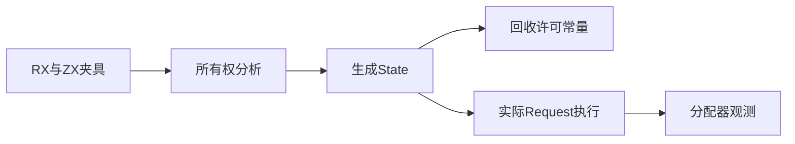
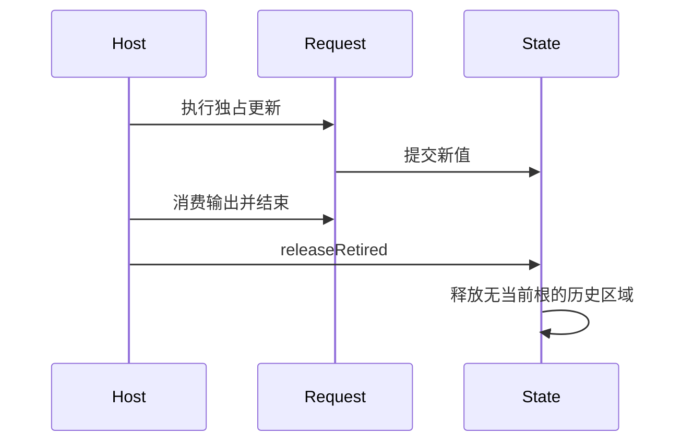

# Store 独占回收验证计划

## Intent：最终目标

验证静态独占证明控制区域回收：只有满足证明的程序在显式借用结束后释放历史请求区域；共享写入、旧宿主和直接 State 提交不能被误回收。

## Data：可用证据

基线 0432eff3，实施会话正在修改 storesOwnValues、生成 can_release_retired/releaseRetired 与 Gateway 收尾。复用真实双 Store RX 项目并增加 borrowed setter 夹具，以生成结果和实际 allocator 活字节验证，不用文本包含判断回收成功。

## Edges：边界与限制

releaseRetired 只在 Request 已结束、旧输出已消费后调用。宿主不伪造独占事实；普通 execute 走生成 setter。直接 State.commit 用于验证退回保守路径。一般共享 Store 回收仍未实现。若生产尚在修改，保留失败证据并将实际缺陷反馈实现会话。

## Answer：交付与成功标准

test-store-reclamation 覆盖 owned、borrowed、readonly、错误后已有提交，检查长期固定活状态写入、幂等释放、OOM 与兼容借用。Debug、ReleaseSafe 通过后记录并提交推送。

