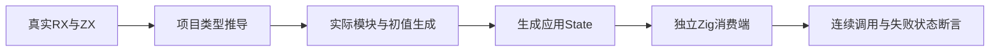
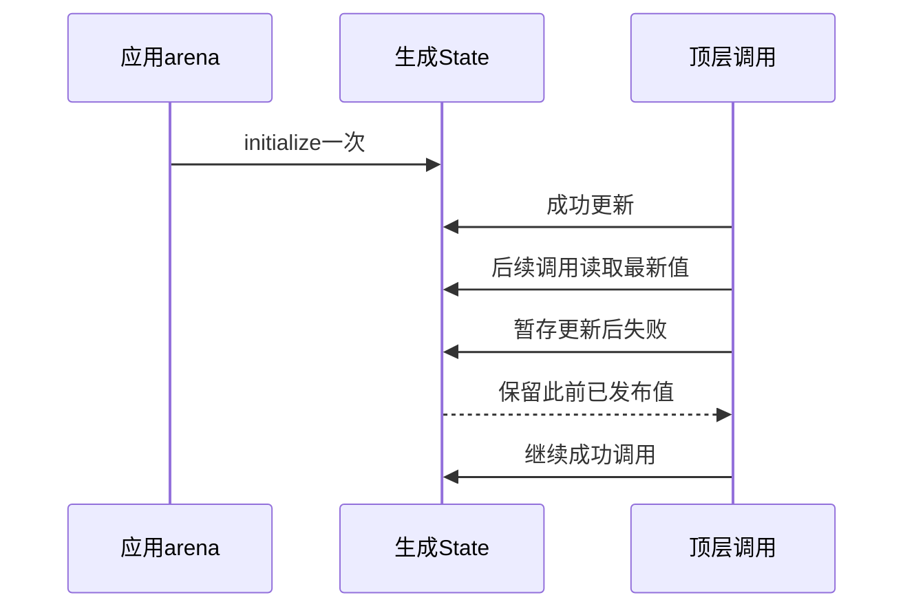

# Store 生成状态连续调用验证

## Intent：最终目标

阶段三百三十八：直接消费编译器生成的应用内存State，验证连续顶层调用、实例隔离、发布门禁、失败暂存丢弃及先前成功提交保留。

## Data：可用证据

当前生成器提供initialize与commit，初值类型来自真实RX定义及共享ABI。已有dual项目覆盖两个同名物理Object；union项目使左Object只读。新增失败函数在写入暂存值之后通过索引越界失败，独立Zig消费方可捕获错误后继续使用同一State。

## Edges：边界与限制

所有调用使用同一应用arena，State在initialize后保持固定地址，不测试或默认允许按值移动。多实例分别初始化。独立请求arena的长期所有权、并发调度和回收仍不在当前实现承诺内。

生成测试必须走真实XML、项目推导、emitModules、store_initializers.append、state.append；读取生成模块依赖清单来构建消费端，不复制生产State或手写替代宿主。

## Answer：交付格式与成功标准

生成三组真实模块：双可写、左只读、函数失败。Node驱动读取完整模块依赖后调用同一Zig编译器执行独立测试；接入根测试图。结果分别报告消费端Zig断言与外层Node驱动，不重复计为JSONL。

## 自我复核

发布拒绝使用与当前状态不同的候选值，避免部分错误发布不可观察。函数失败必须发生在setter之后，不能以尚未执行setter的输入解析失败替代。旧对象和数组应在连续调用及失败后仍保持有效。

## 验证结果

生成状态专项`test-rx-memory-state`为9/9步骤通过，三个Node驱动均通过，内部独立Zig消费端共12/12（双可写5、只读3、失败4）。整体`test-rx-runtime -j4 --summary all`为107/107步骤、197/197直接Zig测试通过，另有上述12消费端Zig与3 Node驱动。外层Node仅负责编译运行门禁，不把它与内部断言重复计入JSONL。

连续输入1与7后，左右状态分别11/108，第一次输出仍为4/101，旧初值3/100与历史数组不变。两个应用arena和两个State并存相互隔离。多Object拒绝、只读拒绝和空更新不会改动原单元；拒绝后应用仍可继续调用。

失败函数先暂存新Object，再读取越界索引。第一Call失败时不发布；第二Call失败时保留第一Call已发布值。捕获错误后在同一State继续成功调用，两种路径均恢复正常；初始化、连续调用、首调用失败恢复和后调用失败恢复的分配失败注入通过。

首轮Node驱动将相对生成目录与cwd重复拼接，导致消费端找不到application.zig，已统一为绝对路径，保留初轮日志。此为测试驱动错误，无生产缺陷，未向实现聊天发送消息。类型检查、格式及diff检查通过。

测试、实际生成的三组源码/模块清单、实现摘要及日志均归档在Store生成状态测试草稿。没有复制或改写生产State来通过测试。JSONL73834、上游2036已审阅不变；未重跑完整根回归。独立请求arena生命周期及并发回收仍属于尚未证明的边界。
