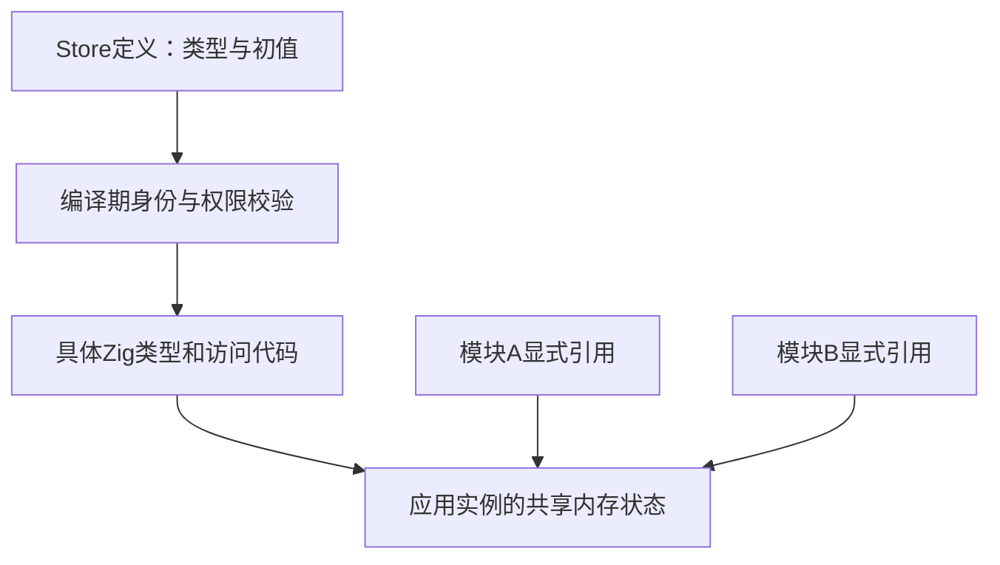
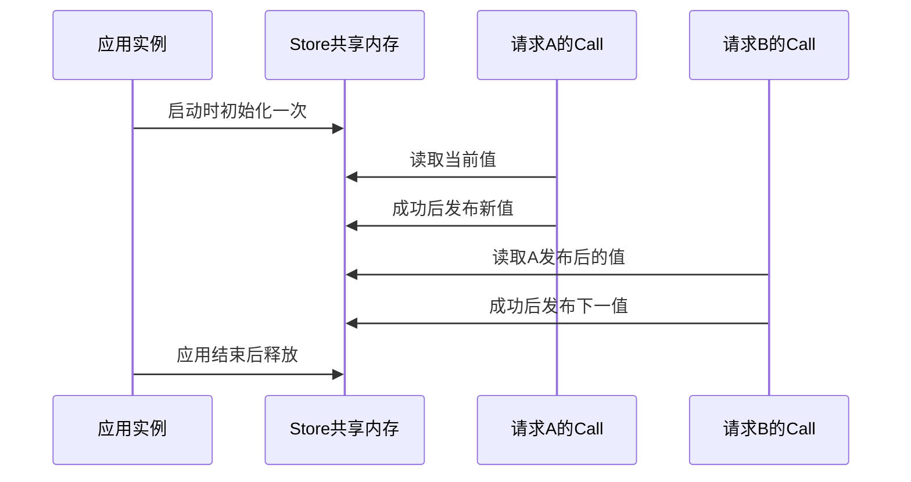

# Store 设计：显式共享内存状态

## Intent：最终目标

Store 用来解决 zxc 不允许普通可变全局变量带来的共享状态需求。它是应用显式声明、受控访问的全局内存状态：让多个模块、函数调用和请求在应用运行期间持续使用同一份值，同时保留 ZX 函数的无隐藏状态与显式授权约束。

这里的“持久”只表示跨调用、跨请求存活，不表示磁盘持久化。Store 不负责落盘、停机恢复、数据库存储或跨进程同步。

## Data：设计依据与当前实现差异

用户在 2026-10-05 明确澄清：Store 是运行时持久变量，无需持久化到磁盘，设计目的是解决 zxc 没有全局变量的痛点。本定义替代此前文档中的“可恢复对象”“配置快照落盘”和“重启恢复”要求。

既有文件身份、字段类型与初值分析、显式 getter/setter 权限、单 Call 暂存提交和无深拷贝约束继续适用。它们服务于共享内存状态，不依赖文件保存机制。

当前 2cb8dc2 引入的 JSON 快照、文件锁、磁盘版本校验、目录同步及 --state-dir 参数偏离设计，待撤除。本轮仅更新文档，不将这些代码描述为已经修正。

## Edges：边界与限制

### 作用域与身份

- 一个应用实例持有一份 Store 状态。同一实例中的模块和请求访问同一个 Object，不因 Module 引用、函数调用或请求开始而创建副本。
- Object 身份由规范化定义文件路径与 Object 名确定。不同文件中的同名 Store/Object 相互独立；不同别名引用同一文件、同一 Object 时共享状态。
- Store.name 和 Module 中的 as 用于命名与访问，不产生新的状态实例，也不按显示名称跨文件自动合并。
- 不同应用实例相互隔离，不同进程不会自动共享 Store。需要进程间通信或外部存储时，使用独立且显式的能力。

### 生命周期

1. 应用启动时，按声明的类型和初值初始化实际使用的 Object，一次应用生命周期内只初始化一次。
2. 后续调用和请求读取、更新同一份状态，调用结束不销毁 Store。
3. 应用结束时释放 Store 及其持有的数据。重新启动时重新使用声明初值，不恢复上次进程的值。
4. Store 中的引用必须覆盖状态使用期；不能把即将释放的请求 arena 指针保存为长期状态。编译器负责正确的分配归属和所有权转移，不以默认深拷贝弥补生命周期错误。
5. 旧值仍被 Call 输入、ctx 或输出借用时，必须保持有效，不能因新值发布立即失效。

例如计数器初值为 0：同一应用实例中的请求 A 更新为 1，请求 B 继续更新为 2；重启应用后重新从 0 开始。单次运行后退出的 CLI 每次启动都是新实例，不能用跨进程恢复来验收 Store。

### 访问与更新

Module 显式声明需要使用的 Store，Call 显式提供读取值和 setter 授权。普通 ZX 函数不能通过 import、隐式全局名称或其他函数的权限访问 Store。

Call 输入读取当前共享值，形成该次调用的不可变读取视图。setter 暂存完整的新 Object，成功时发布，失败时丢弃本次未提交更新。基础语义仍为一个 Call 最多更新一个 Object；需要共同原子更新的字段属于同一个 Object。后续 Call 失败不回滚此前成功的更新。

“快照”只表示内存中的读取视图，不表示文件或序列化副本。“提交”只表示把新值发布为当前共享值，不表示数据库提交或文件写入。顺序调用不需要为此额外生成磁盘版本、文件锁或恢复协议；并发访问的同步必须按实际执行模型生成，不默认加入自动重试。

### 与其他数据的区别

| 数据                                   | 归属                                      |
| -------------------------------------- | ----------------------------------------- |
| 单次调用的中间值                       | ZX 局部绑定                               |
| 单次流程的输入和中间结果               | in / ctx                                  |
| 应用运行期间跨调用、跨请求共享的可变值 | Store                                     |
| 程序级不可变参数                       | 显式配置或常量                            |
| 需要跨重启保留的数据                   | 独立的外部持久化能力，不由 Store 自动处理 |

是否进入 Store 由共享范围、可变性和生命周期决定，不以业务字段名称或“是否能够序列化”决定。运行计数器、调度游标、限流状态、共享缓存索引等都可以按这一标准判断。Store 不负责持有连接、文件句柄或线程等需要独立资源协议的对象。

现有 version 声明字段不意味着磁盘 Schema、自动迁移或恢复协议。本次纠正不擅自修改 XML 语法。

## Answer：编译实现与成功标准

编译器根据可达 Store 定义生成具体类型、初始化代码和共享内存位置，并静态解析访问与授权。genz 负责普通 Zig 代码生成；compiler 负责类型、身份和依赖；应用入口建立并持有应用生命周期状态。无需专用 runtime 包、解释器、动态注册表或字符串路径查找。

验收应确认同一应用实例连续调用时值延续、不同引用共享身份、未授权访问在编译期拒绝、失败不发布本次暂存值、旧借用保持有效，以及重启后使用初值。生成状态代码不应包含自动文件 I/O、序列化限制、快照目录、恢复或磁盘迁移步骤。编译缓存和应用主动使用的文件 API 不属于 Store 状态保存。

待修正实现：撤除 State 文件读写与磁盘元数据、--state-dir、恢复逻辑及相关限制，保留正确的编译期类型、身份、初始化和授权能力。请求级内存与应用级状态的生命周期需要按本设计落实，不能简单把 Store 改成每次调用的局部变量。

## 自我复核

此前把跨调用存活扩大为跨进程恢复，并以这项错误假设引入文件协议，偏离了 Store 替代全局变量的初衷。本次将共享范围、存活时间、访问权限与外部持久化分开描述；同步修正 RX/ZX 设计入口和活动方案，保留历史记录但撤销其规范效力。
