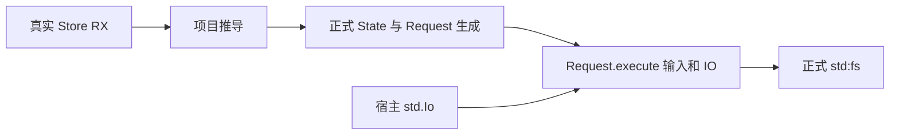
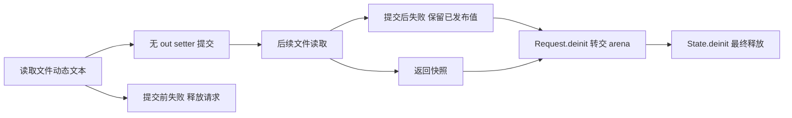

# Store 请求 IO 验证计划

## Intent：最终目标

第 383 阶段验证生成 State.Request 的 IO 入口：IO 读取的动态字符串何时转交 State、请求销毁后快照是否存活，以及提交前后 IO 失败的状态和内存边界。

## Data：可用证据

生成 Request.execute 仅在应用需要 IO 时接收末尾 std.Io，并传给 application.execute。当前请求首次提交登记 Region，Request.deinit 将 arena 转交 State，State.deinit 释放保留 Region。已存在纯 Store 请求和普通 RX IO 测试，尚未把两条链结合。

参考既有 store/dual/emit_state.zig 生成真实状态及初始化器；原生 IO 实施示例使用 read → 无 out setter → 读取 Store。新测试保留此调用方式，并在 setter 后再做一次丢弃结果的文件读取，制造明确的提交前后失败位置。

## Edges：边界与限制

复用正式状态生成器，不手写 State 或提交算法。只改测试驱动、宿主构建接入和文档。修改现有 Node runner 时以可选标准库/夹具参数扩展，保留全部原纯 Store 路径并回归。所有文件 IO 在独立临时目录内。

当前设计保留成功提交请求直到 State 结束，不将中间存活内存误判为泄漏，也不宣称有界长期回收。只读请求输出仅在 Request 存活期内读取。State 比所有 Request 活得更久，销毁 State 后再销毁父 arena。

## Answer：交付与成功标准

- 新增一个 Store，保存 text 和 count；读取文件后无 out setter 提交，再读取 after_path，返回已发布快照。直接及 service 包装都通过真实项目推导。
- 新增只读模式，读取文件与 Store 快照但不授权 setter，覆盖没有 retained Region 的 Request 生成分支。
- 验证多次请求、旧输出与旧快照、State 隔离、提交前读取失败、提交后读取失败及下一请求恢复。
- 以实际存活分配量和逐次分配失败核对未提交释放、已提交保留、State 与父 arena 最终释放；注入宿主 IO 拒绝以确认 Request.execute 使用传入 IO。
- 运行新专项与旧 Store 聚合，归档 IDEA 执行记录及草稿，完成本部分 commit/push。生产缺陷确认后才反馈实现聊天。

## 自我复核

当前是执行计划。此前普通 IO 和纯 Store 分别通过不能推出组合链正确；只有生成 Request 上的真实 IO 与内存观察才计入本阶段结果。

## 第 383 阶段执行记录

已新增 22 个命名测试声明：continuity 6、failure 7、allocation 4、readonly 5。前三组在直接与 service 两种生成入口各执行一次，加只读模式，共 39 项真实 Request IO 执行组合。

夹具保存单个 snapshot 对象的 text/count；读取文件得到动态文本，无 out setter 发布，再执行丢弃返回值的第二次读取，最后返回 Store 快照。State、Request 和初始化器均由既有正式 emit_state 生成，没有重写提交或内存交接。State.initialize 仍不需要 IO 参数，Request.execute 明确接收宿主 IO。

已验证连续 3 次请求销毁后的旧结果、空文本/Unicode/NUL、32 次后续请求后的最早快照、两个 State 隔离，以及 State 与父 arena 销毁后分配归零。提交前与提交后分别覆盖缺失文件、读限额、非法 UTF-8，均核对 count/text 和旧快照，并执行下一请求恢复。提交前失败的存活字节回到初始化基线，提交后失败的字节保留到 State 结束。

分配失败枚举覆盖完整连续请求、两类错误恢复和只读入口。只读请求执行 64 次，每次 Request.deinit 后回到基线；只读错误不改变 State，commit 仍拒绝 StoreNotWritable。直接、service、readonly 三类入口均验证传入宿主拒绝 dirOpenFile 后收到 AccessDenied，确认 Request IO 参数真正进入原生读取。

共享 Node runner 仅增加可选的标准库源码与文件夹具参数；程序、State、标准库与夹具共享同一个生成 ABI。原有纯 Store 调用保留三个位置参数，回归确认没有引入新的宿主依赖。

首轮只读 5 项已通过，其余宿主遇到测试辅助函数参数 input 与同文件 input 函数同名的 Zig 编译错误；将参数更名为 value 后通过，不属于生产缺陷。日志见 [首轮](Store请求IO测试草稿/首轮结果.txt)。

验证结果：

- `zig build test-rx-store-io --summary all`：13/13 构建步骤、7/7 Node 宿主组通过，内部 39/39 Zig 测试通过，见 [专项日志](Store请求IO测试草稿/专项结果.txt)。
- `zig build test-rx-store-runtime --summary all`：**42/42 构建步骤、39/39 构建图 Zig 测试通过**；另由 **14/14 Node 组执行 70/70 Zig 测试**（原有 31、新增 39），见 [Store 聚合日志](Store请求IO测试草稿/Store聚合结果.txt)。两层计数分开，不把构建图计数重复算入内部宿主测试。

基线包含实现聊天的新提交 8466323c。聚合运行期间曾观测到 genz/src/zx/transform.zig 的并行改动，归档时已无生产 diff；没有全程固定源码快照证据，因此仍报告工作区验证，不称固定 HEAD 或根全量。未发现需要向实现聊天反馈的生产缺陷。

自我复核：返回 Request 结果并在 deinit 后使用的辅助函数仅用于已提交的写入夹具；只读结果始终在请求内部观察。未解引用销毁后的只读内存，没有将错误后的已提交状态回滚。有限写入序列仅证明既定保留策略，不证明长期有界回收。下一阶段优先核对新落地的 owned reduce 与静态 tuple 索引能力，补充对应细粒度测试。
