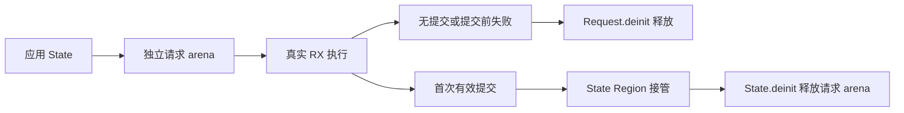

# Store 请求内存验证计划

## Intent：最终目标

针对 7149e3e5 引入的生成 State.Request，验证请求内存何时释放、何时转交 State，以及提交后返回值和旧快照的存活。该计划作为并行任务运行阶段之后的续作入口。

## Data：现有证据与真实缺口

已阅读 `packages/test/build/rx_store_runtime.zig`、`tests/rx/runtime/store/dual/emit_state.zig`、memory 下的 state/readonly/failure 宿主测试，以及 `packages/genz/src/zx/state/request.zig`。

现有 memory 测试使用同一个长期 arena，调用 `application.execute(&arena, input, &state)`。它们证明状态连续、单 Object 提交和旧值保留，但没有经过新的 `State.request()`、`Request.execute()`、`Request.deinit()` 和 `State.deinit()` 内存交接链。旧测试通过不能证明独立请求 arena 的存活与回收正确。

当前生成器行为：Request 从 State 的底层 allocator 建立独立 arena；首次非空提交时先在 State arena 分配 Region，随后发布值；Request.deinit 将整块请求 arena 交给 Region。未提交请求直接释放。State.deinit 释放保留请求 arena，最后调用方再释放 State 自身 arena。

## Edges：边界与限制

只添加测试、构建注册和文档，不擅自实现长期回收算法。当前设计保留已提交请求直到 State 结束；不把中途未回收判为泄漏，也不据此声称已经有界。State 必须晚于其 Request 销毁，不使用非法生命周期制造失败。现阶段不假定支持并发 Store 请求。

动态返回值需要在其请求或保留 Region 的合法存活期内检查。只读请求释放后不得再读取返回指针；通过底层 allocator 的存活字节和泄漏检测判断释放，而非解引用已释放内存。

## Answer：实施路径与成功标准

1. 复用 dual 编译驱动和真实 Store/ZX 夹具，继续由生成器生成 application、types、State 和依赖清单。
2. 新增 Request 宿主测试，走公开的 request/execute/deinit 链；先覆盖连续提交后旧快照与返回结果仍有效，再覆盖两个 State 隔离。
3. 复用 failure 项目，区分首调用失败未提交与先提交后续失败；前者请求销毁后释放全部请求数据，后者保留已发布数据且后续请求可继续。
4. 空提交、多 Object 提交拒绝和只读 Object 拒绝必须在注册 Region 前完成，不改变已发布指针。
5. 使用实际分配统计检查只读/未提交请求释放、提交请求保留，以及 State 和父 arena 销毁后的完全释放；补逐次分配失败，特别关注 Region 注册失败不得先发布值。
6. 增加独立请求长序列与多次执行检查，但不把有限次数当作长期有界证明。

## 自我复核

本文件是基于当前源码的缺口核对与后续计划，不是已执行测试报告。新的 Request 测试尚未添加，不能增加覆盖计数。实施前应重新核对生产实现、已有测试和实际生成模块，避免沿用过时状态。
