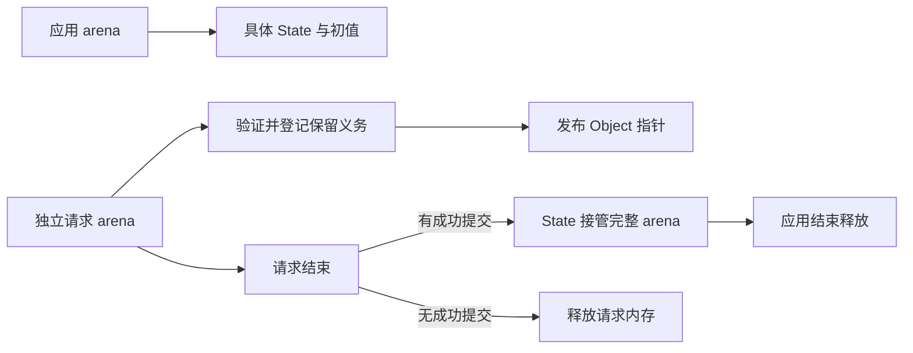
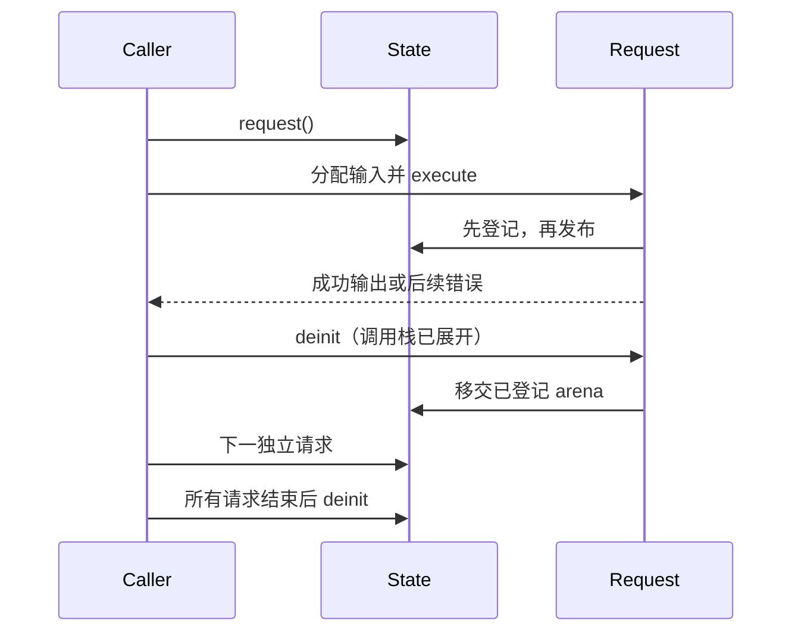

# Store 请求内存归属

## Intent：最终目标

生成显式请求上下文，让独立请求 arena 释放后，已提交 Store 的实际请求分配仍由应用持有。保持纯内存、不可变快照、无深拷贝及无专用运行库。

## Data：可用证据

当前 State.commit 只更新 value_N；application.execute 接收 arena、输入和 context。嵌套 Store adapter 已向 parent 转发 commit，因此顶层请求上下文可以承担内存归属，不改内部函数 ABI。CLI 目前全部使用应用 arena，尚未提供独立请求的生命周期。

本机 Zig 0.16 ArenaAllocator.free/resize 会访问当前 arena 的首节点。不能在 commit 时搬空仍在执行的 arena，否则后续 free/realloc 可能访问空链表。整体 ArenaAllocator 可以在请求栈展开后转交所有权，不必访问或拼接内部 Node。

## Edges：边界与限制

Request 持有独立 arena 和具体 Store 指针。首次非空提交先验证权限、单 Object 限制，并从应用 arena 申请一个登记节点；申请失败不发布值。登记后才发布。执行期间不搬迁 allocator。Request.deinit 在输出消费及调用栈展开后运行：有成功提交则将完整 arena 移交登记节点，否则正常释放。后续失败不取消先前保留义务。

State.deinit 在所有 Request 结束后释放已接管 arena；调用者最后释放应用 arena。原有同应用 arena 的手动 commit API 保持。只读应用不生成保留链表。所有实现直接生成普通 Zig，使用标准 ArenaAllocator，不加入 runtime 包、GC、引用计数、磁盘协议或动态注册。

这个入口只接管本请求实际拥有的内存。传入的深层引用必须来自本请求 arena、应用长期状态或静态存储；外部 Zig/原生宿主对其他借用自行保证应用级存活，不能因经过普通函数或标准库就假定归属已改变。CLI JSON 输入由请求 allocator 解析，使用 allocate_always。Store 本身不新增 JSON 限制。

只覆盖当前顺序请求。已提交请求的临时数据和旧值会保留到应用结束，尚不提供有界长期回收；不能用 Store 被覆盖作为旧借用已经结束的证据。没有成功提交的请求可释放自己的 arena。

不新增测试、不执行全量测试、不调用浏览器。

## Answer：实现与成功标准

genz 生成 State.request、Request.execute、Request.commit、Request.deinit 与 State.deinit；compiler 更新状态缓存版本；CLI 状态入口改用请求 allocator。复用现有 Store 源程序，实际生成并由宿主连续运行独立请求，验证更新、失败后继续、请求结束后的 Store 引用和旧值，以及没有提交时的释放。运行已有 Store 定向回归后提交推送。

## 自我复核

arena 转移不是外部借用来源证明，不应扩张为任意宿主指针安全。延迟接管会保留整个有提交请求的分配，可能持续增长；本阶段解决生命周期安全，不冒充已经实现精细回收或并发服务。

## 实施与验证结果

正式实现位于 genz 的 state/request.zig，生成具体 Request 与保留链；compiler 状态缓存版本更新为 memory.v2；CLI 使用请求 allocator 解析 JSON，在输出完成后结束请求。原有直接 State.commit 保留，需要宿主保证应用级内存归属。

2026-10-05 复核：根构建 14/14 步通过；现有 test-rx-memory-state 定向回归 9/9 步通过，其中状态 5 项、只读授权 3 项、失败恢复 4 项。该回归覆盖原有直接 State 使用契约，独立 Request 的证据来自下述实际宿主执行，不能混为同一种覆盖。

复用现有双 Store 的 memory 和 memory_failure 源程序生成代码，使用 [通用宿主](Store请求归属/宿主示例/main.zig) 连续执行独立请求。输入 1、7、0 后左值从 3 更新到 4、11、11，右值从 100 更新到 101、108、108；每次 Request 结束后仍读取新值与旧快照的 history 数组。失败示例先发生首次 Call 越界，再发生已有发布后的后续 Call 越界，随后成功恢复；状态分别保持初值、保留已发布左值、继续更新。两次完整应用退出的 DebugAllocator remaining_bytes 均为 0。结果见 [执行记录](Store请求归属/执行结果.json)。

另复用现有只读 Store 发布样例构建真实 CLI 应用，退出 0、输出 3，验证无写权限的 State 也可使用新请求入口。未新增测试用例，未执行全量测试。

## 宿主接口与释放次序

应用 arena 和 State 必须固定地址存活；initialize 一次。请求通过 state.request() 创建，使用 request.arena 分配输入，随后 request.execute(input)。输出消费完成、调用栈展开后调用 request.deinit()。所有 Request 结束后调用 state.deinit()，最后释放应用 arena。Request 不可复制、重复结束或结束后继续使用；State 不可提前销毁。

非空提交先验证权限与单 Object 限制，再登记保留义务，最后发布。登记失败不发布值。空提交不保留请求 arena；成功提交后发生的错误不会解除已有保留义务。宿主从外部传入的 slice 仍须保证来源存活，Request 不会自动复制外部借用。

当前仍保留整个提交请求的 arena，包含已被覆盖的旧值和临时值；无界长时间写入会持续增长。后续需要编译期逃逸与分配归属分析，缩小保留范围并证明可回收时机。本阶段只证明顺序请求下的引用存活与最终释放，不声明长期服务内存有界或并发安全。

2026-10-05 后续实现：所有写入均有静态独占证明时，State 提供 releaseRetired，并由 Gateway 在请求结束后调用；Region 节点改由 backing allocator 单独分配和释放。旧宿主若不调用该方法，仍能跨请求保留旧快照。一般持久借用仍不启用回收，见 [独占区域回收参考](Store独占区域回收参考.md)。
