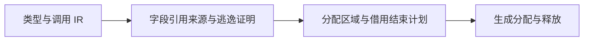
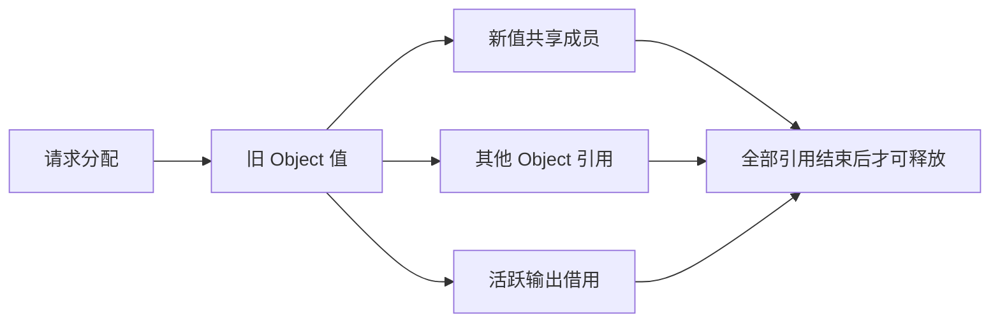

# Store 长期回收边界核对

## Intent：最终目标

在不破坏不可变共享和旧借用的前提下回收已死 Store 数据，避免连续请求保留全部历史 arena。目标仍是完整长期服务能力，不以简单覆盖场景替代验收。

## Data：当前证据

当前 genz/state/request 仅在首次提交登记 Region，Request.deinit 移交整个 arena，State.deinit 统一释放。ownership 的 copy/borrowed/owned 分类不携带字段级区域来源；Store getter 统一为 borrowed。对象展开、嵌套列表以及标准库不可变编辑均可共享原数据。

因此，覆盖一个 Object 不意味着原请求区域死亡：另一个 Object、新值内部成员或仍被消费的输出都可能引用它。同一请求多次提交还可能让最终值引用中间版本。现有宿主样例直接保留 State.value 指针，回收前也必须明确宿主借用结束契约。

## Edges：约束与尚未闭合的证明

- 不能根据最后一次 Store 写入直接释放旧 arena。
- 不能通过默认深拷贝、持久化或把专用回收运行库嵌入生成文件规避既定约束。
- 静态回收需要输入到输出、输入到 Store、Store 到 Store 的引用来源与逃逸摘要；动态索引、条件选择和原生返回值必须有可验证的来源契约。
- 活数据持续增长与已死历史内存积累不同，不能承诺任意程序常量内存。
- 当前仅证明请求 arena 最终释放安全，尚未证明通用长期有界回收。

## Answer：后续实现前置条件

compiler 先建立可验证的字段及区域来源，genz 才能据此拆分临时分配和可跨请求分配，并在借用结束后生成析构。库装载必须重新验证相关摘要，不能信任外部提供的可释放标记。宿主接口必须表达输出借用的结束，不能一边允许无限期裸指针借用，一边自动回收其来源。

本轮只核对边界，未修改 Store 回收实现。已有安全保留方式继续生效，有界回收仍未完成；其他标准库与自举前置能力可以独立推进。

## 自我复核

直接给 Region 加标记只能记录实现状态，不能产生引用来源证明；把动态回收器改名或内嵌生成也不能使其变为纯编译期机制。后续必须补齐上述证据，再改变区域释放时机。
