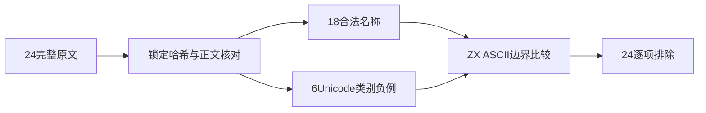
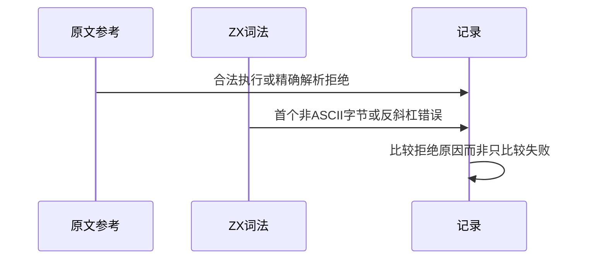

# Test262 Unicode 名称边界审阅

## Intent：最终目标

阶段三百三十九：审阅剩余非Unicode版本表的24个标识符原文，区分Unicode类别规则、字符转义与ZX当前ASCII名称契约。

## Data：可用证据

完整读取24正文：Other_ID_Start/Continue四项、ZWJ/ZWNJ三项、转义起始组合一项、CJK两项、英文转义四项、俄文字母六项、VERTICAL TILDE四项。18正例与6个parse/SyntaxError负例，均无特殊flags/includes。保存锁定版本SHA256、正文、说明与具体名称。

## Edges：边界与限制

ZX词法只识别ASCII名称并在反斜杠或非ASCII字节处拒绝，没有按Unicode ID_Start/Continue分类或解码名称。不能因为六个负例也失败就记为规则通过，也不能把转义改成ASCII字面名称后冒充原文适配。24项按边界排除，不扩张生产语言设计。

## Answer：交付格式与成功标准

逐项原文核验、参考执行及解析拒绝，加入Unicode和转义合法名称的参考能力控制。每原文选取确实含非ASCII或转义的实际名称做ZX边界探针，保留精确错误位置，矩阵审计通过后写入review。

## 自我复核

俄文字母中外观类似ASCII的字符仍按真实码点处理；ZWJ续接样本选含连接字符的名称，不选首个单独美元声明来代表Unicode边界。未读取的122个版本表原文不计审阅，不能据本批推断其全部内容。

## 验证结果

24原文哈希与正文核对通过，参考能力控制包含两种转义、CJK、俄文字母及ZWJ续接合法名称。36次正常执行和12次parse-only拒绝通过。当前CLI重新构建17/17步骤成功，24个探针均在首个反斜杠或非ASCII字符位置报lexical，行列精确匹配；没有以不同原因的拒绝替代原文Unicode分类规则。

新增24项excluded，矩阵审计通过。上游已审阅2060=678 adapted+103 equivalent+1279 excluded，未审阅51537；关联4916，JSONL73834保持不变。没有新增虚假的运行适配数、没有修改生产实现、没有需通知实现聊天的缺陷，也未重跑根回归。

原文证据、独立参考脚本、实际CLI探针、构建日志与矩阵结果均保存在Unicode名称边界草稿。本批完成的是边界审阅，不代表ZX已支持Unicode标识符。
