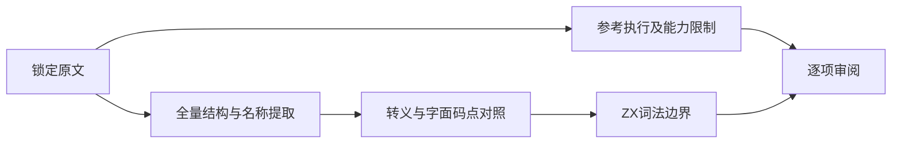
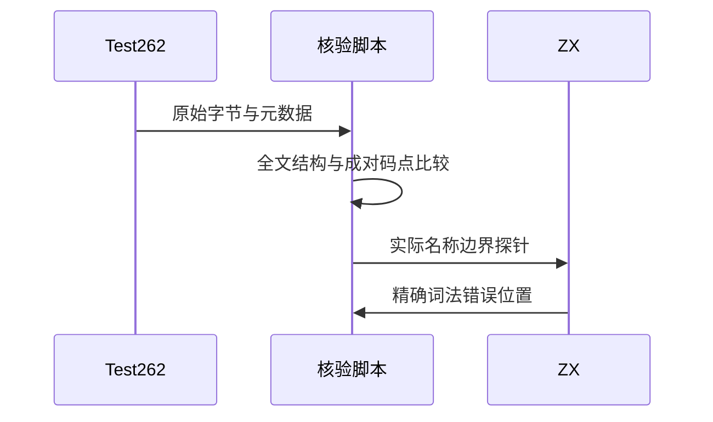

# Test262 Unicode 版本表审阅

## Intent：最终目标

阶段三百四十：核验标识符目录的 Unicode 数字版本表原文，分别记录普通名称、私有字段、起始字符与续接字符，避免把 ASCII 词法拒绝算成 Unicode 支持。

## Data：可用证据

锁定 Test262 7ab7fafa0003f73fc85c1b95d88094d33f7eb8bd。对每份原文保存哈希、元数据和全部正文；用完整结构匹配提取全部名称，并核对转义与字面字符版本的码点序列。参考执行保留真实结果及 Node Unicode 版本。

## Edges：边界与限制

版本表共有120份，另外两个文件虽含 unicode 字样但不是版本表，单独留待审阅。ZX 的词法扫描限于 ASCII；私有类字段还涉及额外语言边界。参考引擎不支持新 Unicode 版本时记为参考能力不足，不记通过，也不改写原文。

## Answer：交付格式与成功标准

交付完整原文证据、可重放结构核验和参考脚本、ZX 名称探针、逐项审阅记录与矩阵审计。原文哈希、完整结构、同版本成对码点及探针位置必须核对。

## 自我复核

表中数千条声明不会拆算为数千份适配用例。脚本完整消费正文，不能用首尾抽样代替结构核验。抽取私有字段的名称用于探测词法边界，不宣称已适配 class 语法。

## 验证结果

120份全文结构匹配成功，累计209036个名称声明；其中60份为私有类字段。60对转义/字面形式的全部名称解码后逐项一致。无negative、flags或includes，按严格与非严格两种模式执行原文240次均通过。参考环境Node v25.8.1、Unicode 17.0，具体V8版本和参考能力控制结果保存在原文结果中。

当前CLI重建17/17步骤通过，120个真实名称探针均在首个非ASCII字符或反斜杠位置精确报lexical。新增120份excluded审阅，矩阵审计通过：已审阅2180=678 adapted+103 equivalent+1399 excluded，未审阅51417；正式JSONL73834与关联4916不变。

本轮未修改生产实现，没有发现需要通知实现聊天的生产缺陷；没有重跑完整根回归。所有证据与脚本保存在Unicode版本表草稿。待继续核验的两个非版本表文件是start-unicode-ltr.js与unicode-escape-nls-err.js，不能因文件名相近归入本批排除。
