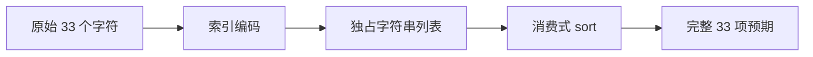
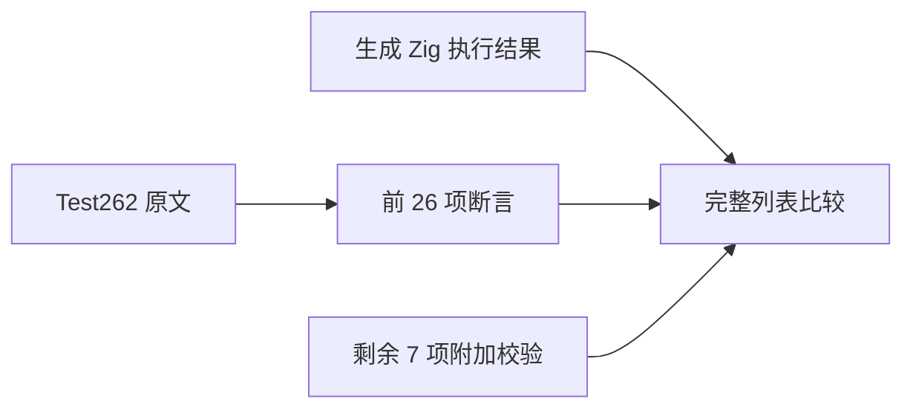

# Test262 俄文字母排序适配

## Intent

将默认排序的俄文字母原文适配到 ZX 消费式字符串列表排序，保留完整原始输入和全部实际断言。

## Data

完整读取 S15.4.4.11_A2.1_T2.js：33 个字符串构成逆序输入，默认 sort 后原文仅遍历前 26 项与 alphabet 比较。所有字符串均为单个 BMP 非代理字符，该集合的 UTF-16 顺序与 UTF-8 字节顺序一致。

已有 generate_strings.ts 和 owned_strings.ts 通过输入索引构造独占列表，并实际调用 sort；既有 ASCII 原文采用同样适配机制。

## Edges

原 JS 可变数组操作改为 ZX 显式消费式 sort，但原文不检查返回对象身份，也不观察比较器调用。新增断言检查完整 33 项，比原文的 26 项更强；明确区分原断言数量与附加校验。

本结论限定这组字符，不推广到代理字符、补充平面字符、默认数字转字符串或自定义比较器。同期读取的逆序比较器与混合对象转换用例保持待审，不把升序测试冒充其覆盖。

## Answer

复用字符串生成器添加一组输入和一个运行目录，注册既有 test-strings。保存原文指纹、正常/严格模式执行记录、一份 adapted 审阅及完整值断言；验证生成一致性、类型检查、覆盖审计和 Debug/ReleaseSafe 后提交。

## 结果与自我复核

原文 SHA-256 与固定索引一致，源文件的两份数组字面量与测试输入/预期逐项核对。普通、严格模式均执行完整原文成功，并额外读取排序后的 33 项结果核对。全部 1089 对字符比较确认本集合 UTF-16 与 UTF-8 顺序一致，不依赖区域排序规则。

Debug 执行 `zig build test-strings -j2 --summary all`，ReleaseSafe 增加 `-Doptimize=ReleaseSafe`，两者均退出 0：101/101 构建步骤、1713/1713 测试全部通过。生成器 --check、包级 typecheck 和覆盖审计通过；既有字符串 JSONL 用例逐文件与 HEAD 比较完全不变，字面量表只追加本轮新字符，原索引不变。

当前目录 80155 项，审阅 2236 份（690 adapted、103 equivalent、1443 excluded），51361 份待审，关联 4933 项。本轮仅新增一个具名运行用例和一份 adapted。

自我复核：实际排序仍由 ZX sort 生成的 Zig 实现完成；索引只用于构造 owned 输入，不返回预先排好序的常量。原文只比较前 26 项，新增完整比较没有删除其中任何观察。未修改生产实现，未发现缺陷，未发送实现会话消息；固定检出全量回归不包含本轮后来添加的目录。
