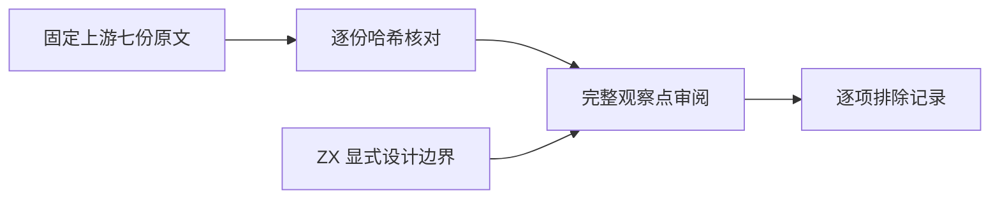
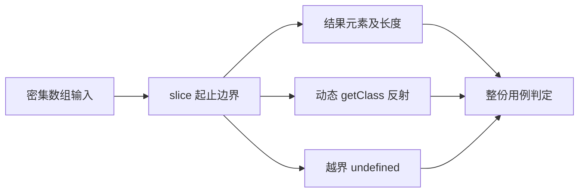

# Test262 切片结果反射审阅

## Intent

逐份核对 slice 正边界测试的完整观察点，防止只验证数值就声明 Test262 整份适配。

## Data

固定 Test262 revision 为 7ab7fafa0003f73fc85c1b95d88094d33f7eb8bd。已全文读取 S15.4.4.10_A1.1_T1 至 T7，逐份 SHA-256 与仓库固定索引相符。每份均动态设置 getClass 并要求 Object.prototype.toString 返回 [object Array]，还检查长度、元素和越界 undefined。详见逐份证据.json。

## Edges

ZX 设计 14.3 明确排除原型、反射和动态属性，不能以静态列表类型代替运行时反射。七份以该明确设计边界标记 excluded，不以尚未实现 slice 为排除依据，不增加 adapted、equivalent 或本地测试数量。

## Answer

新增一份逐项 review JSONL，保留每份原文哈希、具体边界、观察点和设计依据。独立执行上游原文，并运行目录覆盖审计与类型检查后提交。

## 额外候选与自我复核

全文查看 reduce/15.4.4.21-10-2.js、15.4.4.21-7-11.js：前者省略初值并连接字符串，后者要求单元素无初值返回且回调不执行；ZX 显式初值归约不能直接证明这些行为，保持未审阅状态，不建立适配关联。

全文查看 reduce/15.4.4.21-9-c-ii-21 至 24：均通过 Array.prototype.reduce.call 在带 length 的普通对象上归约，并通过外部 accessed 标记检查调用；不能直接改成普通列表数值归约并宣称整份等价。本轮未对这四份作最终范围判定。

本轮的有效成果是明确七份上游边界，而非增加通过数量。Node 原文通过只证明原始 oracle 可执行，不证明 ZX 兼容。不会写测试内自制 slice 算法来冒充生产能力。

## 验证结果

七份未经改写的完整上游原文在隔离 Node vm 中全部通过；逐份执行状态已保存。包级 npm run typecheck 退出 0，audit_matrix 退出 0。当前目录 80133 项；上游 adapted 687、equivalent 103、excluded 1424，总审阅 2214，未审阅 51383，关联本地用例 4930。审计不测量执行状态，不将目录数量声明为通过数量。
