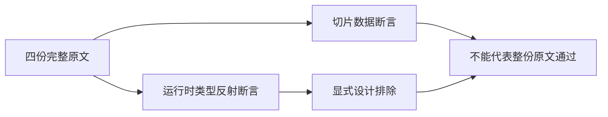

# Test262 切片返回对象审阅

## Intent：最终目标

逐份核验四个 splice 原文的全部断言，区分数值切片行为与返回对象运行时反射，保持整份上游判定的准确性。

## Data：可用证据

四份都先执行 `arr.getClass = Object.prototype.toString`，再要求 `arr.getClass()` 为 `[object Array]`，之后检查删除项和新列表。ZX 设计 14.3 明确排除原型与反射；普通 typed list 的输出类型声明不等于执行上述运行时观察。

| 原文                  | 原始调用（输入均 [0,1,2,3]） | 完整数值观察                                                                                  |
| --------------------- | ---------------------------- | --------------------------------------------------------------------------------------------- |
| S15.4.4.12_A1.1_T3.js | splice(0,4)                  | 删除列表长4且逐项0/1/2/3，原列表长度0；另有 Array 类型反射断言。                              |
| S15.4.4.12_A1.1_T4.js | splice(1,3,4,5)              | 删除列表长3且逐项1/2/3，新列表长3且逐项0/4/5；另有 Array 类型反射断言。                       |
| S15.4.4.12_A1.1_T5.js | splice(0,5)                  | 删除计数大于长度仍删除全部，删除列表长4且逐项0/1/2/3，原列表长度0；另有 Array 类型反射断言。  |
| S15.4.4.12_A1.1_T6.js | splice(1,4,4,5)              | 删除计数大于剩余项数，删除列表长3且逐项1/2/3，新列表长3且逐项0/4/5；另有 Array 类型反射断言。 |

## Edges：边界与限制

四份整文件判定为 excluded，理由不是 ZX 不支持数值 splice，而是无法保留其动态方法安装和运行时类型反射。既有 typed list splice 测试继续有效，但不据此关联整份通过；本次不新造相同语义用例来扩大数量。未审阅的其他 splice 文件保持原状态。

## Answer：交付与成功标准

逐份 SHA 对照锁定 index，原 harness 严格/非严格执行全部通过。正式记录保存具体调用、全部观察的边界和明确设计契约；覆盖审计通过后提交推送，不增加 adapted/equivalent 或执行用例计数。

## 旧记录复核与修正

交叉查看 dense_values.jsonl 后，发现早期两条 splice、concat 和 reverse 的 adapted 记录只验证了部分观察。本次完整读回原文并撤回这四条整份适配结论，保留所有有效的本地执行测试：

- splice/A1.1_T1：删除 [0,1,2]、剩余 [3] 之外，还要求动态 getClass 为 Array。
- splice/A1.1_T2：删除 [0,1,2]、结果 [4,5,3] 之外，同样要求动态 getClass 为 Array。
- concat/A1_T1：结果 [0,1,2,3,4] 和长度 5 之外，还要求原型 toString 的运行时类型结果。
- reverse/A1_T1：原文首先对空、单、双元素三次要求返回对象与接收者严格同一身份，随后检查双元素逆序内容和长度。旧测试没有验证前三条身份断言。

旧理由已披露这些区别，但仍将整份标为 adapted 会高估已承接的断言。本次统一为 excluded，并移除整份通过关联，不修改测试预期、不删除本地用例。反射依据设计 14.3，reverse 身份差异依据公开消费式 list_operation 契约。本次参考核验扩展为八份原文，包含四份新审阅和四份旧结论复核。

## 执行结果与自我复核

八份原文 SHA 均与固定 index 一致，严格/非严格十六次参考执行全部通过。覆盖审计退出 0：catalog 80133 不变；reviewed 2207，其中 adapted 687、equivalent 103、excluded 1417，unreviewed 51390，linked cases 4930。linked 数下降六项来自撤回 reverse 三条、concat 一条、splice 两条整份关联，实际执行用例全部保留。

本次发现的是测试覆盖声明不够严格，已在原记录处修正，不能仅写新文档而保留旧统计。没有因普通 splice 数据正确而宣称原型反射正确，也不把参考引擎通过等同于 zxc 通过。生产实现未改动，无需发送实现修复请求；全量回归结果另行记录。
