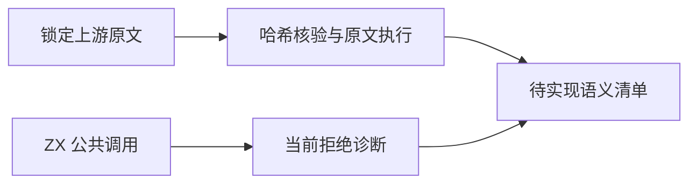

# Test262 字符串搜索核验

## Intent：最终目标

核验 startsWith、endsWith、includes 的真实支持状态，保存完整上游断言和待实现边界，为后续公开 API 实现与回归提供依据。

## Data：可用证据

锁定 Test262 的 15 份原文（12 份命中/未命中与显式/省略位置，3 份空搜索串），逐份 SHA-256 对照仓库 index。使用原始 assert harness 执行 strict/non-strict 共 30 次，全部通过；原文清单、结果和复跑脚本在 `Test262字符串搜索/`。

实际模块清单 packages/compiler/standard/modules.json 无 std:string。calls.zig 的实例调用分析要求 list；expressions.zig 的字符串特殊成员只有 length，字符串索引也不受支持。encoding.d.zx 的 encodeUtf8(string):u8[] / decodeUtf8(u8[]):string 只做编码转换，不能当作搜索实现。

对三个最小 ZX 草稿执行真实 CLI `lint --semantic`，均退出 1，报 `collection methods require a list`；证据见《当前能力复现.json》。这是尚无公开能力的证据，不是已承诺 API 的行为回归。

## Edges：边界与限制

当前 ZX 字符串使用 UTF-8 字节，ECMAScript 搜索位置按 UTF-16 code unit。例如 éx 中 x 的位置分别为 2/1，😀x 为 4/2。不能把 ASCII 上位置恰好相等推广到 Unicode，也不能用编码转换加测试自己的搜索循环来冒充被测实现。

空搜索串原文包含 Infinity；endsWith 还包含 -Infinity 和负数。删去这些断言后不能将整份文件标为适配。ECMAScript 孤立代理项同样需要单独的语言契约决策。

## Answer：交付与成功标准

当前新增上游适配数为 0，15 份文件维持未评审完成状态，没有写入正式 adapted/equivalent/excluded 记录。后续应先确定公开 API、默认位置、负数/非有限位置归一化和字符单位，再完整运行下表断言及对应控制用例。代码草稿只在 docs 中，不向生产或正式通过测试目录写入假实现。

令 S = "The future is cool!"，长度 19。以下每行是一份原文的完整断言，位置“省略”必须真实省略。

| 方法/文件                                             | search, position → expected                                                        |
| ----------------------------------------------------- | ---------------------------------------------------------------------------------- |
| startsWith/searchstring-found-without-position.js     | "The ", 省略 → true；"The future", 省略 → true；S, 省略 → true                     |
| startsWith/searchstring-not-found-without-position.js | "Flash", 省略 → false；"THE FUTURE", 省略 → false；"future is cool!", 省略 → false |
| startsWith/searchstring-found-with-position.js        | "The future", 0 → true；"future", 4 → true；" is cool!", 10 → true                 |
| startsWith/searchstring-not-found-with-position.js    | "The future", 1 → false；S, 1 → false                                              |
| endsWith/searchstring-found-without-position.js       | "cool!", 省略 → true；"!", 省略 → true；S, 省略 → true                             |
| endsWith/searchstring-not-found-without-position.js   | "is Flash!", 省略 → false；"IS COOL!", 省略 → false；"The future", 省略 → false    |
| endsWith/searchstring-found-with-position.js          | "The future", 10 → true；"future", 10 → true；" is cool!", 19 → true               |
| endsWith/searchstring-not-found-with-position.js      | "is cool!", 18 → false；"!", 1 → false                                             |
| includes/searchstring-found-without-position.js       | "The future", 省略 → true；"is cool!", 省略 → true；S, 省略 → true                 |
| includes/searchstring-not-found-without-position.js   | "Flash", 省略 → false；"FUTURE", 省略 → false                                      |
| includes/searchstring-found-with-position.js          | "The future", 0 → true；" is ", 1 → true；"cool!", 10 → true                       |
| includes/searchstring-not-found-with-position.js      | "The future", 1 → false；S, 1 → false                                              |

## 自我复核

原文通过只确认参考引擎与固定原文，不证明 zxc 搜索支持。真实拒绝只证明当前这三个实例调用不可用，不证明无法通过未来标准模块提供能力。没有为避开缺口把该目录整批 excluded；没有改动现有运行时。
