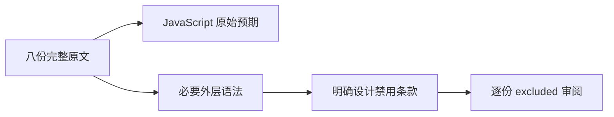
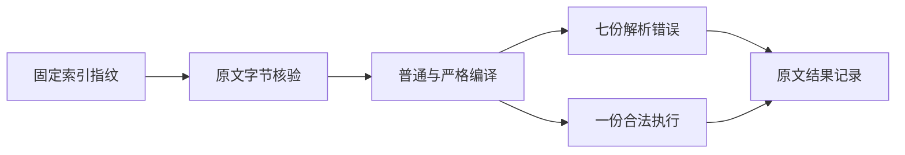

# Test262 常量声明上下文审阅

## Intent

区分 const 自身的约束与外层语法上下文的约束，避免 ZX 拒绝 class/循环结构时被误记为已对齐声明位置或 await 上下文规则。

## Data

完整读取固定 Test262 八份原文：class static block 内 await 绑定非法，但嵌套箭头函数体内同名 const 合法；for、while、do 的无花括号语句位置分别带初始化和不带初始化的 const 均为解析错误。

ZX 设计 14.3 明确禁止 class，14.4 明确禁止 for、while、do while。本轮采用这些显式设计边界，不以当前实现缺能力作为排除理由。

## Edges

两条 class 用例是相反结果，不能统一替换成 await 关键字拒绝测试。六条循环用例必须保留外层语句位置才能表达原始约束；删除循环或改成普通 const 会改变原文的错误条件，尤其不能把带初始化版本简化成缺初始化测试。

每份审阅仅标记 excluded，cases 为空，不制造新的 ZX 拒绝测试来充当关联证据。记录不代表 JavaScript 行为已实现；未来若语言设计改变，这些排除需要重新审阅。

## Answer

保存原文路径、SHA-256、逐份理由、设计契约；Node 在普通/严格模式编译原文，七份要求 SyntaxError 且不执行正文，一份合法 class 原文正常执行。运行覆盖审计与类型检查，记录真实计数并提交。

## 结果与自我复核

八份原文 SHA-256 均与固定索引匹配。普通/严格模式共 16 次检查全部符合预期：七份负例的十四次编译均产生 SyntaxError，正文未执行；合法嵌套箭头函数原文的两次编译和运行成功。

覆盖审计、包级 typecheck 均退出 0。目录数量保持 80154；已审阅 2235 份，其中 689 adapted、103 equivalent、1443 excluded，51362 份仍待审，关联 4932 项。本轮没有修改生成器、测试目录或生产源码，因此未重复运行编译器回归。

自我复核重点是保留上下文差异：合法 class 原文没有 await 求值，只有名称绑定，而且箭头函数未被调用；六条循环原文的条件均为 false，但解析错误发生在求值之前，不能以循环不执行代替语法断言。排除依据分别是明确禁止 class 和循环的设计条款，不是把两种错误状态混同。未发现实现缺陷，未向实现会话发送消息；全量固定检出任务仍保持运行。
