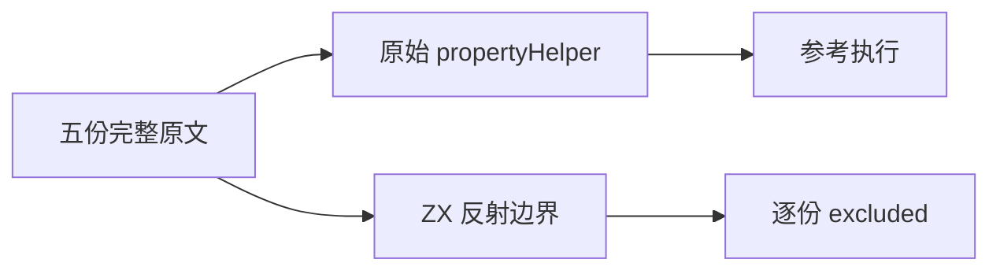
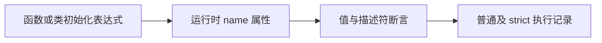

# Test262 常量函数名称审阅

## Intent

逐份核对 const 初始化表达式的函数命名语义，避免用编译期名称检查冒充运行时属性及描述符验证。

## Data

完整阅读 fn-name-arrow、class、cover、fn、gen 五份原文。它们使用 propertyHelper.js 验证 name 的值、不可写、不可枚举、可配置，并在类、括号表达式、普通函数和 generator 中保留具名或非直接匿名表达式的对照。固定 SHA-256 与逐份观察见原文清单。

## Edges

ZX 设计 14.3 明确排除反射。class 和 generator 另有明确设计边界，但五份用例的共同核心是运行时属性描述符，不能删除这些断言后关联静态函数名测试。全部逐份 excluded，不因为功能暂未实现而排除其他 const 用例。

## Answer

使用固定快照的 sta.js、assert.js、propertyHelper.js 执行完整原文，普通与 strict 两种模式分别验证，保存所有源文件及 harness 指纹。执行类型检查和覆盖审计后提交；不修改生产代码、不增加适配通过数。

## 结果与自我复核

五份原文的 SHA-256 全部匹配固定索引，使用原始 harness 执行普通与 strict 两种模式，10/10 次通过。没有简化 propertyHelper 或只检查 name 字符串，三个属性标志及原文的非覆盖对照均保留。harness 自身散列写入原文结果。

测试包 typecheck 和覆盖审计均退出 0。具名目录保持 80152 项；已审阅 2226 份，其中 688 adapted、103 equivalent、1435 excluded；待审 51371，关联 4931 用例。此次增加五份 excluded，不增加通过映射或执行目录计数。

参考执行仅验证原文材料及其断言有效，并不证明 ZX 支持该反射模型。即使某些名称可从编译期符号表取得，也不能替代 writable/enumerable/configurable 等运行时行为。未发现新的生产缺陷，未向实现会话发送消息。固定检出全量回归继续独立观察。
