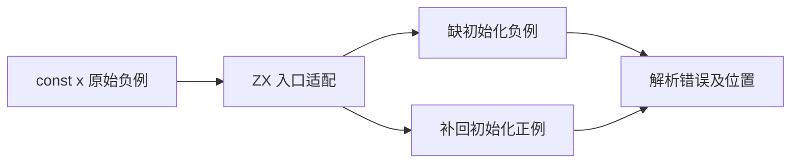
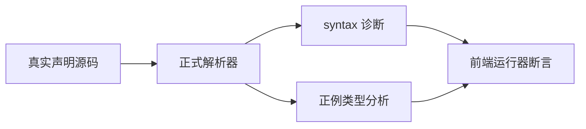

# Test262 常量初始化缺失

## Intent

建立可保留原始错误条件的 const 初始化缺失映射，避免其他不支持语法提前拒绝形成假通过。

## Data

完整读取三份原文：const x;、const x = 1, y;、const x, y = 1;。ZX Binding 语法要求可选类型注解后有等号与表达式，源码明确 expected =。本轮仅映射单声明原文，SHA-256 与固定索引匹配。

## Edges

移除分号并包装进类型化入口，保留名称 x 和缺少初始化条件，标记 adapted。两个多声明候选仍待审，不把不支持逗号声明当作初始化检查。成功对照补回 = in，并在 return x 中使用绑定。

## Answer

六项前端测试：普通、类型注解、注释间隔各有缺初始化负例和成功正例；负例必须在 return 处报 parse/syntax，正例完整 analyze 成功。原文在 Node 编译阶段验证 SyntaxError，正文不执行。类型检查、生成一致性、覆盖审计及 Debug/ReleaseSafe 定向回归后提交。

## 执行结果与自我复核

上游完整原文指纹匹配，普通及 strict 模式均在 Node 编译阶段产生 SyntaxError，正文没有执行。ZX 六项用例在 Debug、ReleaseSafe 下均为 8/8 构建步骤、6/6 测试通过。生成器已加入全量一致性检查并追踪其 data 文件；生成器 --check、包级 typecheck、覆盖审计均通过。

当前具名目录 80152 项，审阅 2221 份：688 adapted、103 equivalent、1430 excluded；51376 份待审，关联 4931 用例。本轮新增六项测试和一份 adapted。

移除分号是明确的语言表面语法适配，正例证明相同包装、名称及类型本身合法。负例诊断 span 指向缺等号之后的 return token，没有借其他语法错误提前拒绝。此结果不扩展到逗号多声明或 JavaScript 全局词法环境；另外两份原文保持待审。未发现生产缺陷，未向实现会话发送消息。固定检出全量任务仍按旧固定提交运行，本轮新用例在主工作区单独验证。
