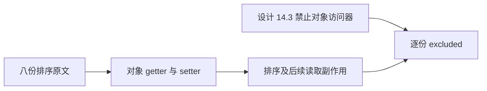
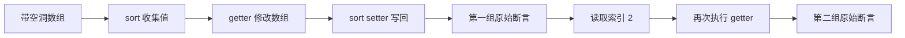

# Test262 排序 getter 副作用审阅

## Intent

逐份核对排序收集元素时的访问器副作用及排序后再次读取的变化，避免用普通列表值排序替代对象 getter 语义。

## Data

完整读取八份 precise-getter-* 原文。它们使用带 undefined 与空洞的数组，将索引 2 定义为 getter/setter；getter 分别删前项、删后项、改前项、改后项、缩短长度、增加长度、pop 两项或 push 两项。setter 将排序写回的值保存在 foo。

排序后先断言数组值、长度与属性存在性，再读取索引 2，再断言相应副作用。这些观察依赖访问与修改发生的具体先后关系。

## Edges

ZX 设计 14.3 明确禁止用户定义对象 getter/setter、this、反射和动态属性。这里的对象访问器与允许的 RX Store getter 不是同一语义。排除理由逐份记录实际变化，不根据暂时未实现的接口推断。

不能把带副作用的 getter 改成预先计算的普通值，也不能以 undefined/null 替换抹平空洞与自有属性差异。每份标记 excluded，cases 为空。

## Answer

保存八份固定原文指纹及逐份理由，用原始 sta.js/assert.js 执行普通、严格模式，验证原始断言全部通过。验证脚本在执行后不再读取数组元素，避免额外调用 getter。覆盖审计通过后提交，不新增 ZX 用例或重复编译器回归。

## 结果与自我复核

八份原文指纹均与固定索引一致，原始 sta.js/assert.js 运行普通、严格模式共 16 次全部通过。八份合计 112 条直线执行的原始 sameValue 断言，每种模式均完整执行；验证脚本执行后未增加数组读取。

覆盖审计退出 0。目录保持 80155 项，审阅 2248 份（690 adapted、103 equivalent、1455 excluded），51349 份待审，关联保持 4933 项。本轮没有修改生产实现、生成器或测试目录，没有发现生产缺陷，也未向实现会话发送消息。

自我复核：sets/deletes-predecessor 不能与 successor 混同，前项已被 sort 收集；增长数组时新增末尾元素也不进入原长度范围的收集。排序后 getter 的再次执行会继续变更数组，不能把第一次结果当作最终不变状态。逐份理由保留了这些差别，并仅以明确禁止对象访问器的条款排除；未扩展到 RX Store getter。固定检出全量回归仍在运行。
