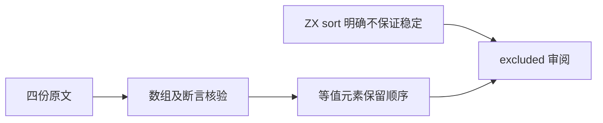
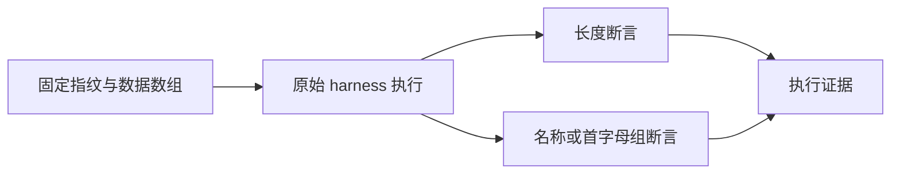

# Test262 排序稳定性审阅

## Intent

逐份记录 JavaScript 稳定排序要求与 ZX 明确不保证稳定排序的设计差异，避免用普通数值或字符串排序测试替代等值元素的顺序观察。

## Data

审阅 stability-5-elements.js、stability-11-elements.js、stability-513-elements.js 和 stability-2048-elements.js。它们均按对象 rating 降序排序，检查输入长度与排序后的 name 序列。

两份大数组的数据逐项机器核验：每行只能包含 name/rating 字面量，数量和名称唯一性必须正确；同时完整查看元数据、比较器、reduce 与断言。513 项由前十组各 47 项和 K 组 43 项组成，2048 项由前十组各 187 项和 K 组 178 项组成。

ZX 设计 4.5 的 sort 契约为数值或字符串升序、NaN 排在后方，明确“不保证稳定排序”。本轮排除依据是这条设计约束。

## Edges

5/11 项原文连接全部单字母名称；513/2048 项原文只观察相邻首字母组，未观察同一字母内部的数字后缀顺序。四份都关注比较相等的 rating 在不同名称组间保留先后关系，不能改成只排序 rating 值后声称对齐。

每份标为 excluded，cases 为空；不据此认定生产实现有缺陷，也不宣称 ZX 已通过稳定排序。若后续设计要求稳定排序，应重新审阅这些记录。

## Answer

保存固定原文指纹、数组结构核验摘要、逐份理由和设计契约。完整执行原文普通/严格模式，并使用原始 sta.js/assert.js；运行覆盖审计后提交。此处只修改审阅与文档，编译器回归不重复执行。

## 结果与自我复核

四份原文 SHA-256 均与固定索引匹配，共 2577 个数组条目逐项核验字面量结构、总数、名称唯一性和 rating 分组。原始 sta.js/assert.js 运行普通、严格模式共八次全部通过；原始长度和 reduced 断言均执行，结果另存原文结果.json。

覆盖审计退出 0。目录保持 80155 项，审阅增至 2240 份（690 adapted、103 equivalent、1447 excluded），51357 份待审，关联用例保持 4933 项。本轮只添加四份 excluded 审阅与配套证据，未修改编译器或测试目录。

自我复核：两份大数组保留同字母分组只是一部分稳定性观察，原文不证明组内数字后缀顺序；文档和理由没有把它扩展为全部 513/2048 项的完整顺序断言。排除根据明确的 sort 设计条款，未将生产的某次偶然保序结果当作稳定保证。未发现生产缺陷，未发送实现会话消息；固定检出全量回归仍在运行。
