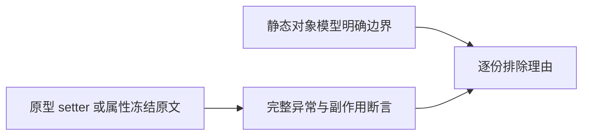
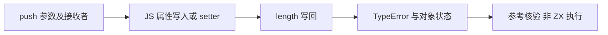

# Test262 数组写入属性审阅

## Intent：最终目标

准确区分 JS push 的动态属性写入失败语义与 ZX 的静态所有权边界，逐份完成四个明确依赖被禁止对象模型的原文审阅。

## Data：可用证据

ZX 设计文档 14.3 明确禁止原型链、对象 getter/setter 与反射。四份原文完整依赖属性描述符或冻结对象，并检查 JS TypeError；没有可独立抽离的普通列表值算法。

| 原文                                            | 完整观察                                                                                                           |
| ----------------------------------------------- | ------------------------------------------------------------------------------------------------------------------ |
| set-length-array-is-frozen.js                   | 原型索引 0 的 setter 冻结数组；push(1) 抛 TypeError；没有自身索引 0；length=0；setter 恰调用一次。                 |
| set-length-array-length-is-non-writable.js      | 原型索引 0 的 setter 把数组 length 设为不可写；push(1) 抛 TypeError；没有自身索引 0；length=0；setter 恰调用一次。 |
| set-length-zero-array-is-frozen.js              | 冻结空数组后 push() 仍因 length 写入抛 TypeError；没有自身索引 0；length=0。                                       |
| set-length-zero-array-length-is-non-writable.js | 空数组 length 设为不可写后 push() 仍抛 TypeError；没有自身索引 0；length=0。                                       |

## Edges：边界与限制

不能把前两份简化成“操作冻结数组”，它们还验证 push 过程中调用原型 setter 的顺序。不能把后两份简化为“无参不改变数组”，原文要求写回相同 length 仍失败。ZX 的所有权冻结是编译期规则，不是 Object.freeze 或可写描述符，因此不建立替代通过用例。

四份分别登记 excluded、cases 为空，理由对应全部原文断言；不修改 push 其余文件，不把参考引擎成功计作 zxc 执行成功。

## Answer：交付与成功标准

逐份核对 SHA-256 和原始 harness 执行，保存路径、哈希、设计契约与具体理由。覆盖审计通过后提交推送；若将来对象模型契约扩展，需重新评估这些记录。

## 执行结果与自我复核

四份原文均与固定 index 的哈希一致，严格和非严格八次参考执行全部通过。覆盖审计退出 0：catalog 80125、linked cases 4934 均未增加；reviewed 2202，其中 adapted 690、equivalent 103、excluded 1409，unreviewed 51395。

排除依据是已明确选择的静态对象模型，而非当前 push 某个实现缺口。记录保留原型 setter、动态描述符、冻结时机、调用次数与无参写回的全部区别；没有将这些行为替换成容易通过的普通列表操作。生产代码和正式执行测试均未修改，没有需要发送的新实现缺陷。
