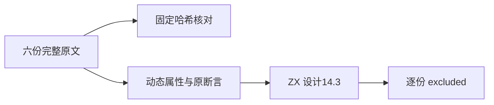

# Test262 数组动态属性遍历审阅

## Intent

逐份核对数组遍历遇到非索引动态属性时的语义，避免将普通稠密列表测试错误关联为整份上游适配。

## Data

固定 Test262 7ab7fafa0003f73fc85c1b95d88094d33f7eb8bd 的六份原文已完整阅读，路径和 SHA-256 见原文清单。every/some 检查返回布尔值与 10 次调用，map/filter 检查 5 次调用，reduce/reduceRight 无初值时检查 4 次调用。全部先添加字符串键 i 和布尔键 true。

## Edges

设计文档 14.3 明确排除动态属性。此处按该设计记录 excluded，而非因某个数组方法暂未实现排除；删掉动态属性会删除用例核心条件，不能算 adapted。Math.abs/absolute-value 和本轮读到的 reduce 无初值、单形参及索引观察候选没有据此批量排除，保持原待审状态。

## Answer

六份原文分别记录审阅，使用 Node vm 执行完整原文的普通与 strict 两种模式；核对固定哈希、记录原断言实际值。执行测试包 typecheck 与覆盖审计，不新增生产代码或虚假替代测试。按阶段提交推送。

## 结果与自我复核

六份原文哈希均匹配，12/12 次完整原文参考执行通过。测试包 `npm run typecheck` 与 `node src/audit_matrix.ts` 均退出 0。审计结果：80146 个具名目录用例，2220 份已审阅（687 adapted、103 equivalent、1430 excluded），51377 份待审，关联4930用例。

本轮只推进六份明确设计边界的审阅，不增加适配通过数；原文 callback 返回 undefined、布尔返回及无初值归约差异均已逐份保留描述，没有用回调次数相同的普通列表替代带动态属性的输入。原文参考运行仅证明材料与断言有效，不证明 ZX 支持该 JavaScript 对象模型。没有发现应由实现会话修正的新生产缺陷，因此未发送消息。长期 ReleaseSafe 全量任务独立运行，不以本轮审计结果替代它。
