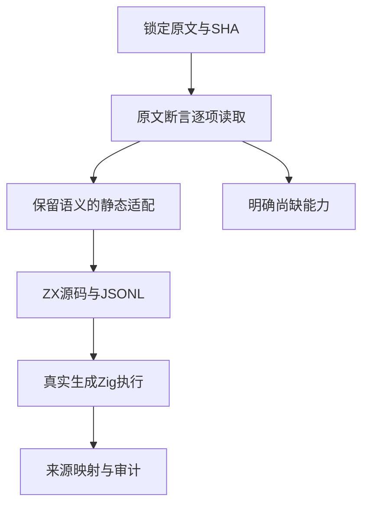
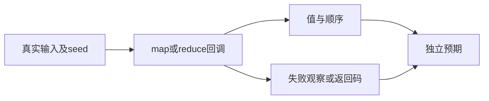

# Test262 数组回调对齐计划

## Intent：最终目标

从锁定 Test262 的 reduce/map 原始断言补充真实执行适配，验证初值、空数组不调用回调、字符串遍历顺序及回调参数，不把类似输出或静态拒绝冒充原语义。

## Data：可用证据

当前审计为 80087 个登记案例；53597 份上游中正式审阅 2187 份（683 adapted、103 equivalent、1401 excluded），51410 份未进入正式审阅清单。登记数量不证明执行通过。

两个只读分析任务已全文阅读 reduce 260 份、map 216 份。主会话再次读取选中原文和 ZX 集合回调契约：map 一个元素参数，reduce 两个参数并显式给定 initial，回调禁止捕获外部状态。

本阶段候选：

| 上游原文                      | 原始断言                            | 保留方式                                                                                          |
| ----------------------------- | ----------------------------------- | ------------------------------------------------------------------------------------------------- |
| map/15.4.4.19-2-2.js          | [12,11] 的映射长度2                 | 返回完整 [true,true]，同时约束长度                                                                |
| map/15.4.4.19-4-12.js         | [11,9] 得到 [true,false]、长度2     | 原比较谓词和原值完整执行                                                                          |
| reduce/15.4.4.21-5-9.js       | 空数组 seed3 且 callback 不调用     | fallible 回调观察，非空失败控制排除恒等回调的假证据                                               |
| reduce/15.4.4.21-7-1.js       | 空数组返回 seed1                    | 显式初值原样保留                                                                                  |
| reduce/15.4.4.21-10-5.js      | 字符串按序拼接得到012345            | 原字符串与初值，删除未使用的idx/obj                                                               |
| reduce/15.4.4.21-9-c-ii-11.js | 二形参callback中cur>10且prev严格为1 | 原输入[11]、seed1、二形参及谓词保留，以2/0返回观察谓词；seed1不是成功码，空数组不能冒充执行过回调 |

## Edges：边界与限制

- map 的零形参原文 8-c-ii-9 不记适配：增加unused参数会删除文件明确要验证的形参数量语义。
- callback 次数不得用结果长度替代；索引参数不得用恰好等于索引的输入元素代替。
- 属性getter、holes、动态receiver、species、realm、可调整buffer和省略reduce初值的原文仍按具体缺口保留，不能整目录批量填excluded。
- 5-9 的调用标志改为可执行失败观察；9-c-ii-11 的外部布尔标志改为返回码，均明确标adapted，不声称逐字等价。控制用例验证观察机制确实可区分执行与未执行、成功与失败。
- 原文参考运行必须校验SHA、严格模式变体和includes；原文通过只验证参考语义，不能证明ZX实现通过。

## Answer：交付格式与成功标准

新增分层的 callback catalogs、可重复生成器和六份正式上游映射；每份保留来源SHA、理由和具体执行case。真实生成Zig通过Debug/ReleaseSafe，独立类型、生成器check、矩阵审计通过后提交push。全量回归继续观察现有进程。

## 执行状态

本阶段已完成四个分层suite、29个运行案例和六份正式adapted映射。Debug与ReleaseSafe专项均退出码0；ReleaseSafe完整构建摘要记录29/29测试通过。原文476份SHA核对和946个严格/非严格变体参考执行全部通过。生成器--check、独立TypeScript严格检查及覆盖矩阵审计通过。

更新后登记案例80116，runtime62581；正式审阅2193份，其中689 adapted、103 equivalent、1401 excluded，未审阅51404份，关联4933案例。其他原文全文阅读保存在审阅要点与清单中，不自动增加正式review计数。

## 自我复核

没有把零形参callback改写后记为兼容，没有用输出长度代替调用次数；两处观察机制转换均明确标adapted，并有失败/空输入控制。新增代码只存在于测试包和docs，未发现本批可复现生产缺陷，无需通知实现会话。全量回归仍是独立进程，已发现的旧RX夹具问题将在后续阶段修复，不把本专项通过冒充全量通过。
