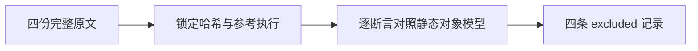
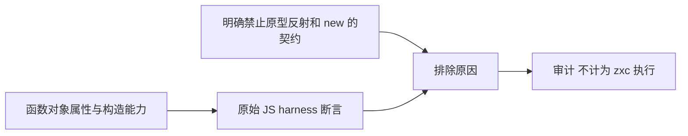

# Test262 数组方法反射审阅

## Intent：最终目标

将已逐份完整审阅的 Array.prototype.push 反射原文与既定静态 ZX 设计边界准确对应，避免以普通 push 值测试冒充函数对象反射语义。

## Data：可用证据

ZX 设计文档 14.3 明确禁止 new、原型链与反射；14.4 禁止可逃逸 lambda。当前列表调用契约提供编译期识别的 push 操作，不提供 Array.prototype 上可反射的函数对象。

本次只处理以下四份完整原文，均按固定 upstream index 校验 SHA-256，并用原 Test262 harness 执行严格和非严格变体：

| 原文                      | 完整断言与排除依据                                                                                                                                           |
| ------------------------- | ------------------------------------------------------------------------------------------------------------------------------------------------------------ |
| push/length.js            | 函数对象 length 值为 1，writable=false、enumerable=false、configurable=true。ZX 的操作参数数量不能代替可反射属性及其描述符。                                 |
| push/name.js              | 函数对象 name 值为 push，writable=false、enumerable=false、configurable=true。操作名存在不代表具有运行时 name 属性。                                         |
| push/prop-desc.js         | typeof Array.prototype.push 为 function，原型 push 属性 writable=true、enumerable=false、configurable=true。原型对象与可反射属性描述符均不在静态模型中。     |
| push/not-a-constructor.js | isConstructor(Array.prototype.push) 为 false，new Array.prototype.push() 抛 TypeError。ZX 禁止 new、反射及该函数对象，编译拒绝不能冒充 JS 运行时 TypeError。 |

## Edges：边界与限制

四个记录为 excluded，cases 为空；没有新增 adapted/equivalent 或伪造通过用例。push 的其他二十份未审阅完成原文保持原状态，不依目录名称批量排除。JavaScript 原文执行通过仅验证参考行为，不算 zxc 通过。

## Answer：交付与成功标准

保存四条带原文路径、SHA、具体断言原因和设计契约的正式 review；原文核验结果和覆盖审计通过后提交push。无需生成只会报 Array 名称未定义的替代测试，那不能验证这里的反射机制。

## 执行结果与自我复核

四份哈希与锁定 index 一致，原 harness 严格/非严格八次执行全部通过。覆盖审计退出 0：目录用例仍为 80125，linked cases 仍为 4934；reviewed 2198，其中 adapted 690、equivalent 103、excluded 1405，unreviewed 51399。

这里没有把“当前尚未实现”自动当作排除依据，而是使用用户已选择的静态 ZX 设计所明确禁止的原型、反射和 new。四份原文均没有可拆出的独立普通值行为；未删去描述符或运行时构造错误断言来制造适配。未来若公开对象模型契约改变，需要重新审阅这些记录。本次不改变生产语义，也不需要发送实现缺陷消息。
