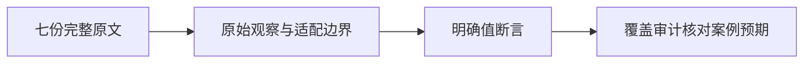
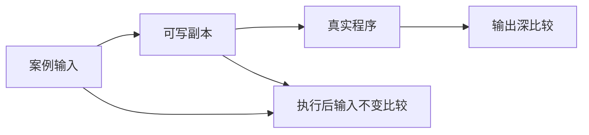

# Test262 数组映射复核

## Intent：最终目标

复核 dense_values 中剩余七条 adapted，确认上轮发现的反射与身份断言遗漏没有延续到它们，并补充机器可校验的结果锚点。

## Data：可用证据

逐份完整原文、既有 JSONL 输入/预期、生成 ZX 和 collections 支撑器。支撑器用可写深拷贝执行真实程序，然后对原输入和副本深比较，因此 map/filter 原文的“不改变输入”不是仅从输出推断。

| 原文                       | 原文观察                                 | 对应证据                                                                                       |
| -------------------------- | ---------------------------------------- | ---------------------------------------------------------------------------------------------- |
| sort/S15.4.4.11_A2.1_T1.js | 26 个 ASCII 字符依次等于 A..M,n..z       | 保留 value_input 全部字符，编码输入用于构造 owned 字符串列表，完整结果深比较。                 |
| map/15.4.4.19-8-c-ii-10.js | 单形参 val>10 对 [11] 的首项结果 true    | 原输入和单参数谓词保留，完整输出 [true]。                                                      |
| map/15.4.4.19-9-1.js       | 原输入 [1,2,3,4,5] 五项均不变            | 可写副本执行后比较输入；[true,true,true,true,true] 输出是额外控制。                            |
| map/15.4.4.19-9-2.js       | 输出五项 11..15                          | 原输入 1..5 和 val+10 保留，整列表比较额外约束长度。                                           |
| filter/15.4.4.20-10-1.js   | 原输入 [1,2,3,4,5] 五项均不变            | 可写副本比较原输入，保留全部值的输出只是额外控制。                                             |
| filter/15.4.4.20-10-2.js   | 输出长度3、逐项1/3/5                     | 原回调通过 if(val%2) 返回 bool，ZX 显式改为 val%2!=0；保留原数据与全部结果。                   |
| reduce/15.4.4.21-7-10.js   | 空输入返回字符串 initialValue is present | 保留该初值，回调按 ZX 两参数与类型要求改写；原文没有调用次数断言，不把该条单独算作未调用证明。 |

## Edges：边界与限制

状态继续为 adapted，不新增上游文件完成数或运行案例。移除未使用 idx/obj 不删任何正文观察；数字真值转换只说明这一原输入下的显式谓词适配，不声称一般 JS coercion。元数据 assertions 绑定输出预期；输入不变仍由运行器实际断言负责，不能把输出断言称为输入不变检查。

## Answer：交付与成功标准

原文哈希及原 harness 参考执行通过，七条记录分别加入明确 expected value 锚点，让覆盖审计拒绝未来案例预期与原文映射无意漂移。记录核验和自我复核后提交push，保留上轮纠正的四条 excluded。

## 执行结果与自我复核

七份 SHA 与固定 index 一致，严格/非严格十四次参考执行全部通过。已读回七份 ZX、sort_literal 索引到字符的映射及实际 JSONL，确认输入与正文一致。七条明确输出断言均通过覆盖审计，未改任何运行用例或生产代码。

统计保持 catalog 80133、reviewed 2207（adapted 687、equivalent 103、excluded 1417）、unreviewed 51390、linked cases 4930。当前全量回归仍在运行，本次静态复核不替代其执行结果。

map/filter 的输入不变由执行后副本深比较证明，输出断言只是额外检查；排序只覆盖原来的 ASCII 顺序，不能扩展成 UTF-16 全域等价；空 reduce 的零形参不可达函数按类型契约改写，不补造原文未要求的调用次数结论。没有发现新的缺失原文断言，因此保留这七条 adapted，而非为统一形式全部排除。
