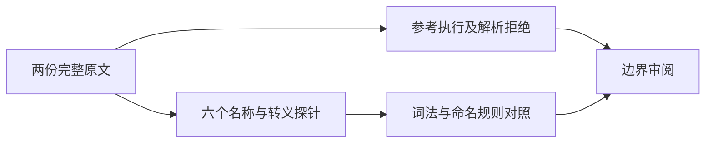
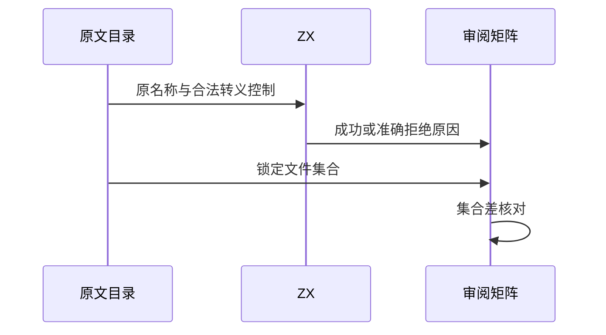

# Test262 标识符目录收尾核验

## Intent：最终目标

阶段三百四十一：核验剩余两个非版本表原文，并用锁定目录与审阅矩阵的集合差确认是否仍有遗漏。

## Data：可用证据

start-unicode-ltr.js实际声明并读取x、xx、x$和x_，不能仅按description中的UnicodeLetter归类。unicode-escape-nls-err.js要求带下划线的Unicode码点转义在parse阶段抛SyntaxError。ZX词法只扫描ASCII名称，lint.checkName还禁止值名称含美元及末尾下划线。

## Edges：边界与限制

原文第一个用例包含两个合法ZX名称及两个不同契约的名称；仅保留前半不能算整份适配。第二个用例的Unicode转义无论有无分隔符都不受ZX支持，不能将统一拒绝记成数字分隔符规则通过。

## Answer：交付格式与成功标准

交付原文哈希、正文与元数据、两种模式参考结果、六个实际ZX探针、逐项审阅和目录集合差。记录执行状态而非把审阅完成视为语义支持完成。

## 自我复核

两个用例的文件名都不是准确的语义摘要，必须按正文决定覆盖。既有snake_case硬约束不是编译器缺陷；不通过更名或删除不兼容断言制造适配结果。

## 验证结果

原文两种模式共2次正常执行、2次parse-only SyntaxError拒绝通过。六个ZX探针分别验证：x与xx编译成功；x$在6:10报syntax expected =；x_在6:9报naming；非法与合法码点转义均在6:9报lexical。脚本逐项断言退出码和错误位置/内容，成功探针只证明编译，不夸大为运行测试。

新增两项excluded，矩阵审计通过：2182已审阅=678 adapted+103 equivalent+1401 excluded，51415未审阅；JSONL73834与关联4916不变。锁定language/identifiers目录268份原文全部已有审阅记录，集合差为空。目录审阅完成不等于Unicode与ECMAScript名称规则支持完成。

本轮复用上一阶段刚构建的CLI，未改生产实现、未重跑完整根回归、没有需通知实现聊天的缺陷。证据均在标识符目录收尾草稿。后续应转向其他未审阅语言目录及实现聊天新增接口的真实测试，不继续重复审阅该目录。
