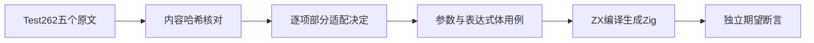
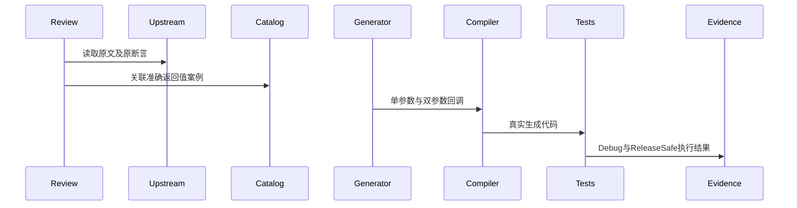

# Test262箭头表达式体对齐

## Intent：最终目标

阶段三百六十三：继续Test262逐项语义审阅，覆盖箭头表达式体、参数括号及箭头后的合法换行，在ZX支持的内联无捕获集合回调边界内执行独立测试。

## Data：可用证据

固定上游7ab7fafa快照。已逐字阅读syntax目录的四项identity表达式体测试及variations.js；四项均包含返回1及typeof function断言，variations包含零/单/双参数、表达式/语句体共六项执行断言。ZX parser支持箭头表达式，transforms只接受map/filter/reduce的内联无捕获回调。

## Edges：边界与限制

不改变ZX语言设计。不把回调执行等同于一等函数、typeof、立即调用、闭包捕获、零参数或语句体支持。五条审阅均仅关联实际适配的返回值语义，其余断言在原因中明确不覆盖。箭头前换行与ASI不属于这一批正例，仍保持未审阅。

## Answer：交付与成功标准

以map单元素执行identity和increment，以reduce单次调用执行双参数求和。扩展空列表、多元素、负数、重复值和不同换行，但扩展不冒充上游原始断言。源文件SHA匹配索引；上游Node原文核验与ZX生成Zig运行分别计数。目录审计与生成器重现检查通过后提交push。

## 自我复核

四项identity原文的typeof断言没有替代实现；必须标为adapted。variations仅映射单参数表达式体和双参数表达式体两项，不能用同一个map结果代表全部六项。CR/CRLF扩展属于ZX自有边界，不能额外增加上游审阅数。

## 实施与证据

新增生成器generate_arrow_bodies.ts与五条SHA种子记录，生成language/expressions/arrow/bodies下的真实ZX程序和60条独立目录案例。十种表达式形态分别覆盖无括号/括号参数与箭头后的无换行、LF、CR、CRLF，以及单参数加一、双参数reduce求和；每种接受空列表、单元素、多元素正负混合、重复值、抵消值与原始上游输入。

五条adapted审阅只关联六个准确返回值案例，并逐条声明未覆盖原文的哪些方面；其余扩展案例不冒充新的上游对应。test-arrow-bodies接入默认runtime；生成器与数据文件接入根test的重现检查。登记表保留原格式，只增加本项。

| 验证                             | 实测结果                                            |
| -------------------------------- | --------------------------------------------------- |
| Debug test-arrow-bodies          | 13/13构建步骤，60/60测试通过                        |
| ReleaseSafe test-arrow-bodies    | 13/13构建步骤，60/60测试通过                        |
| 上游原文                         | 5文件SHA匹配，普通/严格两模式10次执行、28项断言通过 |
| generate_arrow_bodies.ts --check | 60案例及5审阅可重现                                 |
| @zxc/test typecheck              | 退出码0                                             |
| audit_matrix.ts                  | 73,894个登记案例，2,187条审阅，51,410条未审阅       |

两种优化模式执行同一批60个ID，不重复增加案例数。审计中adapted683、equivalent103、excluded1401；总案例中runtime56,359、frontend5,305、evaluation_order1,084、safety464、module_graphs10,446、stores236。目录数和原文Node执行都不代替完整zxc执行证据。

起始HEAD为ba3e6cbc，提交前实现聊天推进至ad4b5d02（Store初始化产物）；本轮没有测试或声称验证该新功能。无生产缺陷，未向实现聊天发送消息。未执行根目录完整回归，目标仍未完成。源码副本、上游核验脚本、逐文件结果和审计结果保存在Test262箭头表达式测试草稿目录；Debug和ReleaseSafe原始日志本地忽略。
