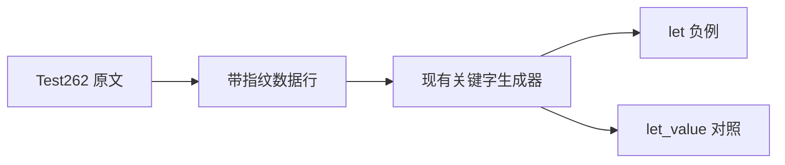
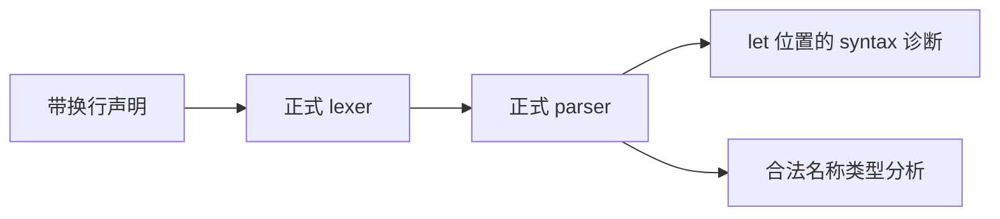

# Test262 跨行常量绑定

## Intent

对齐 const 与 let 之间出现换行时仍禁止使用 let 作为绑定名的早期错误，补足关键字绑定测试的跨行边界。

## Data

完整读取固定 Test262 的 const-declaring-let-split-across-two-lines.js。原文要求解析阶段 SyntaxError，const 后换行，绑定 let，字符串初始化值为 irrelevant initializer。正式 syntax.isKeyword 明确包含 let；已有关键字生成器只处理数值初始化及空格。

## Edges

保留原声明、换行、绑定名称和初始化值，移入 ZX 类型化函数并去掉分号。该包装属于 adapted，不宣称直接执行原文。错误必须位于 let 三字节跨度；成功对照只在名称后加 _value，且完整执行类型分析。无 runtime 语义、ASI 或全局词法环境的扩展主张。

## Answer

扩展现有生成器接受字符串初始化和显式声明间隔，不改变已有数值案例输出。新增两项正式前端测试、一份 adapted 审阅；原文普通/严格模式编译检查、生成一致性、类型检查、覆盖审计与 Debug/ReleaseSafe 定向测试通过后提交。

## 执行结果与自我复核

原文 SHA-256 与固定索引匹配；Node 在普通、strict 两种模式均编译抛出 SyntaxError，未执行正文。新增负例在 parse 阶段报 syntax，span 为 [109,112]，正好指向 let；let_value 对照完整 analyze 成功。

Debug 与 ReleaseSafe 定向关键字组均为 8/8 构建步骤、42/42 测试通过，命令是 `zig build test-frontend -Dfrontend-filter=language/lexical/identifiers/keywords -j2 --summary all`，ReleaseSafe 增加 `-Doptimize=ReleaseSafe`。生成器 --check、包级 typecheck、覆盖审计均退出 0。

原有四十个关键字测试及二十份审阅行保持不变，生成器仅为数据允许字符串初始化与声明间隔。当前目录 80154 项，审阅 2227 份（689 adapted、103 equivalent、1435 excluded），51370 份待审，关联 4932 项。

错误定位和合法对照证明拒绝来自保留名称，不是字符串值或换行本身。实现将 let 一般分类为关键字，比 ECMAScript 的上下文规则更严格；本条原文恰好处于禁止绑定的 const 上下文，不由此宣称其他上下文完全对齐。未发现实现问题，未向实现会话发送消息。
