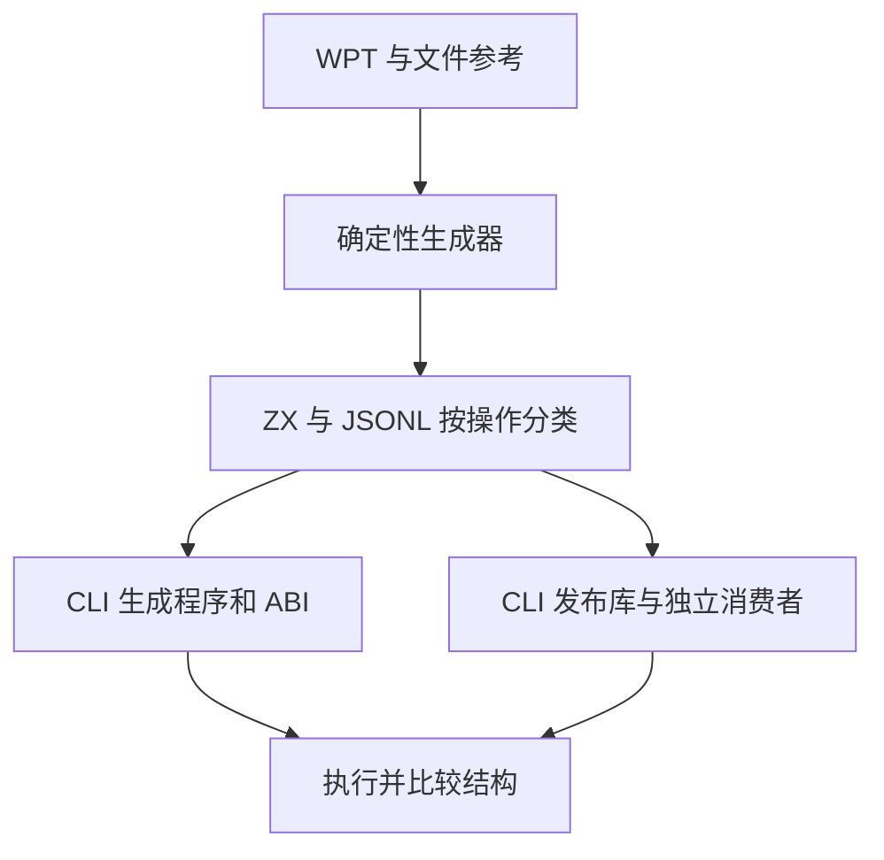

# URL 公开接口验证计划

## Intent：最终目标

通过真实 ZX 源码、共享 ABI 与发布库消费验证 std:url 全部 12 个已公开入口。内部算法已通过不替代公开接口验收。

## Data：可用证据

固定 WPT URL 语料与前两轮文件路径参考案例；当前 url.d.zx 声明、api/record.zig 记录复制实现、既有标准库 runtime 套件与 collections 支持层。源代码路径经 CLI 生成程序和 ABI，发布路径经 CLI --mode lib 与独立 ZX、Zig 消费者编译。

## Edges：边界与限制

Url 是不可变记录，query/fragment 的 null 与空字符串必须区分，path 与 opaque_path 保持不同形状。期望来自 WPT 字段与独立文件参考，不从被测实现读出后回填。域名遵循当前 WHATWG 的 ASCII 兼容契约，不能盲用旧 Node 的拒绝结果。尚未实现的字段编辑不作为已完成能力。API 复制分配失败与正常 arena 执行证据需分别说明。

## Answer：交付格式与成功标准

按公开操作创建 ZX/JSONL 测试目录，接入 runtime catalog 与专用 test-url-api。发布库测试使用同一固定案例，独立工作区消费，检查实际输出与错误，不以生成成功替代执行。Debug 与 ReleaseSafe 均通过；失败向指定实现会话反馈。完成后记录自审、提交推送。

## 落地入口

- test-url-api：12 组 ZX/JSONL，经 CLI 源码生成和共享 ABI 执行。
- test-url-api-library：发布库的 ZX 消费及独立 Zig 消费，后者也可单独运行 test-url-api-native。
- test-url-api-resources：公开记录资源所有权与逐分配点故障检查，接入 test-standard-resources。
- 各执行路径消费相同的 6,193 条固定案例，不将重复路径计为新的独立语义案例。资源检查另有 5 项 Zig 测试。
