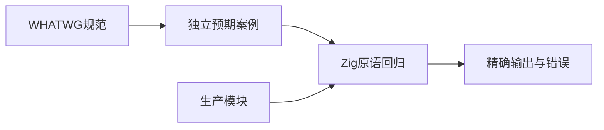
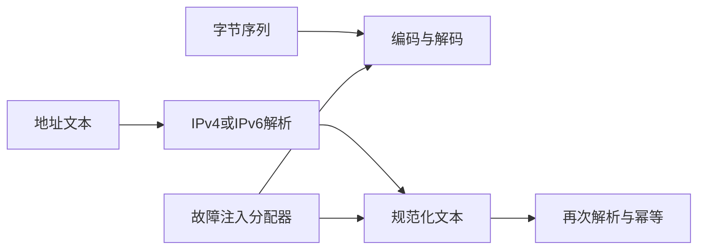

# URL 基础验证计划

## Intent：最终目标

阶段405：为新实现的 percent、IPv4、IPv6 底层模块建立语义与内存回归，避免完整 URL 解析建立在未验证的基础上。

## Data：可用证据

实现提交 c50dae67；直接引用生产 Zig 模块。规范依据 [WHATWG 编码集合](https://url.spec.whatwg.org/#percent-encoded-bytes)、[IPv4 解析](https://url.spec.whatwg.org/#concept-ipv4-parser)、[IPv6 解析](https://url.spec.whatwg.org/#concept-ipv6-parser) 与序列化。规范在本次访问显示更新日期 2026-09-10。IP 文本预期另以 Node URL 主机结果核对。

## Edges：边界与限制

这些是内部字节编码与地址解析函数，不是完整 URL API，也不是 Test262 的 URL 标准覆盖。只向 IP 原语传递主机地址文本，方括号由完整 host serializer 负责。任意字节解码不等于 UTF-8 校验。分配失败回归检查释放，不用成功路径代替失败路径。

## Answer：交付与成功标准

按 percent/host 分层组织 Zig 测试，新增 test-url-primitives 并接入标准库资源回归。语义、无效输入、规范化、往返及资源清理分别断言。Debug、ReleaseSafe 通过后记录并提交推送；发现生产缺陷交指定实现会话修复。





## 实施与首次问题

新增百分比编码 21 项、IPv4 64 项、IPv6 48 项，共 133 个 Zig 测试。编码集合用完整可打印 ASCII 预期字符串，另测控制及高位字节、NUL、无效百分号、大小写十六进制、只解码一次、UTF-8 字节及任意字节往返。IPv4 覆盖 1–4 段、进制、段上界、整体上界、尾点和数字后缀；IPv6 覆盖零段压缩、最长段及同长优先位置、嵌入 IPv4 与无效输入。

首轮 130 项中 129 通过，IPv6 序列化分配故障注入收到 WriteFailed，而非 OutOfMemory。调用栈指向内存 Writer 的分配失败转换；这不是已证明的内存泄漏。问题已发送指定实现会话。实现改为上限 39 字节的栈缓冲输出后分配结果，返回类型明确为 Allocator.Error；原故障注入用例保留并通过。随后加入两个最大长度表达及完整零段位置组合，最终达到 133 项。

## 独立对照与分层边界

Node v25.8.1 对照 94 个地址输入：83 个处于可比的 IP 主机语义范围，全部一致；11 个属于域名选择或 IDNA 前处理，不与直接 ASCII IPv4 数字解析器作成败等价判断。首次粗略把所有无效数字文本都当作无效 URL 主机，产生了这种层级误差；已依据规范的 ends-in-number 分流纠正分类，并保留每个输入的实际 Node 输出。

另用 Node URL 生成 256 种 IPv6 零段位置的规范化文本，形成独立静态预期；生产函数逐项比较并验证 parse/serialize 幂等。该 256 组检查只计为一个组合回归，不膨胀独立测试数量。生成器、Node 对照脚本和结果均存放在 URL基础验证/，正式用例位于 packages/test/tests/standard/resources/url/。

## 最终验证

Debug 与 ReleaseSafe 各 7/7 步骤、133/133 测试通过，两模式共 266 次独立测试执行。百分比 encode/decode、IPv4 serialize、IPv6 serialize 均通过分配故障注入。Zig 格式和 diff 检查通过；没有运行全仓回归、浏览器或完整 URL API 测试。

## 自我批判

底层字节编码不负责 Unicode 标量校验；IP 内部解析不是域名解析和 IDNA。Node 对照提供实现独立性，仍不是规范证明，故明确区分可比范围。组合掩码只枚举零段的位置，没有穷举整个 128 位地址空间。当前未新增 Test262 审阅或适配记录，不能把 WHATWG 原语回归宣称为 ECMAScript 全面对齐。

## 复验命令

在仓库根生成和核对案例：

```sh
python3 docs/2026-10-05/URL基础验证/生成用例.py
node docs/2026-10-05/URL基础验证/核对预期.mjs
zig fmt packages/test/tests/standard/resources/url
```

在 packages/test 运行：

```sh
zig build test-url-primitives --summary all
zig build test-url-primitives -Doptimize=ReleaseSafe --summary all
```
