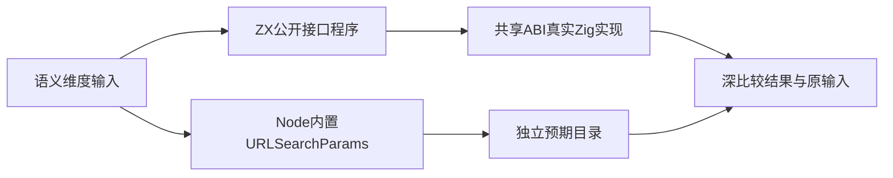
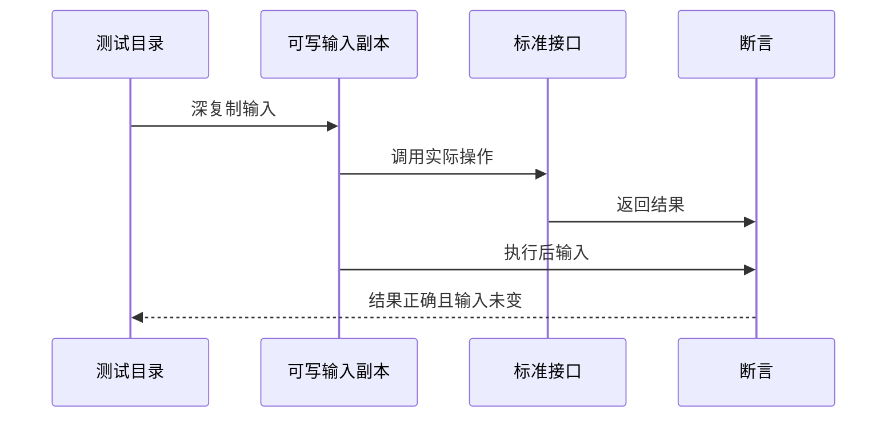

# URL 查询参数全接口验证

## Intent：最终目标

阶段三百三十五：为新标准接口std:url/search_params的12个操作建立独立参考与真实运行测试，补齐全特性测试范围中的新增功能。

## Data：可用证据

当前公开声明含parse、stringify、get、getAll、has、append、set、remove、sort、keys、values、size。参考[WHATWG URLSearchParams算法](https://url.spec.whatwg.org/#urlsearchparams)和[Node URLSearchParams文档](https://nodejs.org/api/url.html#class-urlsearchparams)，使用本机Node内置实现生成独立预期。语义包括顺序及重复项、null表示未提供匹配值、UTF-16稳定排序、表单百分号编码。

## Edges：边界与限制

URLSearchParams是Web平台接口，不把这些用例计作Test262原文适配。ZX使用不可变Entry列表；Node参考每次建立独立可变实例后取结果。采用既有collections测试支持层，将输入复制为可写内存并在执行后逐字段验证不变，防止只比较结果忽略副作用。

有效UTF-8文本、百分号形式的任意字节和畸形序列均可通过ZX运行目录验证；原生调用方传入非法UTF-8、裸分配器失败清理另需资源专项，不能由arena释放证明。

## Answer：交付格式与成功标准

按standard/url/search_params/操作建立12组JSONL与ZX程序，提供生成器与独立专项入口。参考实现能力控制、生成器重复性、矩阵、类型检查和实际运行通过。发现确定实现缺陷时按用户要求通知实现聊天，不改预期规避失败。

## 自我复核

参考实现与生产算法独立；显式检查Node支持按值删除及按值has，避免旧引擎静默忽略参数导致参考错误。排序样本包含UTF-8与UTF-16顺序不同的补充平面字符，以及大量相同键以检查稳定性。读取和修改均保留有序重复项，不能借用普通对象映射消去重复键。

## 验证结果

在packages/test执行`zig build test-url-search-params -j4 --summary all`，57/57步骤、8640/8640测试通过。parse552；stringify、sort、keys、values、size各140；get与getAll各437；has与remove各1509；append与set各1748。

全部通过既有collections支持层深复制并核对输入不变，真实CLI生成程序并链接标准库共享ABI。包含1001条查询不截断、所有百分号单字节在键和值中的位置、非法UTF-8替换、表单编码安全字符、补充平面UTF-16顺序、40个交错重复项的稳定排序、null匹配与空字符串值的区别。

Node按值has/delete及size能力控制通过。生成器--check、矩阵审计、TypeScript类型检查、Prettier、Zig格式和diff检查通过。首次类型检查因Node构造参数被推断为string[][]失败，补充明确的二元元组返回类型后通过；没有修改参考值或生产实现。

JSONL总数73834，其中runtime56299，frontend5305。Test262已审阅2036、未审阅51561、关联4916不变；本批属于新增ZX标准库覆盖，不计作Test262适配。没有发现需向实现聊天报告的缺陷。未重跑完整根回归。

后续还需原生非法UTF-8输入与裸分配器失败清理测试，本批arena释放及结果断言不证明这些边界。代码、目录副本、实现哈希、参考环境和日志均在URL查询参数测试草稿中。
